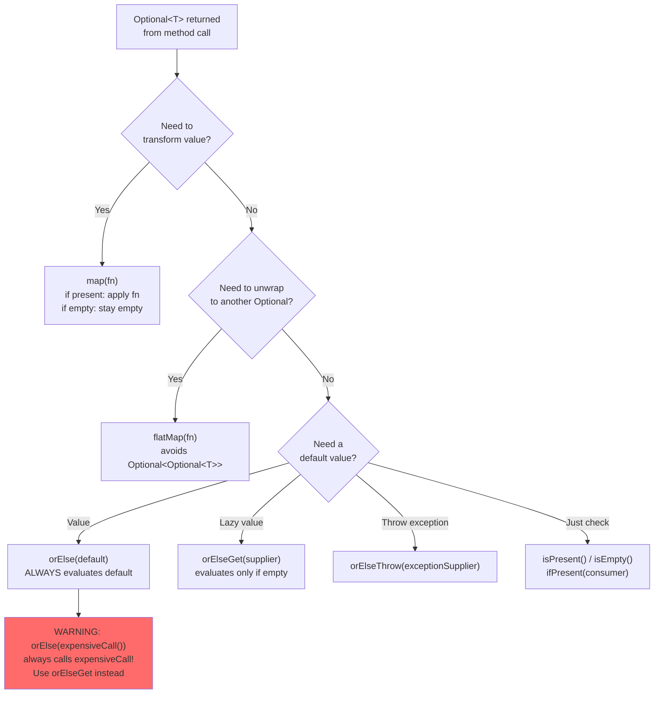

# Optional: Null-Safe Return Types

## Diagram: Optional Method Decision Tree



## The Billion-Dollar Mistake

Tony Hoare, who invented null references, called them his "billion-dollar mistake." NullPointerException is the #1 runtime exception in Java applications.

```java
// The problem:
String city = user.getAddress().getCity();  // What if getAddress() returns null?
// → NullPointerException at runtime with NO compile-time warning

// The old fix (defensive null checks):
String city = "Unknown";
if (user != null) {
    Address addr = user.getAddress();
    if (addr != null) {
        city = addr.getCity();
    }
}
// Deeply nested, error-prone, ugly.
```

## What Is Optional?

`Optional<T>` is a container that may or may not hold a value. It forces the caller to acknowledge that a value might be absent.

```
Optional<String> STATES:

  ┌────────────────────────┐     ┌────────────────────────┐
  │  Optional.of("Alice")  │     │  Optional.empty()       │
  │  ┌──────────────────┐  │     │  ┌──────────────────┐   │
  │  │  value: "Alice"  │  │     │  │  value: null      │   │
  │  │  isPresent: true │  │     │  │  isPresent: false │   │
  │  └──────────────────┘  │     │  └──────────────────┘   │
  └────────────────────────┘     └────────────────────────┘
  
  Think of it like Python's:
    x: Optional[str] = "Alice"   vs   x: Optional[str] = None
    (but Java ENFORCES handling the None case)
```

## Creating Optional

```java
// From a non-null value (throws NPE if null!)
Optional<String> opt = Optional.of("Alice");

// From a possibly-null value
Optional<String> opt = Optional.ofNullable(possiblyNull);

// Empty optional
Optional<String> opt = Optional.empty();
```

## Safe Access Patterns

```java
Optional<String> name = findUserName(userId);

// Pattern 1: orElse — provide default
String result = name.orElse("Unknown");

// Pattern 2: orElseGet — lazy default (computed only if empty)
String result = name.orElseGet(() -> computeExpensiveDefault());

// Pattern 3: orElseThrow — throw if empty
String result = name.orElseThrow(() -> new UserNotFoundException(userId));

// Pattern 4: map — transform if present
Optional<Integer> length = name.map(String::length);

// Pattern 5: flatMap — for nested Optionals
Optional<String> city = findUser(id)
    .flatMap(User::getAddress)     // returns Optional<Address>
    .flatMap(Address::getCity);    // returns Optional<String>

// Pattern 6: ifPresent — execute if value exists
name.ifPresent(n -> System.out.println("Found: " + n));

// Pattern 7: filter — keep value only if it matches
Optional<String> longName = name.filter(n -> n.length() > 3);
```

## Chaining (Monadic Pipeline)

```java
// BEFORE (nested nulls):
String display = "N/A";
User user = findUser(id);
if (user != null) {
    Address addr = user.getAddress();
    if (addr != null) {
        String city = addr.getCity();
        if (city != null) {
            display = city.toUpperCase();
        }
    }
}

// AFTER (Optional pipeline):
String display = findUser(id)           // Optional<User>
    .flatMap(User::getAddress)          // Optional<Address>
    .flatMap(Address::getCity)          // Optional<String>
    .map(String::toUpperCase)           // Optional<String>
    .orElse("N/A");                     // String
```

## Anti-Patterns (NEVER DO THESE)

```java
// ❌ ANTI-PATTERN 1: Using Optional as a field
class User {
    Optional<String> nickname;  // WRONG. Use nullable String instead.
}

// ❌ ANTI-PATTERN 2: Using Optional as a parameter
void process(Optional<String> name) { }  // WRONG. Use @Nullable or overload.

// ❌ ANTI-PATTERN 3: Calling get() without isPresent()
String value = optional.get();  // Throws NoSuchElementException if empty!

// ❌ ANTI-PATTERN 4: Using Optional just to check null
if (Optional.ofNullable(x).isPresent()) { }  // Just use: if (x != null)

// ✅ CORRECT USAGE: Return type from a method
Optional<User> findById(String id) { ... }
```

## Python Comparison

```python
# Python has no Optional, but uses None with type hints:
from typing import Optional

def find_user(id: str) -> Optional[User]:  # might return None
    ...

# Python's "Optional chaining" equivalent:
city = getattr(getattr(user, 'address', None), 'city', 'N/A')
# Much less elegant than Java's Optional pipeline!
```

---

## Interview Questions

**Q1: When should you use Optional vs returning null?**
> Use Optional as a return type when absence is a valid, expected result (e.g., `findById` might not find a user). Don't use Optional for fields (wastes memory), parameters (use overloads or `@Nullable`), or in collections (use empty collection instead). Optional signals intent: "this method might not return a value."

**Q2: What is the difference between `orElse()` and `orElseGet()`?**
> `orElse(defaultValue)` evaluates the default eagerly — even if the Optional has a value. `orElseGet(() -> computeDefault())` evaluates lazily — only called if the Optional is empty. Use `orElseGet()` when the default is expensive to compute (database call, object creation).

**Q3: How does Optional relate to Spring's `CrudRepository.findById()`?**
> `findById()` returns `Optional<T>` instead of null. This forces the caller to explicitly handle the "not found" case. Typical pattern: `repo.findById(id).orElseThrow(() -> new ResourceNotFoundException(id))`. This eliminates null checks and makes the code self-documenting.
