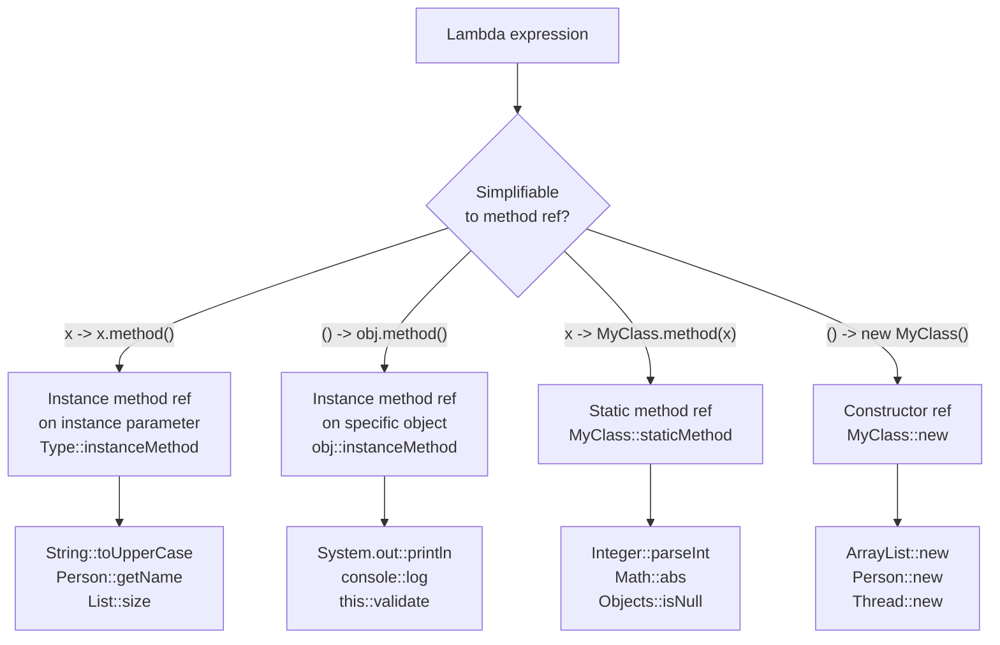

# Method References — Lambda Shorthand

## Diagram: Four Method Reference Types



## The Four Types

### Type 1: Static Method Reference

```java
// Lambda:       x -> Integer.parseInt(x)
// Method ref:   Integer::parseInt

List<String> numStrings = List.of("1", "2", "3");
List<Integer> numbers = numStrings.stream()
    .map(Integer::parseInt)   // equivalent to: s -> Integer.parseInt(s)
    .collect(Collectors.toList());
```

### Type 2: Instance Method Reference on Parameter Type

```java
// Lambda:       s -> s.toUpperCase()
// Method ref:   String::toUpperCase

// The instance is the parameter itself:
List<String> upper = names.stream()
    .map(String::toUpperCase)     // each name -> name.toUpperCase()
    .collect(Collectors.toList());

// With argument:
// Lambda:       (s1, s2) -> s1.compareTo(s2)
// Method ref:   String::compareTo
list.sort(String::compareTo);
```

### Type 3: Instance Method Reference on Specific Object

```java
// Lambda:       x -> myObject.someMethod(x)
// Method ref:   myObject::someMethod

PrintStream out = System.out;
names.forEach(System.out::println);  // out::println on specific instance

// Useful for logging, validators, etc.:
names.forEach(logger::info);
names.stream().filter(validator::isValid).collect(...)
```

### Type 4: Constructor Reference

```java
// Lambda:       () -> new ArrayList<>()
// Method ref:   ArrayList::new

// Used with Supplier<T>:
Supplier<List<String>> factory = ArrayList::new;
List<String> list = factory.get();  // creates new ArrayList

// In Collectors.toCollection:
.collect(Collectors.toCollection(TreeSet::new))

// With Function<T, R> — constructor taking one argument:
Function<String, StringBuilder> sbFactory = StringBuilder::new;
StringBuilder sb = sbFactory.apply("initial value");
```

---

## When to Use Method References vs Lambdas

```
Use method reference when the lambda:
  ✅ just calls ONE method with the same parameters as the lambda receives
  ✅ has no logic beyond the method call
  ✅ the name makes intent clearer than the lambda

Keep as lambda when:
  ❌ the method reference is ambiguous or confusing
  ❌ there's additional logic (condition, transformation)
  ❌ clarity would be reduced by removing the parameter names

EXAMPLES:
  ✅ .map(String::toLowerCase)   clearer than .map(s -> s.toLowerCase())
  ✅ .forEach(System.out::println)
  ❌ .map(s -> s.trim().toLowerCase())  ← has TWO calls, keep as lambda
  ❌ .filter(x -> x != null)           ← Objects::nonNull is less clear
```

---

## Method References in Spring

```java
// Spring Bean registration with method references:
@Bean
public PasswordEncoder passwordEncoder() {
    return new BCryptPasswordEncoder();
}

// Controller validation:
users.stream()
    .filter(userValidator::isActive)   // Type 3: specific object
    .map(userMapper::toDto)             // Type 3: specific object
    .collect(Collectors.toList());

// Event handling:
publisher.publishEvent(this::handleEvent);  // Type 3
```

---

## Python Bridge

| Java Method Reference | Python Equivalent |
|---|---|
| `Integer::parseInt` | `int` (class itself is callable) |
| `String::toUpperCase` | `str.upper` (unbound method) |
| `System.out::println` | `print` (function reference) |
| `ArrayList::new` | `list` (class as factory) |
| `Objects::isNull` | `lambda x: x is None` |
| `String::compareTo` | `str.__lt__` (less natural in Python) |

**Critical Difference:** Python functions and methods are first-class objects — `str.upper` IS a method reference. `int` IS a constructor reference. Java needed explicit syntax (`::`) because methods and constructors are not values in Java's type system; they need to be wrapped in a functional interface. Python's duck typing makes this transparent — any callable works wherever a function is expected.

---

## Interview Questions

**Q1: When is `String::compareTo` a `BiFunction<String, String, Integer>` and when is it a `Comparator<String>`?**
> The same method reference can satisfy multiple functional interfaces, depending on the target type. `String::compareTo` takes two `String` parameters and returns `int` — this matches `BiFunction<String, String, Integer>` (generic interface), but also matches `Comparator<String>` (same signature). The compiler infers which to use based on where the method reference is assigned or passed. `list.sort(String::compareTo)` uses `Comparator<String>`.

**Q2: What is the difference between `MyClass::instanceMethod` (Type 2) and `obj::instanceMethod` (Type 3)?**
> Type 2 (`String::toUpperCase`): the instance is the **first parameter** from the stream — `s -> s.toUpperCase()`. Type 3 (`obj::method`): the instance is a **captured variable** from outside the lambda — `x -> obj.method(x)`. Type 2 works when the method is called ON each stream element; Type 3 works when you delegate each element TO a specific object.

**Q3: Why can't `System.out::println` be used where `Function<String, String>` is expected?**
> `println` returns `void`, not `String`. `Function<String, String>` requires a return type of `String`. It matches `Consumer<String>` (which returns void). The functional interface return type must match the method's return type.
