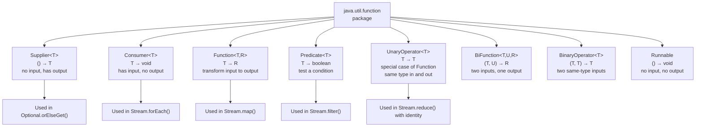

# Functional Interfaces — The Type System for Lambdas

## Diagram: Core Functional Interface Hierarchy



## The Core Four

### Function\<T, R\> — Transform

```java
// T input → R output
Function<String, Integer> strLen = String::length;
Function<String, String> upper = String::toUpperCase;

// Compose functions:
Function<String, Integer> trimThenLength = upper.andThen(strLen);
//  andThen: apply THIS, then apply the next function
//  compose: apply the next function FIRST, then THIS
```

### Predicate\<T\> — Test

```java
// T input → boolean
Predicate<String> isEmpty  = String::isEmpty;
Predicate<String> isLong   = s -> s.length() > 5;

// Combining predicates:
Predicate<String> isLongAndNotEmpty = isLong.and(isEmpty.negate());
Predicate<String> either = isEmpty.or(isLong);
Predicate<String> notEmpty = isEmpty.negate();
```

### Consumer\<T\> — Side Effect

```java
// T input → void
Consumer<String> print   = System.out::println;
Consumer<String> log     = logger::info;

// andThen chains consumers:
Consumer<String> printAndLog = print.andThen(log);
list.forEach(printAndLog);  // for each element: print THEN log
```

### Supplier\<T\> — Factory / Lazy Value

```java
// () → T
Supplier<List<String>> listFactory = ArrayList::new;
Supplier<LocalDateTime> now        = LocalDateTime::now;

// Critical use case — lazy evaluation in Optional:
Optional.empty()
    .orElseGet(() -> expensiveComputation());  // only called if empty
//  vs:
Optional.empty()
    .orElse(expensiveComputation());  // ALWAYS called, even if non-empty!
```

---

## Primitive Specializations

```
WHY: Function<Integer, Integer> boxes/unboxes — heap allocation per value!
     For numeric pipelines, use primitive specializations:

┌──────────────────────────────────────────────────────────────────┐
│  IntFunction<R>        int → R                                    │
│  ToIntFunction<T>      T → int                                    │
│  IntToLongFunction     int → long                                 │
│  IntUnaryOperator      int → int                                  │
│  IntBinaryOperator     (int, int) → int                           │
│  IntPredicate          int → boolean                              │
│  IntConsumer           int → void                                 │
│  IntSupplier           () → int                                   │
│                                                                  │
│  (Same families for Long and Double)                             │
└──────────────────────────────────────────────────────────────────┘

Example — stream of primitives:
  IntStream.range(0, 1_000_000)
      .filter(n -> n % 2 == 0)   ← IntPredicate (no boxing!)
      .map(n -> n * n)            ← IntUnaryOperator
      .sum();                     ← returns int directly
```

---

## Custom Functional Interfaces

```java
// When the JDK interfaces don't fit your signature:

@FunctionalInterface
interface TriFunction<A, B, C, R> {
    R apply(A a, B b, C c);
}

// With throws:
@FunctionalInterface
interface CheckedFunction<T, R> {
    R apply(T t) throws Exception;
}

// Domain-specific:
@FunctionalInterface
interface PriceCalculator {
    double calculate(double base, int quantity, String promoCode);
}
// This is the Strategy pattern expressed as a functional interface!
```

---

## Functional Composition in Spring

```java
// Spring's HandlerInterceptor is effectively a chain of Consumers
// Spring Security's Filter chain is a chain of Functions

// Example — request transformation pipeline:
Function<HttpRequest, HttpRequest> addAuth    = req -> req.header("Auth", token);
Function<HttpRequest, HttpRequest> addTracing = req -> req.header("X-Trace", UUID.randomUUID());
Function<HttpRequest, HttpResponse> execute   = httpClient::send;

Function<HttpRequest, HttpResponse> pipeline =
    addAuth.andThen(addTracing).andThen(execute);

// Used in Spring WebClient:
webClient.get()
    .uri("/api/users")
    .retrieve()
    .bodyToMono(String.class);
```

---

## Python Bridge

| Java Functional Interface | Python Equivalent |
|---|---|
| `Function<T, R>` | Any callable with `(T) -> R` signature |
| `Predicate<T>` | Any callable with `(T) -> bool` |
| `Consumer<T>` | Any callable with `(T) -> None` |
| `Supplier<T>` | `Callable[[], T]` — a zero-arg callable |
| `BiFunction<T, U, R>` | Any callable with `(T, U) -> R` |
| `Runnable` | Any callable with `() -> None` |
| `IntFunction<R>` | Same as Function — Python has no primitives |
| `@FunctionalInterface` annotation | Just a callable — no annotation needed |

**Critical Difference:** Python has no concept of functional interfaces — any callable (function, lambda, class with `__call__`) can be used anywhere a callable is expected. Java's type system requires an explicit interface type because lambdas must map to a named type for the compiler. The advantage of Java's approach: you get self-documenting code (`Predicate<User> isActive` is clearer than just `callable`) and compile-time verification of the signature.

---

## Interview Questions

**Q1: What's the difference between `orElse()` and `orElseGet()` in Optional? Which is more efficient?**
> `orElse(value)` always evaluates the argument at the call site — even if the Optional is non-empty. `orElseGet(supplier)` accepts a `Supplier<T>` that is only called if the Optional is empty. If the default is expensive to compute (e.g., database call, object creation), `orElseGet()` is always more efficient. `orElse(new User())` creates a `User` object every time — even when it's discarded.

**Q2: Can a functional interface have more than one method?**
> Yes — it can have exactly ONE abstract method (the SAM). But it CAN have: `default` methods (any number), `static` methods (any number), and methods inherited from `Object` (`equals`, `hashCode`, `toString`) don't count as abstract. `@FunctionalInterface` enforces the single-abstract-method constraint at compile time.

**Q3: You have a `Function<String, String>` and want to log the input and output of every call. How do you do it without modifying the function?**
> Use `andThen` to chain a logging consumer, or wrap it: `Function<String, String> logged = input -> { logger.info("in: " + input); String result = original.apply(input); logger.info("out: " + result); return result; };` This is the Decorator pattern applied to functional interfaces. In production, Spring AOP does this transparently via `@Around` advice.
