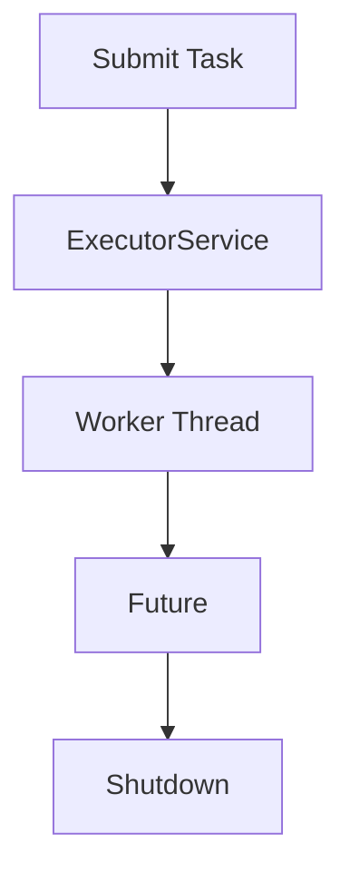

# Multithreading One-Page Cheat Sheet

## Fast Rules

| Topic | Rule |
|---|---|
| Raw `Thread` | okay for learning, not a production default |
| `ExecutorService` | use for bounded, reusable background execution |
| `Future` | use for result retrieval, timeouts, cancellation |
| `synchronized` | use for critical sections on shared state |
| interruption | preserve it when catching `InterruptedException` |

## Python Bridge

| Java | Python |
|---|---|
| `ExecutorService` | `ThreadPoolExecutor` |
| `Future.get()` | `future.result()` |
| `shutdown()` | executor shutdown / context manager exit |
| `synchronized` | `Lock` / `RLock` |

## Common Traps

1. Starting too many raw threads.
2. Forgetting to shut down executors.
3. Ignoring interruption.
4. Sharing mutable state without protection.

## Interview Questions

1. Why is a thread pool safer than raw threads in a server app?
2. What does `Future` give you that `Runnable` does not?
3. Why should interruption be preserved?
