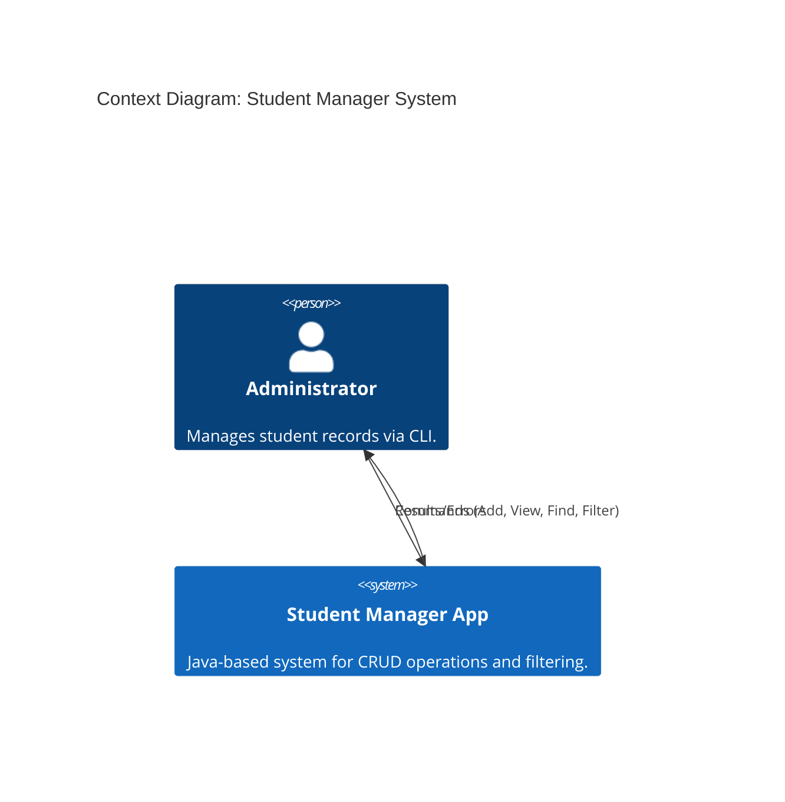
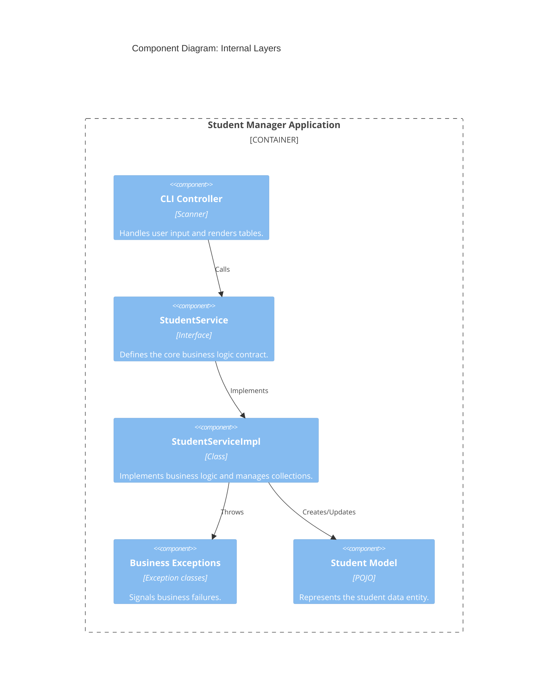

# 01 - Student Manager Architecture (C4 Model)

> **Python Bridge:** In Python, architecture is often "flat" and resides in single scripts. Java architecture is **Layered by contract**. This document describes the C4 container/component level view of the Student Manager System.

---

## 1. C4 Context Diagram

---

## 2. C4 Component Diagram (Internal Structure)

---

## 3. Data Integrity Strategy

| Scenario | Logic | Java Tool |
|---|---|---|
| **Invalid GPA** | Prevent value addition | `@Setter` with validation or `throw` |
| **Duplicate ID** | O(1) existence check | `HashMap.containsKey()` |
| **Missing Data** | Check for `null` or empty | `Optional` or custom validation |
| **Search Fail** | Signal caller | `Optional<Student>` or `Exception` |

---

## 4. Python vs. Java Mental Model

| Aspect | Python (Flat Script) | Java (Layered Components) |
|---|---|---|
| **Entrypoint** | `if __name__ == "__main__":` | `public class Main { public static void main... }` |
| **Contract** | Duck Typing | `interface` (Explicit Contracts) |
| **State** | Global variables or classes | `private` members with encapsulation |
| **Validation** | `if not name:` | `@Validator` or setter-based enforcement |

---

## 5. Interview Questions

### Conceptual
**Q: Why use a C4 Component diagram for a small CLI app?**
> **A:** It establishes the **separation of concerns** early. Even in a small app, keeping the UI (CLI logic) separate from the Business Logic (Service) is critical for future-proofing. If we wanted to add a GUI or a Web API tomorrow, we would only replace the UI component while keeping the `StudentService` and `StudentModel` untouched.

### Scenario/Debug
**Q: How do custom exceptions play into the C4 Component architecture?**
> **A:** Exceptions act as the "Communication Protocol" between components. When the `ServiceImpl` component encounters a business error (e.g., ID already exists), it doesn't print a message itself (UI's job). Instead, it throws an exception that the `UI Controller` must catch and present to the user.
