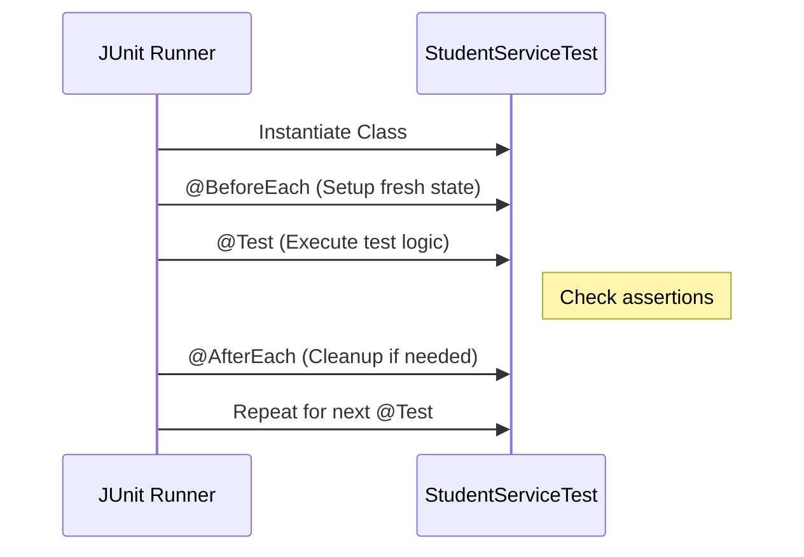

# Deep Dive: Unit Testing in Java (JUnit 5 & Mockito)

> **Python Bridge:** In Python, you likely use `pytest`. `pytest` uses simple functions and `assert` statements. In Java, tests are **Classes**, and we use **Annotations** (`@Test`) to tell the runner what to execute. Mocking in Python (`unittest.mock.Mock`) is dynamic; in Java, Mockito uses **Bytecode generation** to create type-safe mocks.

---

## 1. JUnit 5 vs Pytest Comparison

| Feature | Python (Pytest) | Java (JUnit 5) |
|---|---|---|
| **Test Marker** | Function name starts with `test_` | `@Test` annotation on method |
| **Setup Code** | `@pytest.fixture` | `@BeforeEach` or `@BeforeAll` |
| **Assertions** | `assert x == y` | `assertEquals(x, y)` |
| **Exceptions** | `with pytest.raises(Error):` | `assertThrows(Error.class, () -> ...)` |
| **Suite Level** | `conftest.py` | `@Suite` or Class hierarchy |

---

## 2. The JUnit 5 Lifecycle



---

## 3. Mocking Deep Dive (Mockito)

In Python, you can mock anything because it's dynamic. In Java, we use **Mockito** to create "fake" versions of our interfaces.

```java
// How to create a Mock in Java
StudentService mockService = Mockito.mock(StudentService.class);

// How to define behavior (Pytest-mock: return_value=...)
when(mockService.findById(1)).thenReturn(new Student(1, "Mock", 4.0, "CS"));

// How to verify calls (Pytest-mock: assert_called_once_with)
verify(mockService).findById(1);
```

### Why Mock?
1. **Isolation:** Test the UI without needing a real database or real service logic.
2. **Speed:** Mocks are instant; real logic (like API calls) is slow.
3. **Control:** Force a mock to `throw` an exception to test your error handling.

---

## 4. 4-Layer Commenting in Tests

When writing tests for the Student Manager, we follow the same standards:

1. **Header:** Purpose of the test class.
2. **Class-level:** Python equivalent and setup strategy.
3. **Method-level:** The specific "Scenario" being tested (e.g., "Success Case", "Edge Case").
4. **Inline:** Triple-A pattern (**Arrange**, **Act**, **Assert**).

```java
@Test
void testAddStudent() {
    // Arrange: Create data
    Student s = new Student(10, "Test", 3.0, "Math");
    
    // Act: Perform action
    service.addStudent(s);
    
    // Assert: Verify result
    assertEquals(s, service.findById(10));
}
```

---

## 5. Interview Questions

### Conceptual
**Q: What is the benefit of `@BeforeEach` over creating objects inside the `@Test` method?**
> **A:** `@BeforeEach` ensures **Test Independence**. If one test modifies the `service` state, the next test gets a completely fresh instance. Creating objects inside each test leads to code duplication and maintenance headaches.

**Q: In Python, I use `pytest.mark.parametrize`. What is the Java equivalent?**
> **A:** Java uses `@ParameterizedTest` combined with `@ValueSource` or `@MethodSource`. This allows you to run the same test logic with multiple inputs (e.g., testing different invalid GPA values in one method).

### Scenario/Debug
**Q: A test passed on your machine but fails in CI. It only fails if run after `testDeleteStudent`. Why?**
> **A:** This is a **Leaky State** bug. The `testDeleteStudent` likely modified a static shared variable or a database that wasn't cleaned up. In Java unit tests, avoid `static` state in services to prevent this "Order of Execution" dependency.
