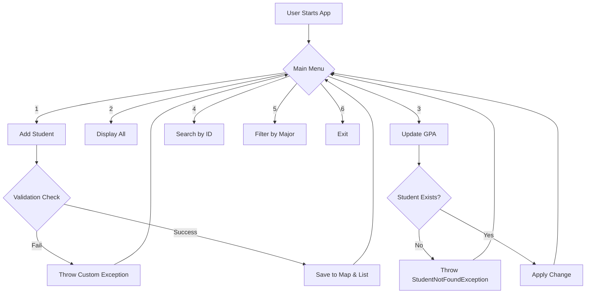

# Mini-Project 01: Student Management System (Java Foundation)

> **Python Bridge:** This project is the equivalent of building a CLI-based Student Manager in Python using `pydantic` for models, a `list[dict]` or `dict` for storage, and custom `Exception` classes for validation. In Java, we replace `dict` with strongly-typed `Objects`, `pydantic` with `Encapsulation`, and `os.environ` with `Interfaces`.

---

## 1. Project Requirements

Build a robust CLI application that performs CRUD operations on Student records.

- **Data Model:** `id` (int), `name` (String), `gpa` (double), `major` (String).
- **Storage:** Use `ArrayList` for sequence and `HashMap` for O(1) ID-based lookups.
- **Validation:** 
  - GPA must be between 0.0 and 4.0.
  - Name cannot be empty.
  - ID must be unique.
- **Operations:**
  - Add Student
  - View All Students
  - Update GPA
  - Remove Student
  - Search by ID
  - Filter by Major (using Java Streams)
- **Standards:** Comprehensive exception handling and 4-layer documentation.

---

## 2. System Flow



---

## 3. Python vs. Java Mental Model

| Task | Python (The Pythonic Way) | Java (The Deep Practitioner Way) |
|---|---|---|
| **Data Structure** | `dict` or `TypedDict` | `class Student` (Private fields + Getters) |
| **Logic Layer** | Logic in main script | `interface StudentService` + Impl |
| **Errors** | `raise Exception("msg")` | `throw new BusinessException("msg")` |
| **Filtering** | `[s for s in students if s['major'] == 'CS']` | `students.stream().filter(s -> s.getMajor().equals("CS")).collect(Collectors.toList())` |

---

## 4. How to Run

```powershell
# From the project root
./gradlew :00-java-foundation:mini-project-01-student-manager:run
```

---

## 5. Interview Questions

### Conceptual
**Q: Why use both an `ArrayList` and a `HashMap` for storage?**
> **A:** An `ArrayList` preserves insertion order and is efficient for sequential view-all operations. A `HashMap` (mapping ID -> Student) provides O(1) lookup time for specific records, preventing costly linear searches through a list when the dataset grows.

**Q: How does Java's Exception Hierarchy improve the Student Manager?**
> **A:** By creating specific checked exceptions like `StudentNotFoundException` and unchecked exceptions like `InvalidGPAException`, we force the developer (and the UI) to handle distinct business states separately rather than relying on generic strings or `None` checks.

### Scenario/Debug
**Q: You are seeing duplicate student IDs in the system despite having validation. What happened?**
> **A:** Likely the `HashMap` key was not correctly updated, or multiple threads accessed the storage without `ConcurrentHashMap` or `synchronized` blocks. For this project, we assume single-threaded access but maintain unique IDs through the `Map.containsKey()` check pre-insertion.
