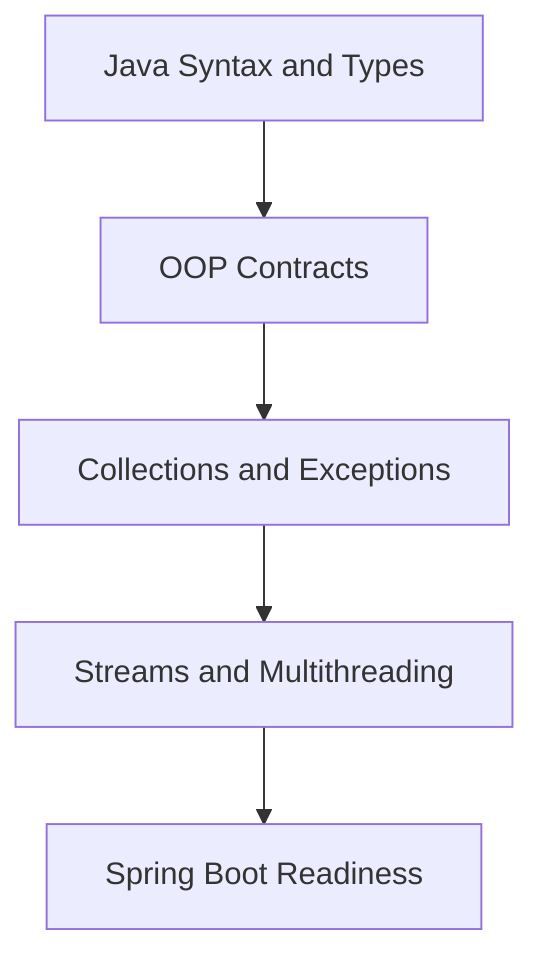

# Java Foundation One-Page Cheat Sheet



## Python to Java Fast Bridge

| Python | Java | Why it matters |
|---|---|---|
| dynamic variable | declared type | the compiler enforces contracts earlier |
| `@dataclass` | `record` | immutable data carriers become explicit |
| list comprehension | `stream().filter().map()` | common service-layer transformation style |
| `threading.Thread` | `ExecutorService` | bounded concurrency is the production default |
| `try/except` | `try/catch` | checked vs unchecked design matters |

## High-Value Rules

| Topic | Rule to remember |
|---|---|
| Strings | Use `.equals()`, not `==`, for value comparison |
| Collections | Pick the data structure for behavior, not convenience |
| Records | Great for immutable boundaries, not mutable domain state |
| Exceptions | Do not swallow exceptions just to "keep going" |
| Threads | Prefer executors over raw thread creation |

## Spring-Relevant Traps

| Trap | Why it hurts later |
|---|---|
| confusing `int` and `Integer` | `null` handling and collection behavior become surprising |
| mutable shared objects | singleton Spring beans become race-condition factories |
| weak `equals()` / `hashCode()` thinking | caches, sets, and ORM identity logic get messy |
| wrong collection choice | silent performance and ordering bugs appear in APIs |

## Mental Model

```text
Java foundation -> stronger type contracts -> safer service code
Java collections -> predictable data behavior -> better repository and DTO code
Java executors -> controlled concurrency -> safer request and job handling
```

## Read These First

1. `README.md`
2. `MINDMAP.md`
3. `03-advanced-oop/explanation/07-records.md`
4. `08-multithreading/explanation/04-executor-service.md`

## Interview Questions

1. Why are immutable objects safer in multi-threaded Spring applications?
2. When would you choose a record over a class with setters?
3. Why is `ExecutorService` a better default than `new Thread(...)`?
