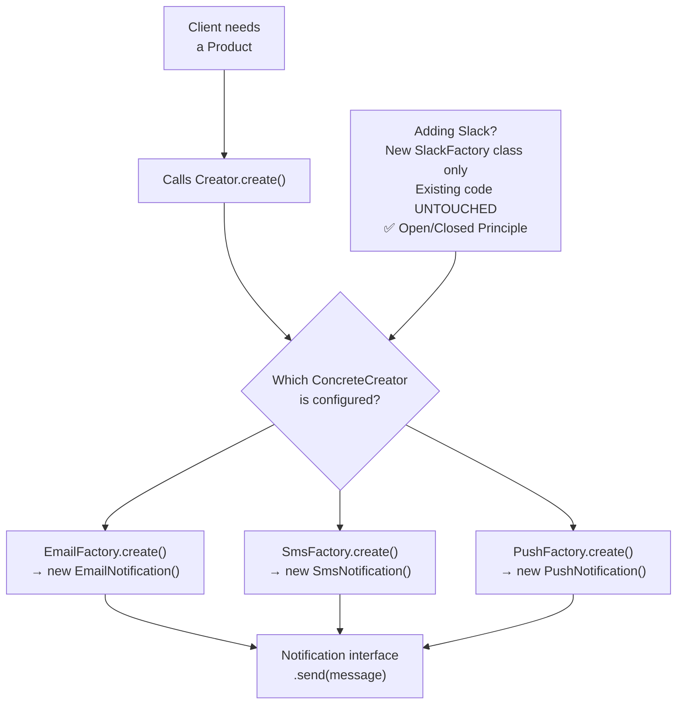

# Factory Method Pattern — Let Subclasses Decide

## Diagram: Factory Method Structure



## The Problem It Solves

```
Without Factory:
  if (type.equals("email"))    return new EmailNotification();
  if (type.equals("sms"))      return new SmsNotification();
  if (type.equals("push"))     return new PushNotification();
  // Adding Slack? Must modify THIS code → violates Open/Closed!

With Factory:
  NotificationFactory factory = getFactory(type);
  Notification n = factory.create();  // Factory decides which class
  // Adding Slack? Just add SlackFactory. Existing code UNTOUCHED!
```

---

## 1. Structure

```
┌─────────────────────┐         ┌──────────────────────┐
│  <<interface>>      │         │  <<interface>>       │
│     Creator         │         │     Product          │
│  ───────────────    │         │  ──────────────      │
│  + create(): Product│─creates→│  + execute()         │
└─────────────────────┘         └──────────────────────┘
         △                               △
    ┌────┴─────┐                    ┌────┴──────┐
    │          │                    │           │
EmailFactory  SmsFactory      EmailNotif    SmsNotif
```

### Implementation

```java
// Product interface
interface Notification {
    void send(String message);
}

// Concrete products
class EmailNotification implements Notification {
    public void send(String msg) { System.out.println("📧 Email: " + msg); }
}
class SmsNotification implements Notification {
    public void send(String msg) { System.out.println("📱 SMS: " + msg); }
}

// Factory interface
interface NotificationFactory {
    Notification create();
}

// Concrete factories
class EmailFactory implements NotificationFactory {
    public Notification create() { return new EmailNotification(); }
}
class SmsFactory implements NotificationFactory {
    public Notification create() { return new SmsNotification(); }
}
```

---

## 2. Simple Factory vs Factory Method

```
Simple Factory (NOT a GoF pattern):
┌──────────────────────────────────┐
│ NotificationFactory              │
│   static create(String type)     │  ← ONE class with if/else
│     "email" → EmailNotification  │
│     "sms"   → SmsNotification    │
└──────────────────────────────────┘
❌ Must modify factory to add types

Factory Method (GoF pattern):
┌──────────────────┐     ┌──────────────┐
│ EmailFactory      │     │ SmsFactory    │
│   create() → Email│     │  create()→Sms │
└──────────────────┘     └──────────────┘
✅ Add new factory class — existing code untouched
```

---

## 3. Spring's Factory Pattern

```
Spring BeanFactory:
┌──────────────────────────────────────────┐
│ ApplicationContext (BeanFactory)          │
│                                          │
│  @Bean                                   │
│  public DataSource dataSource() {        │
│      return new HikariDataSource();      │  ← Factory method!
│  }                                       │
│                                          │
│  @Bean                                   │
│  public CacheManager cacheManager() {    │
│      return new RedisCacheManager();     │  ← Another factory!
│  }                                       │
└──────────────────────────────────────────┘

Every @Bean method IS a factory method.
Spring's ApplicationContext IS the factory.
```

---

## Python Bridge

| Java Factory Method | Python Equivalent |
|---|---|
| `interface NotificationFactory { Notification create(); }` | Protocol class or callable returning base type |
| Concrete factory subclass | Function returning the concrete type |
| `@Bean` method in `@Configuration` | FastAPI dependency function: `def get_service() -> Service` |
| `BeanFactory` / `ApplicationContext` | FastAPI `Depends()` container |
| `FactoryBean<T>` | `functools.lru_cache` wrapping a factory function |

**Critical Difference:** Python uses duck typing — no interface is needed. A factory is simply any callable that returns the right type. Java's static typing requires the `interface`/`abstract` contract to be explicit. Spring's `@Bean` method is the most common Java factory you'll write day-to-day, and it maps directly to FastAPI's dependency injection functions.

## 🎯 Interview Questions

**Q1: What's the difference between Simple Factory and Factory Method?**
> Simple Factory is a single class with conditional creation logic (not a GoF pattern). Factory Method defines an interface for creation and lets subclasses decide the concrete type — following Open/Closed Principle. Simple Factory requires modification when adding types; Factory Method requires only a new subclass.

**Q2: How does Spring use the Factory pattern?**
> Every `@Bean` method in a `@Configuration` class is a factory method. `BeanFactory` / `ApplicationContext` is the abstract factory that creates and manages all beans. `FactoryBean<T>` is a special interface for complex bean creation logic.

**Q3: When would you choose Factory Method over Constructor?**
> When the exact class to instantiate isn't known at compile time, when creation logic is complex, when you want to decouple client code from concrete classes, or when you need to return cached/pooled instances instead of always creating new ones.
