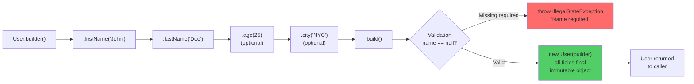

# Builder Pattern — Step-by-Step Construction

## Diagram: Builder Construction Flow



## The Problem

```
// Constructor with too many parameters — which is which?
new User("John", "Doe", 25, true, false, "NYC", null, "john@mail.com");
//       ???    ???   ???  ???   ???    ???   ???    ???

// Builder makes it readable:
User user = User.builder()
    .firstName("John")
    .lastName("Doe")
    .age(25)
    .active(true)
    .city("NYC")
    .email("john@mail.com")
    .build();
```

---

## 1. Structure

```
Client                  Builder                     Product
  │                       │                           │
  │  builder()            │                           │
  ├──────────────────────→│                           │
  │  .name("John")        │                           │
  ├──────────────────────→│ sets name                 │
  │  .age(25)             │                           │
  ├──────────────────────→│ sets age                  │
  │  .build()             │                           │
  ├──────────────────────→│──── creates ─────────────→│
  │                       │     validates              │ User
  │←──────────────────────────────────────────────────┤ (immutable)
```

### Implementation

```java
public class User {
    private final String name;     // immutable!
    private final String email;
    private final int age;
    private final String city;

    private User(Builder builder) {  // private constructor
        this.name = builder.name;
        this.email = builder.email;
        this.age = builder.age;
        this.city = builder.city;
    }

    public static Builder builder() { return new Builder(); }

    public static class Builder {
        private String name;
        private String email;
        private int age;
        private String city;

        public Builder name(String name)   { this.name = name; return this; }
        public Builder email(String email) { this.email = email; return this; }
        public Builder age(int age)        { this.age = age; return this; }
        public Builder city(String city)   { this.city = city; return this; }

        public User build() {
            // Validation before creation
            if (name == null) throw new IllegalStateException("Name required");
            return new User(this);
        }
    }
}
```

---

## 2. Builder in Spring / JDK

```
Spring uses builders everywhere:

ResponseEntity.ok()                    ← Builder start
    .header("X-Custom", "value")       ← chaining
    .body(data);                       ← terminal

UriComponentsBuilder.fromPath("/api")
    .pathSegment("users", "{id}")
    .queryParam("active", true)
    .build(42);                        ← /api/users/42?active=true

JDK builders:
StringBuilder, StringBuffer           ← mutable string building
Stream.builder()                       ← build streams
HttpClient.newBuilder()                ← HTTP client (Java 11)
```

---

## 3. Lombok @Builder

```java
@Builder
@Getter
public class User {
    private final String name;
    private final String email;
    private final int age;
}
// Lombok generates the entire Builder class at compile time
// Usage: User.builder().name("John").email("j@m.com").age(25).build()
```

---

## Python Bridge

| Java Builder | Python Equivalent |
|---|---|
| `User.builder().name("x").build()` | `@dataclass` with `field(default=None)` — keyword args |
| `@Builder` (Lombok) | `@dataclass` auto-generates `__init__` |
| `build()` with validation | `__post_init__` in `@dataclass` for validation |
| `private User(Builder builder)` (immutable) | `@dataclass(frozen=True)` |
| `ResponseEntity.ok().header(...).body(...)` | Method chaining via `return self` in Python |

**Critical Difference:** Python's `@dataclass` with keyword arguments achieves the same readability without needing a separate Builder class. Java requires the Builder pattern because constructors only accept positional args and can't be named. With Java records (Java 16+), simple immutable data carriers no longer need Builder — but complex objects with many optional fields still benefit from `@Builder`.

## 🎯 Interview Questions

**Q1: Builder vs Constructor vs Setter — when to use each?**
> Constructor: ≤ 3 required parameters. Setter: mutable objects (JavaBeans). Builder: > 3 params, optional params, immutable objects, or when readability matters. Builder also enables validation at `build()` time.

**Q2: Why does each setter in Builder return `this`?**
> To enable **method chaining** (fluent API). Without it, you'd need a separate statement for each property. Returning `this` allows `.name("x").age(25).build()` in a single expression.

**Q3: How does @Builder interact with inheritance?**
> Lombok's `@Builder` doesn't handle inheritance well by default. Use `@SuperBuilder` on both parent and child classes to support builder inheritance with proper method chaining.
