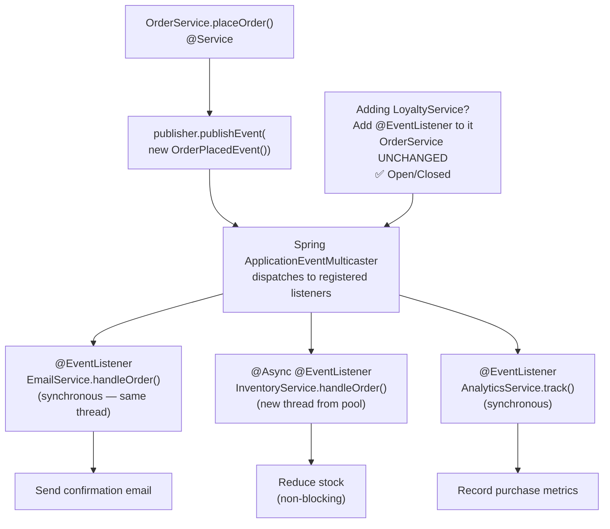

# Observer Pattern — Event-Driven Communication

## Diagram: Spring Event Flow



## The Problem

```
Without Observer:
  OrderService.placeOrder() {
      saveOrder();
      emailService.sendConfirmation();    ← tight coupling
      inventoryService.reduceStock();     ← knows about inventory
      analyticsService.trackPurchase();   ← knows about analytics
      // Adding loyalty points? MODIFY this method!
  }

With Observer:
  OrderService.placeOrder() {
      saveOrder();
      eventPublisher.publish(new OrderPlacedEvent(order));
      // Email, inventory, analytics, loyalty — all listen independently!
  }
```

---

## 1. Structure

```
┌──────────────────┐           ┌──────────────────┐
│     Subject       │   notify  │    Observer       │
│  (Event Source)    │──────────→│  (Event Listener) │
│  ────────────────  │          │  ────────────────  │
│  + subscribe(obs)  │          │  + update(event)   │
│  + notify(event)   │          └──────────────────┘
└──────────────────┘                    △
                              ┌────────┴────────┐
                              │                 │
                        EmailListener    InventoryListener
```

### Core Java Implementation

```java
// Event
record OrderEvent(String orderId, double total) {}

// Observer interface
interface OrderObserver {
    void onOrderPlaced(OrderEvent event);
}

// Subject
class OrderService {
    private List<OrderObserver> observers = new ArrayList<>();

    public void subscribe(OrderObserver obs) { observers.add(obs); }

    public void placeOrder(String id, double total) {
        // ... save order logic ...
        OrderEvent event = new OrderEvent(id, total);
        observers.forEach(obs -> obs.onOrderPlaced(event)); // notify all
    }
}
```

---

## 2. Spring's Event System

```
Spring events — the PRODUCTION way to do Observer:

┌──────────────┐     publish     ┌─────────────────┐
│ OrderService  ├───────────────→│ ApplicationEvent │
│  @Component   │                │  OrderPlacedEvent│
└──────────────┘                └────────┬──────────┘
                                         │
                           Spring dispatches to all listeners:
                                         │
                    ┌────────────────────┼────────────────────┐
                    ▼                    ▼                    ▼
           @EventListener       @EventListener       @EventListener
           EmailService         InventoryService     AnalyticsService
```

```java
// Event class
public class OrderPlacedEvent extends ApplicationEvent {
    private final String orderId;
    
    public OrderPlacedEvent(Object source, String orderId) {
        super(source);
        this.orderId = orderId;
    }
}

// Publisher
@Service
public class OrderService {
    @Autowired
    private ApplicationEventPublisher publisher;
    
    public void placeOrder(String orderId) {
        // ... business logic ...
        publisher.publishEvent(new OrderPlacedEvent(this, orderId));
    }
}

// Listeners (decoupled!)
@Component
public class EmailService {
    @EventListener
    public void handleOrder(OrderPlacedEvent event) {
        // send confirmation email
    }
}

@Component
public class InventoryService {
    @Async @EventListener  // runs in separate thread!
    public void handleOrder(OrderPlacedEvent event) {
        // reduce stock
    }
}
```

---

## Python Bridge

| Java Observer / Spring Events | Python Equivalent |
|---|---|
| `ApplicationEventPublisher.publishEvent()` | Python `signal` library, or FastAPI `BackgroundTasks` |
| `@EventListener` | `@receiver` in Django signals, or explicit callback registration |
| `@Async @EventListener` | FastAPI `BackgroundTasks.add_task()` |
| `publisher.publishEvent(new OrderEvent())` | `asyncio.create_task()` for async side-effects |
| Synchronous `@EventListener` | `signal.send()` in Django (synchronous) |

**Critical Difference:** Python async frameworks (FastAPI) use `BackgroundTasks` for post-request side effects — which is exactly what `@Async @EventListener` does in Spring. Django's signal system is synchronous-first, like Spring's default `@EventListener`. The key advantage of Spring's system over manual callbacks is transaction awareness: `@TransactionalEventListener(phase=AFTER_COMMIT)` fires only after a successful commit — no equivalent in Python ORMs without manual wiring.

## 🎯 Interview Questions

**Q1: What's the difference between synchronous and asynchronous event listeners in Spring?**
> By default, `@EventListener` methods execute synchronously in the same thread as the publisher. Adding `@Async` makes them execute in a separate thread from the task executor pool. Async is preferred for non-critical side effects (email, analytics) that shouldn't slow down the main flow.

**Q2: Observer vs Message Queue — when to use which?**
> Observer (Spring Events) is for intra-application communication within a single JVM. Message queues (RabbitMQ, Kafka) are for inter-service communication across multiple JVMs/services with guaranteed delivery, persistence, and retry. Use events for in-process decoupling; use queues for distributed systems.

**Q3: What happens if an @EventListener throws an exception?**
> For synchronous listeners, the exception propagates back to the publisher, potentially rolling back the transaction. For `@Async` listeners, the exception is handled by the `AsyncUncaughtExceptionHandler`. This is why critical operations should be in the main flow, not in listeners.
