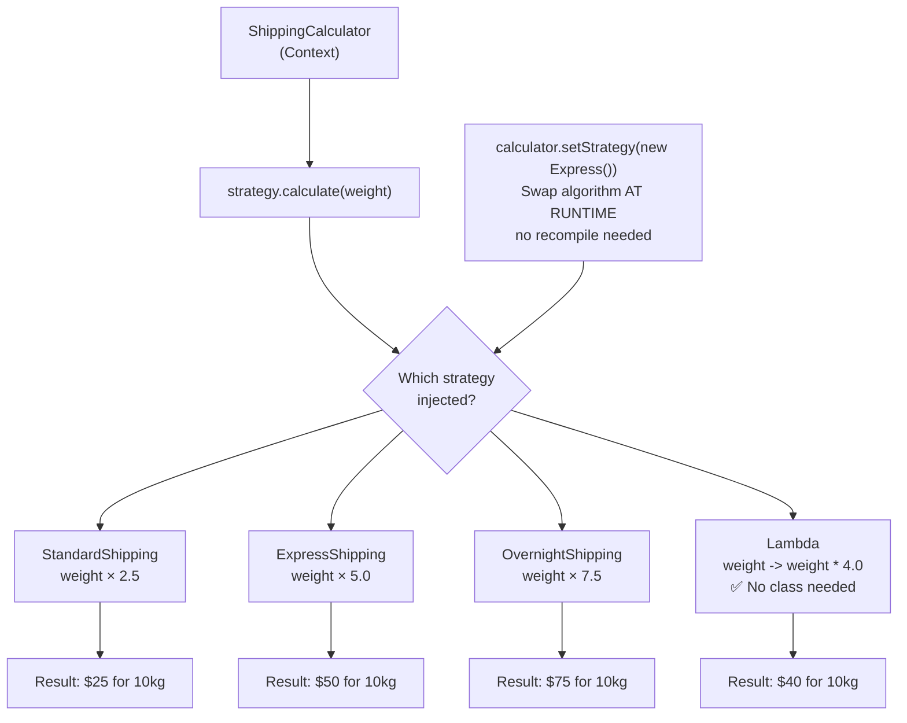

# Strategy Pattern — Swappable Algorithms

## Diagram: Strategy Swap at Runtime



## The Problem

```
Without Strategy:
  double calculate(String type, double amount) {
      if (type.equals("standard"))  return amount * 0.1;
      if (type.equals("express"))   return amount * 0.2;
      if (type.equals("overnight")) return amount * 0.3;
      // New shipping type? Add another if. Violates Open/Closed!
  }

With Strategy:
  double calculate(ShippingStrategy strategy, double amount) {
      return strategy.calculate(amount);  // Strategy decides the algorithm!
  }
```

---

## 1. Structure

```
┌──────────────────┐        ┌────────────────────────┐
│     Context       │ uses   │  <<interface>>         │
│  ────────────────  │──────→│  Strategy              │
│  - strategy       │        │  ──────────────────    │
│  + execute()      │        │  + calculate(amount)   │
└──────────────────┘        └────────────────────────┘
                                       △
                          ┌────────────┼────────────┐
                          │            │            │
                    StandardShip  ExpressShip  OvernightShip
```

### Implementation

```java
// Strategy interface (or use functional interface!)
@FunctionalInterface
interface ShippingStrategy {
    double calculate(double weight);
}

// Concrete strategies
class StandardShipping implements ShippingStrategy {
    public double calculate(double weight) { return weight * 2.5; }
}
class ExpressShipping implements ShippingStrategy {
    public double calculate(double weight) { return weight * 5.0; }
}

// Context
class ShippingCalculator {
    private ShippingStrategy strategy;

    public void setStrategy(ShippingStrategy strategy) {
        this.strategy = strategy;
    }
    public double calculate(double weight) {
        return strategy.calculate(weight);
    }
}

// Usage — strategies are interchangeable:
calculator.setStrategy(new StandardShipping());  // $25 for 10kg
calculator.setStrategy(new ExpressShipping());   // $50 for 10kg
calculator.setStrategy(weight -> weight * 7.5); // Lambda! $75 for 10kg
```

---

## 2. Strategy = Functional Interfaces

```
With Java 8+, Strategy pattern simplifies to:

Before (classes):                    After (lambdas):
┌──────────────────────┐            ┌──────────────────────┐
│ class StandardShip   │            │ weight -> weight * 2.5│
│   implements Strategy│    →       │                      │
│   calculate(w)       │            │ (one line!)          │
│     return w * 2.5   │            └──────────────────────┘
└──────────────────────┘

Java's built-in Strategy patterns:
  Comparator      → sorting strategy
  Predicate       → filtering strategy
  Function<T,R>   → transformation strategy
  Consumer<T>     → action strategy
```

---

## 3. Spring's Strategy Pattern

```
Spring Auth uses Strategy everywhere:

SecurityFilterChain
      │
      ▼
AuthenticationManager
      │ delegates to
      ▼
┌─────────────────────────────────────────────┐
│ AuthenticationProvider (Strategy interface)   │
├─────────────────────────────────────────────┤
│ DaoAuthenticationProvider (username/password) │
│ JwtAuthenticationProvider (JWT token)          │
│ OAuth2AuthenticationProvider (Google/GitHub)   │
│ LdapAuthenticationProvider (corporate LDAP)   │
└─────────────────────────────────────────────┘

Add Google login? Just add another AuthenticationProvider.
Existing code unchanged!
```

---

## Python Bridge

| Java Strategy | Python Equivalent |
|---|---|
| `@FunctionalInterface ShippingStrategy` | Any callable (function, lambda, class with `__call__`) |
| `calculator.setStrategy(new Express())` | `calculator.strategy = express_fn` |
| `strategy.calculate(weight)` | `strategy(weight)` — Python callables are first-class |
| Lambda strategy: `weight -> weight * 5` | `lambda weight: weight * 5` — identical concept |
| `Comparator` (built-in strategy) | `key=lambda x: x.price` in `sorted()` |

**Critical Difference:** Python functions are first-class objects — Strategy is the natural Python style. You don't need a `@FunctionalInterface` annotation or an interface at all; any callable works. In Java, the `@FunctionalInterface` annotation plus lambda support (Java 8+) closes this gap, letting you write strategies as lambdas rather than full classes.

## 🎯 Interview Questions

**Q1: How is Strategy different from Template Method?**
> Strategy uses **composition** (has-a): the algorithm is an injected object. Template Method uses **inheritance** (is-a): the algorithm skeleton is in a base class, subclasses override steps. Strategy is more flexible (swap at runtime); Template Method is simpler for fixed workflows.

**Q2: Can you give a JDK example of Strategy pattern?**
> `Comparator` is the classic example. `Collections.sort(list, comparator)` — the sorting algorithm is fixed (TimSort), but the comparison strategy is injected. `Predicate` in Stream's `filter()`, and `Function` in `map()` are also strategies.

**Q3: How does Spring's `AuthenticationProvider` implement Strategy?**
> `AuthenticationManager` is the context that holds multiple `AuthenticationProvider` strategies. Each provider handles a specific auth type (form login, JWT, OAuth2). The manager iterates through providers until one successfully authenticates — this is Strategy + Chain of Responsibility combined.
