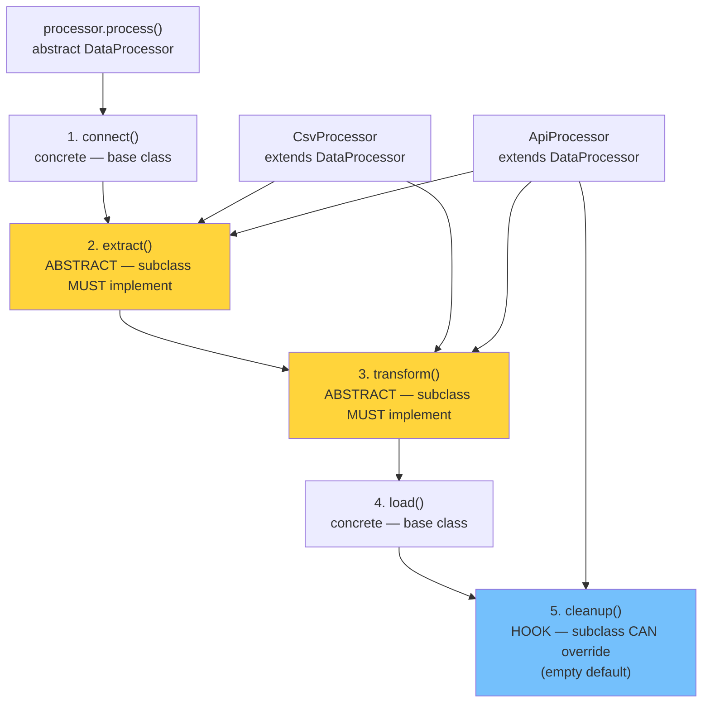

# Template Method Pattern — Define the Skeleton

## Diagram: Template Method Execution Skeleton



## The Problem

```
ETL Pipeline:
  1. Connect to data source       ← SAME for all sources
  2. Extract data                 ← DIFFERENT (CSV vs API vs DB)
  3. Transform data               ← DIFFERENT (parsing logic varies)
  4. Load into warehouse           ← SAME for all sources
  5. Close connections             ← SAME for all sources

Template Method: Base class defines steps 1,4,5.
                 Subclasses implement steps 2,3.
```

---

## 1. Structure

```
┌───────────────────────────────────┐
│  <<abstract>> DataProcessor       │
│  ─────────────────────────────    │
│  + process()         ← FINAL     │
│    1. connect()      ← concrete  │
│    2. extract()      ← ABSTRACT  │
│    3. transform()    ← ABSTRACT  │
│    4. load()         ← concrete  │
│    5. cleanup()      ← HOOK      │
│  ─────────────────────────────    │
│  # extract(): abstract            │
│  # transform(): abstract          │
│  # cleanup(): hook (empty default)│
└───────────────────────────────────┘
              △
     ┌────────┴────────┐
     │                 │
CsvProcessor      ApiProcessor
  extract()          extract()
  transform()        transform()
  cleanup()          cleanup()
```

### Implementation

```java
abstract class DataProcessor {
    // Template method — defines the algorithm skeleton
    public final void process() {   // final = can't override!
        connect();
        extract();      // abstract — subclass MUST implement
        transform();    // abstract — subclass MUST implement
        load();
        cleanup();      // hook — subclass CAN override
    }

    private void connect() { System.out.println("Connecting..."); }
    private void load()    { System.out.println("Loading to warehouse..."); }

    protected abstract void extract();
    protected abstract void transform();

    // Hook method — optional override (empty default)
    protected void cleanup() { /* nothing by default */ }
}

class CsvProcessor extends DataProcessor {
    protected void extract()   { System.out.println("Reading CSV rows"); }
    protected void transform() { System.out.println("Parsing CSV fields"); }
}

class ApiProcessor extends DataProcessor {
    protected void extract()   { System.out.println("Calling REST API"); }
    protected void transform() { System.out.println("Parsing JSON response"); }
    protected void cleanup()   { System.out.println("Closing HTTP connection"); }
}
```

---

## 2. Spring's Template Pattern

```
Spring's *Template classes are THE classic example:

JdbcTemplate.query(sql, rowMapper):
  1. Get connection from pool        ← Template handles
  2. Create PreparedStatement         ← Template handles
  3. Execute query                    ← Template handles
  4. Map each row to object           ← YOU provide (RowMapper)
  5. Close statement                  ← Template handles
  6. Return connection to pool        ← Template handles
  7. Handle exceptions                ← Template handles

You only write step 4. Template handles the boring 6 steps!

Other Spring Templates:
  RestTemplate    → HTTP request lifecycle
  TransactionTemplate → begin/commit/rollback
  RedisTemplate  → connection management
  KafkaTemplate  → producer lifecycle
```

---

## 3. Template Method vs Strategy

```
┌─────────────────┬────────────────────┬─────────────────────┐
│                 │ Template Method    │ Strategy            │
├─────────────────┼────────────────────┼─────────────────────┤
│ Relationship    │ IS-A (inheritance) │ HAS-A (composition) │
│ Customization   │ Override methods   │ Inject object       │
│ Runtime change  │ ❌ Fixed at compile│ ✅ Swap at runtime  │
│ Coupling        │ Tighter            │ Looser              │
│ Use when        │ Fixed algorithm    │ Interchangeable     │
│                 │ with varying steps │ algorithms          │
└─────────────────┴────────────────────┴─────────────────────┘
```

---

## Python Bridge

| Java Template Method | Python Equivalent |
|---|---|
| `abstract class DataProcessor` | Class with `@abstractmethod` from `abc` module |
| `public final void process()` | Method that calls `self._extract()` — no `final` in Python |
| `protected abstract void extract()` | `@abstractmethod def extract(self)` |
| Hook method (empty default) | Method with empty `pass` body — subclass can override |
| `JdbcTemplate.query(sql, RowMapper)` | No direct equiv; Python ORMs handle this internally |

**Critical Difference:** Python has no `final` keyword — nothing prevents a subclass from overriding the template method itself. Java's `final` enforces the Hollywood Principle mechanically; Python relies on convention and documentation. Also, Python's multiple inheritance and mixins offer an alternative to Template Method for composing behavior — e.g., a `LoggingMixin` that overrides `process()` and calls `super().process()`.

## 🎯 Interview Questions

**Q1: Why is the template method typically `final`?**
> To prevent subclasses from changing the algorithm's structure. Subclasses should only customize specific steps via abstract/hook methods, not redefine the entire workflow. This is the Hollywood Principle: "Don't call us, we'll call you."

**Q2: What is a hook method?**
> A method in the base class with an empty or default implementation that subclasses can optionally override. Unlike abstract methods (which MUST be implemented), hooks provide extension points without forcing every subclass to implement them.

**Q3: How does JdbcTemplate demonstrate Template Method?**
> `JdbcTemplate` handles connection management, statement creation, exception translation, and resource cleanup. You only provide the query and a `RowMapper` (the custom step). This eliminates boilerplate and ensures resources are always properly closed, even when exceptions occur.
