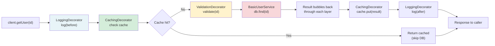

# Decorator Pattern — Wrapping Layers of Behavior

## Diagram: Decorator Onion Layers



## The Problem

```
Want to add logging, caching, and validation to a service?

Without Decorator:
  class UserService {
      User getUser(id) {
          log("Getting user " + id);       // logging concern
          if (cache.has(id)) return cache;  // caching concern
          validate(id);                     // validation concern
          User user = db.find(id);          // actual business logic
          cache.put(id, user);              // caching again!
          log("Found user " + user);        // logging again!
          return user;
      }
  }
  // 6 lines of cross-cutting concerns, 1 line of actual logic!

With Decorator:
  UserService service = new LoggingDecorator(
                          new CachingDecorator(
                            new ValidationDecorator(
                              new BasicUserService())));
  // Each layer adds ONE concern. Compose like LEGO!
```

---

## 1. Structure

```
┌─────────────────────────────────┐
│    <<interface>> Component       │
│    + execute(): Result           │
└────────────┬────────────────────┘
             │
     ┌───────┴──────────┐
     │                  │
ConcreteComp     <<abstract>> Decorator
                 │  - wrapped: Component  │
                 │  + execute()           │
                 └────────┬──────────────┘
                     ┌────┴──────┐
                     │           │
                LoggingDec   CachingDec

Execution flow (onion layers):
┌──────────────────────────────────────────┐
│ LoggingDecorator                          │
│  log("before")                            │
│  ┌──────────────────────────────────────┐ │
│  │ CachingDecorator                      │ │
│  │  if (cached) return cached            │ │
│  │  ┌──────────────────────────────────┐ │ │
│  │  │ BasicUserService                  │ │ │
│  │  │  return db.find(id)               │ │ │
│  │  └──────────────────────────────────┘ │ │
│  │  cache.put(result)                    │ │
│  └──────────────────────────────────────┘ │
│  log("after")                             │
└──────────────────────────────────────────┘
```

---

## 2. Java I/O — Classic Decorator

```
Java I/O is BUILT on Decorator pattern:

InputStream (Component)
  ├── FileInputStream (ConcreteComponent)
  └── FilterInputStream (Decorator base)
        ├── BufferedInputStream (adds buffering)
        ├── DataInputStream (adds typed reads)
        └── GZIPInputStream (adds decompression)

Composing I/O decorators:
  InputStream raw  = new FileInputStream("data.gz");
  InputStream buf  = new BufferedInputStream(raw);      // + buffering
  InputStream gzip = new GZIPInputStream(buf);           // + decompression
  DataInputStream data = new DataInputStream(gzip);     // + typed reads

  // Or chained:
  var in = new DataInputStream(
              new GZIPInputStream(
                new BufferedInputStream(
                  new FileInputStream("data.gz"))));
```

---

## 3. Spring's Decorator Examples

```
HandlerInterceptor chain = Decorator pattern:

Request → SecurityInterceptor
              → LoggingInterceptor
                  → CorsInterceptor
                      → Controller  (actual handler)
                  ← CorsInterceptor
              ← LoggingInterceptor
          ← SecurityInterceptor → Response

Each interceptor wraps the next, adding cross-cutting behavior.
```

---

## Python Bridge

| Java Decorator | Python Equivalent |
|---|---|
| `class LoggingDecorator implements UserService` | `@functools.wraps` / `@app.middleware` in FastAPI |
| Wrap via constructor: `new Logging(new Caching(base))` | `wrapped = logging_decorator(caching_decorator(base_fn))` |
| Java I/O: `new BufferedInputStream(new FileInputStream(...))` | `io.BufferedReader(open(...))` — identical concept! |
| Spring `HandlerInterceptor` chain | FastAPI `middleware` stack |
| Spring AOP `@Around` advice | Python `@decorator` syntax |

**Critical Difference:** Python's `@decorator` syntax IS the Decorator pattern — it's a first-class language feature. `@app.middleware("http")` in FastAPI is exactly a decorator wrapping every request. Java lacks syntactic sugar; you must explicitly wrap objects. Spring AOP uses CGLIB proxies to apply decorators transparently at runtime, matching what Python decorators do at function-definition time.

## 🎯 Interview Questions

**Q1: Decorator vs Inheritance — why use Decorator?**
> Inheritance is static (compile-time) and creates class explosion (BufferedGZIPEncryptedFileInputStream?). Decorator is dynamic (runtime) and composable — mix and match layers independently. Decorator follows the Single Responsibility Principle: each decorator does ONE thing.

**Q2: How is Java I/O an example of Decorator?**
> `InputStream` is the component interface. `FileInputStream` is the concrete component. `FilterInputStream` is the decorator base class. `BufferedInputStream`, `GZIPInputStream`, etc. are concrete decorators that wrap any `InputStream` and add behavior while maintaining the same interface.

**Q3: Decorator vs Proxy — what's the difference?**
> Decorator adds NEW behavior to an object. Proxy controls ACCESS to an object (lazy loading, security, remote). Structurally they're identical (both wrap a component), but the intent differs. Spring AOP uses the Proxy pattern, not Decorator.
