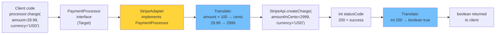

# Adapter Pattern — Bridge Incompatible Interfaces

## Diagram: Adapter Translation Flow



## The Problem

```
Your code expects:              Legacy library provides:
┌──────────────────┐            ┌──────────────────────┐
│ interface Logger  │            │ class LegacyLogger   │
│   log(String msg) │            │   writeLog(String s) │
└──────────────────┘            └──────────────────────┘
          ↑                              ↑
    Your code calls                Can't modify this!
    logger.log(msg)                (third-party library)

Adapter bridges the gap:
┌─────────────────────────────────────────┐
│ class LegacyLoggerAdapter implements Logger │
│   log(msg) → legacyLogger.writeLog(msg)    │
└─────────────────────────────────────────┘
```

---

## 1. Structure

```
Client → Target Interface → Adapter → Adaptee

┌──────────┐    ┌───────────────────┐    ┌──────────────────┐
│  Client   │───→│ <<interface>>     │    │    Adaptee       │
│           │    │    Target         │    │  (legacy/3rd     │
│           │    │  + request()      │    │   party code)    │
│           │    └───────────────────┘    │  + specificReq() │
│           │           △                └──────────────────┘
│           │           │                          ↑
│           │    ┌──────┴──────────┐                │
│           │    │    Adapter       │──── wraps ─────┘
│           │    │  + request()     │
│           │    │    → adaptee     │
│           │    │      .specificReq│
│           │    └─────────────────┘
└──────────┘
```

---

## 2. Implementation

```java
// Target interface (what our code expects)
interface PaymentProcessor {
    boolean charge(double amount, String currency);
}

// Adaptee (third-party SDK with different interface)
class StripeApi {
    int createCharge(long amountInCents, String cur) {
        // Stripe charges in cents, returns status code
        return 200; // success
    }
}

// Adapter
class StripeAdapter implements PaymentProcessor {
    private final StripeApi stripe = new StripeApi();

    @Override
    public boolean charge(double amount, String currency) {
        long cents = Math.round(amount * 100);  // dollars → cents
        int status = stripe.createCharge(cents, currency);
        return status == 200;  // int → boolean
    }
}

// Client code — doesn't know about Stripe!
PaymentProcessor processor = new StripeAdapter();
processor.charge(29.99, "USD");
```

---

## 3. Spring's Adapter Examples

```
Spring MVC uses adapters extensively:

┌────────────────┐     ┌──────────────────────┐     ┌────────────────┐
│ DispatcherServlet│────→│ HandlerAdapter       │────→│ Controller     │
│  (Client)       │     │ (bridges the gap)    │     │ (Adaptee)      │
└────────────────┘     └──────────────────────┘     └────────────────┘

HandlerAdapter implementations:
  RequestMappingHandlerAdapter  → @Controller methods
  SimpleControllerHandlerAdapter → Controller interface
  HttpRequestHandlerAdapter     → HttpRequestHandler

Why? DispatcherServlet doesn't know what type of handler it's calling.
The adapter converts the handler to a standard interface.

Also:
  MessageConverter → converts between HTTP body and Java objects
    Jackson → JSON ↔ Object
    JAXB   → XML ↔ Object
    String → text/plain ↔ String
```

---

## Python Bridge

| Java Adapter | Python Equivalent |
|---|---|
| `class StripeAdapter implements PaymentProcessor` | Wrapper class or function that translates the API |
| Object Adapter (composition) | Python class wrapping the third-party object |
| Class Adapter (inheritance) | Python class inheriting from both (multiple inheritance allowed) |
| `HandlerAdapter` in Spring MVC | No direct equiv; Python web frameworks use duck typing |
| Adapter for unit tests (mock) | `unittest.mock.patch` wraps the external API |

**Critical Difference:** Python's duck typing often eliminates the need for a formal Adapter. If the third-party object happens to have the methods you need with compatible signatures, no adapter is needed. Java's static type system requires an explicit Adapter class that implements the target interface. However, when APIs genuinely differ (Stripe's cents vs your dollars), an adapter wrapper is equally necessary in both languages.

## 🎯 Interview Questions

**Q1: Adapter vs Facade — what's the difference?**
> Adapter converts one interface to another expected by the client (1:1 mapping). Facade provides a simplified interface to a complex subsystem (1:many simplification). Adapter is about compatibility; Facade is about simplicity.

**Q2: Class Adapter vs Object Adapter?**
> Class Adapter uses inheritance (extends adaptee + implements target). Object Adapter uses composition (wraps adaptee as a field). Object Adapter is preferred in Java because Java doesn't support multiple inheritance of classes, and composition is more flexible.

**Q3: Give a real-world use case for the Adapter pattern.**
> Integrating a payment gateway: your app expects `PaymentProcessor.charge(amount)`, but Stripe's SDK has `Stripe.createCharge(cents, currency, idempotencyKey)`. An adapter translates between your interface and Stripe's API without exposing Stripe-specific concepts to your business logic.
