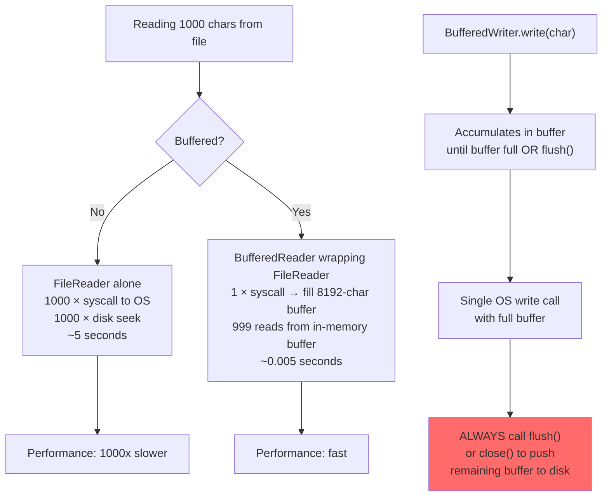

# Buffered Streams — Performance Through Batching

## Diagram: Buffered vs Unbuffered I/O



## Why Buffering Matters

```
WITHOUT Buffer (FileReader alone):
  Disk read → 1 char   → process → Disk read → 1 char ...
  1000 chars = 1000 disk reads (each takes ~5ms = 5 seconds!)

WITH Buffer (BufferedReader wrapping FileReader):
  Disk read → 8192 chars → buffer → process from buffer ...
  1000 chars = 1 disk read + 1000 memory reads (~0.005 seconds)

┌────────────────────────────────────────────────────────────┐
│  Performance Impact:                                        │
│  Unbuffered: 1,000 disk accesses for 1,000 reads           │
│  Buffered:   1 disk access for 8,192 reads                 │
│  Speedup:    ~1000x for sequential reads!                   │
└────────────────────────────────────────────────────────────┘
```

---

## 1. How the Buffer Works

```
┌──────────────────────────────────────────────────┐
│  BufferedReader (default 8192 char buffer)         │
│  ┌────────────────────────────────────────────┐   │
│  │ H│e│l│l│o│,│ │W│o│r│l│d│!│\n│T│h│i│s│...│   │
│  └──┬─────────────────────────────────────────┘   │
│     │ position                                     │
│     ▼                                              │
│  read() → 'H' (from memory, not disk)             │
│  read() → 'e' (from memory)                       │
│  ...                                               │
│  read() at pos 8192 → REFILL buffer from disk     │
└──────────────────────────────────────────────────┘
```

---

## 2. BufferedReader — Line-by-Line

```java
// The Decorator pattern in action!
try (BufferedReader br = new BufferedReader(
        new FileReader("server.log"),
        16384)) {  // custom buffer: 16KB
    
    String line;
    while ((line = br.readLine()) != null) {
        if (line.contains("ERROR")) {
            System.out.println(line);
        }
    }
}

// Java 8+ with Stream:
try (BufferedReader br = Files.newBufferedReader(Path.of("server.log"))) {
    br.lines()
      .filter(line -> line.contains("ERROR"))
      .forEach(System.out::println);
}
```

---

## 3. BufferedWriter — Batch Writing

```java
try (BufferedWriter bw = new BufferedWriter(
        new FileWriter("report.csv"))) {
    
    bw.write("id,name,score");
    bw.newLine();
    
    for (int i = 1; i <= 100_000; i++) {
        bw.write(i + ",Student" + i + "," + (60 + i % 40));
        bw.newLine();
    }
    // bw.flush() called automatically on close()
}
```

```
flush() semantics:
┌─────────────────────────────────────────────┐
│ write("data")  → goes to BUFFER (memory)    │
│ flush()        → buffer → DISK              │
│ close()        → flush() + release resources│
│                                              │
│ ⚠️ Data in buffer is LOST on crash!         │
│ Call flush() after critical writes.          │
└─────────────────────────────────────────────┘
```

---

## Python Bridge

| Java Buffered I/O | Python Equivalent |
|---|---|
| `new BufferedReader(new FileReader(path))` | `open(path, 'r')` — buffered by default |
| `new BufferedWriter(new FileWriter(path))` | `open(path, 'w')` — buffered by default |
| `BufferedReader.readLine()` | `f.readline()` |
| `BufferedWriter.newLine()` | `f.write('\n')` or `print(..., file=f)` |
| `bw.flush()` | `f.flush()` — same concept |
| `new BufferedInputStream(fis, 65536)` | `open(path, 'rb', buffering=65536)` |

**Critical Difference:** Python's `open()` is buffered by default (unlike Java's `FileReader` which is unbuffered). This is a common Java trap: using `FileReader` directly in a loop is 100x slower than wrapping it with `BufferedReader`. Python developers never hit this issue because the buffering is automatic.

---

## 🎯 Interview Questions

**Q1: What's the default buffer size in BufferedReader?**
> 8192 characters (8KB). For high-throughput file processing, you can increase it via the constructor: `new BufferedReader(reader, 65536)` for 64KB. Larger buffers reduce I/O calls but use more memory.

**Q2: When should you call flush() explicitly?**
> When you need to ensure data is written to disk immediately (logging, audit trails, real-time file sharing). `close()` calls `flush()` automatically, so it's not needed if you're about to close. For long-running writes, flush periodically to prevent data loss on crash.

**Q3: BufferedInputStream vs BufferedReader — which for what?**
> `BufferedInputStream` buffers raw bytes — for binary data. `BufferedReader` buffers characters — for text with proper encoding support. Using byte buffer on text can corrupt multi-byte UTF-8 characters.
