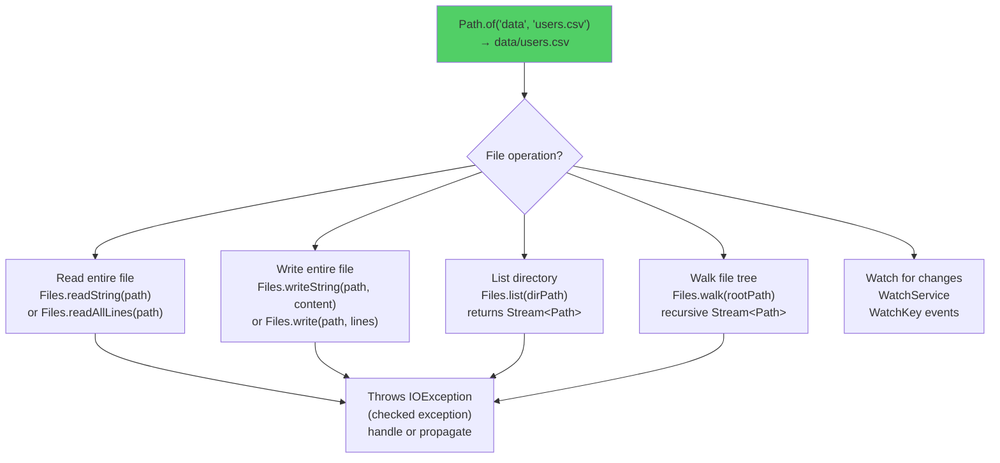

# NIO.2 API — Modern File Operations (Java 7+)

## Diagram: NIO.2 Path Operations



## Old API vs New API

```
┌────────────────────┬──────────────────────┬─────────────────────────┐
│                    │ java.io.File (OLD)   │ java.nio.file (NIO.2)   │
├────────────────────┼──────────────────────┼─────────────────────────┤
│ Path rep           │ new File("a/b.txt")  │ Path.of("a", "b.txt")   │
│ Read file          │ FileReader + loop    │ Files.readString(path)   │
│ Write file         │ FileWriter + loop    │ Files.writeString(path)  │
│ List dir           │ file.list()          │ Files.list(path)         │
│ Walk tree          │ recursive methods    │ Files.walk(path)         │
│ Error handling     │ returns false        │ throws IOException       │
│ Symbolic links     │ ❌ Not supported     │ ✅ Full support          │
│ File attributes    │ Limited              │ Rich attribute views     │
│ Atomic operations  │ ❌                   │ ✅ move with ATOMIC      │
└────────────────────┴──────────────────────┴─────────────────────────┘

Rule: Always use NIO.2 (Path + Files) for new code.
```

---

## 1. Path — The Modern File Reference

```java
// Creating paths
Path p1 = Path.of("data", "users.json");         // data/users.json
Path p2 = Path.of("/home/app/config.yml");        // absolute
Path p3 = Path.of("src").resolve("main/java");    // src/main/java

// Path operations
p1.getFileName();      // users.json
p1.getParent();        // data
p1.toAbsolutePath();   // /full/path/data/users.json
p1.normalize();        // removes .. and .

// Relative paths
Path base = Path.of("/home/app");
Path file = Path.of("/home/app/logs/error.log");
base.relativize(file); // logs/error.log
```

---

## 2. Files — One-Liner Operations

```java
// Read entire file (Java 11+)
String content = Files.readString(Path.of("config.json"));

// Read lines
List<String> lines = Files.readAllLines(Path.of("data.csv"));

// Write string
Files.writeString(Path.of("output.txt"), "Hello, NIO!");

// Write lines
Files.write(Path.of("log.txt"),
    List.of("Line 1", "Line 2", "Line 3"),
    StandardOpenOption.APPEND, StandardOpenOption.CREATE);

// Copy, Move, Delete
Files.copy(source, target, StandardCopyOption.REPLACE_EXISTING);
Files.move(source, target, StandardCopyOption.ATOMIC_MOVE);
Files.deleteIfExists(path);

// Check file properties
Files.exists(path);
Files.isDirectory(path);
Files.size(path);         // bytes
Files.getLastModifiedTime(path);
```

---

## 3. Walking Directory Trees

```java
// List directory contents (1 level)
try (Stream<Path> entries = Files.list(Path.of("src"))) {
    entries.forEach(System.out::println);
}

// Walk entire tree (recursive)
try (Stream<Path> tree = Files.walk(Path.of("project"))) {
    tree.filter(Files::isRegularFile)
        .filter(p -> p.toString().endsWith(".java"))
        .forEach(p -> System.out.println("Java file: " + p));
}

// Find files matching pattern
try (Stream<Path> matches = Files.find(
        Path.of("project"), 10,  // max depth
        (path, attrs) -> path.toString().endsWith(".log")
                       && attrs.size() > 1_000_000)) {
    matches.forEach(System.out::println);
}
```

---

## Python Bridge

| Java NIO.2 | Python Equivalent |
|---|---|
| `Path.of("data", "users.csv")` | `Path("data") / "users.csv"` (pathlib) |
| `Files.readString(path)` | `path.read_text(encoding='utf-8')` |
| `Files.writeString(path, content)` | `path.write_text(content)` |
| `Files.list(dirPath)` | `path.iterdir()` |
| `Files.walk(rootPath)` | `path.rglob("*")` or `os.walk()` |
| `Files.exists(path)` | `path.exists()` |
| `Files.copy(src, dst)` | `shutil.copy2(src, dst)` |
| `WatchService` | `watchdog` library (third-party) |

**Critical Difference:** Python's `pathlib.Path` is conceptually identical to Java's `java.nio.file.Path` — both represent paths as objects with rich methods rather than raw strings. Python adopted this approach later (Python 3.4) taking direct inspiration from Java NIO.2. Both should be preferred over their legacy equivalents (`java.io.File` vs `os.path` string operations).

---

## 🎯 Interview Questions

**Q1: Path.of() vs new File() — why prefer Path?**
> `Path` is immutable, supports symbolic links, provides richer operations (relativize, normalize), and works with the `Files` utility class for one-liner operations. `File` returns `false` for errors instead of throwing exceptions, making failures silent.

**Q2: Why use Files.walk() with try-with-resources?**
> `Files.walk()` returns a `Stream<Path>` that holds an open directory handle. If not closed, it leaks file handles. `try-with-resources` ensures the stream (and the underlying handle) is closed even if an exception occurs.

**Q3: How does Spring use NIO.2?**
> `ClassPathResource` and `FileSystemResource` use `Path` internally. Spring's `ResourceLoader` abstracts file access so you can load from classpath, filesystem, or URL with the same API. `spring.config.import` uses `Path` for config file resolution.
