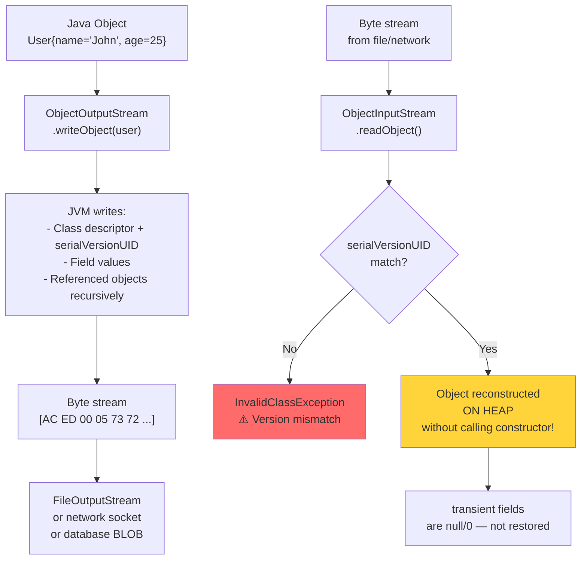

# Serialization — Object ↔ Bytes

## Diagram: Serialization Pipeline



## What is Serialization?

```
┌─────────────────────────────────────────────────────────┐
│  Serialization = Convert object graph → byte stream     │
│  Deserialization = Convert byte stream → object graph   │
│                                                          │
│  User user = new User("John", 25);                      │
│       │                                                  │
│  Serialize: ObjectOutputStream.writeObject(user)         │
│       │                                                  │
│       ▼                                                  │
│  [AC ED 00 05 73 72 00 04 55 73 65 72 ...]  (bytes)    │
│       │                                                  │
│  Deserialize: ObjectInputStream.readObject()             │
│       │                                                  │
│       ▼                                                  │
│  User user = {name="John", age=25}  (reconstructed)     │
└─────────────────────────────────────────────────────────┘
```

---

## 1. Java Serialization (Know It, Avoid It)

```java
// Step 1: Implement Serializable
class User implements Serializable {
    private static final long serialVersionUID = 1L;  // version control!
    
    private String name;
    private int age;
    private transient String password;  // NOT serialized!
}

// Step 2: Serialize
try (ObjectOutputStream oos = new ObjectOutputStream(
        new FileOutputStream("user.ser"))) {
    oos.writeObject(new User("John", 25));
}

// Step 3: Deserialize
try (ObjectInputStream ois = new ObjectInputStream(
        new FileInputStream("user.ser"))) {
    User user = (User) ois.readObject();  // unsafe cast!
}
```

---

## 2. Why Java Serialization is Dangerous

```
⚠️ SECURITY WARNING:
┌──────────────────────────────────────────────────┐
│ Deserialization can execute ARBITRARY CODE!        │
│                                                    │
│ Attacker crafts malicious byte stream              │
│   → readObject() constructs object graph           │
│   → Constructor/finalizer runs attacker's code     │
│   → Remote Code Execution (RCE)!                   │
│                                                    │
│ Famous vulnerabilities:                             │
│   Apache Commons Collections (2015)                │
│   WebLogic, Jenkins, JBoss — all affected          │
│                                                    │
│ Joshua Bloch (Effective Java): "There is no reason │
│ to use Java serialization in new systems."         │
└──────────────────────────────────────────────────┘

Use instead: JSON (Jackson), Protocol Buffers, Avro
```

---

## 3. serialVersionUID

```
┌────────────────────────────────────────────────────┐
│ What happens when class changes after serialization?│
│                                                      │
│ Version 1: class User { String name; int age; }      │
│ Serialize → file                                     │
│                                                      │
│ Version 2: class User { String name; int age;        │
│                         String email; }  ← NEW FIELD │
│ Deserialize → InvalidClassException!                 │
│   (serialVersionUID mismatch)                        │
│                                                      │
│ Solution: Declare explicit serialVersionUID           │
│   private static final long serialVersionUID = 1L;   │
│   → JVM won't auto-calculate, uses YOUR version      │
│   → New fields get default values on deserialization  │
└────────────────────────────────────────────────────┘
```

---

## Python Bridge

| Java Serialization | Python Equivalent |
|---|---|
| `implements Serializable` | `pickle.dumps(obj)` — any object |
| `ObjectOutputStream.writeObject(obj)` | `pickle.dumps(obj)` |
| `ObjectInputStream.readObject()` | `pickle.loads(data)` |
| `transient` field (excluded) | Override `__getstate__` to exclude fields |
| `serialVersionUID` | No equivalent — pickle is more fragile |
| `readObject()` / `writeObject()` custom | `__reduce__` or `__getstate__` / `__setstate__` |
| Jackson `@JsonIgnore` | Pydantic `Field(exclude=True)` |

**Critical Difference:** Python's `pickle` is simpler but **less safe** — unpickling untrusted data is a remote code execution vulnerability (same as Java's native deserialization). Both Java (via `ObjectInputStream` gadget chains) and Python `pickle` have had critical deserialization CVEs. In practice, always prefer JSON/Protobuf over native serialization for data exchange. Use Java serialization only for short-lived caches.

---

## 🎯 Interview Questions

**Q1: What does `transient` do?**
> Marks a field to be excluded from serialization. Use for sensitive data (passwords), derived/cached values, or non-serializable fields (database connections). On deserialization, transient fields get their default values (null, 0, false).

**Q2: Why is Java serialization considered a security risk?**
> Deserialization constructs objects from untrusted byte streams, potentially executing arbitrary code via gadget chains (sequences of method calls triggered by object construction). This has led to critical RCE vulnerabilities in major frameworks.

**Q3: What's the modern alternative to Java serialization?**
> JSON via Jackson (human-readable, Spring's default). Protocol Buffers (compact binary, schema-enforced). Avro (schema evolution support, used in Kafka). All are safer because they don't execute arbitrary code during deserialization.
