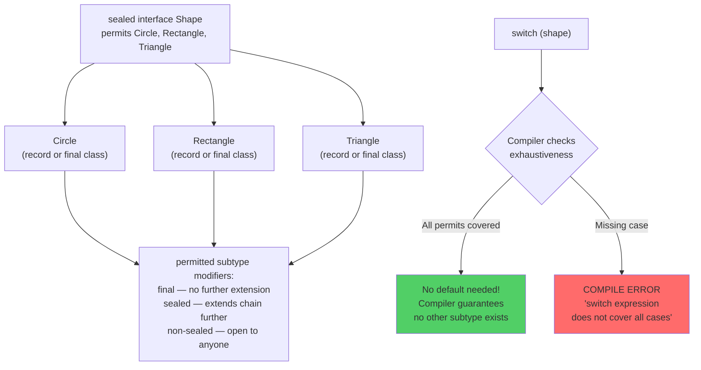

# Sealed Classes — Controlled Inheritance (Java 17)

## Diagram: Sealed Class Hierarchy and Exhaustiveness



## The Problem Sealed Classes Solve

```
BEFORE Sealed Classes:
┌────────────────────────────────────────────────────────┐
│ interface Shape { }                                     │
│                                                         │
│ // ANYONE can implement Shape — you can't control it!   │
│ class Circle implements Shape { }                       │
│ class Square implements Shape { }                       │
│ class WeirdShape implements Shape { } // ← unexpected!  │
│                                                         │
│ // switch is NEVER exhaustive:                          │
│ switch (shape) {                                        │
│   case Circle c → ...                                   │
│   case Square s → ...                                   │
│   default → ???  // forced to handle unknown types      │
│ }                                                       │
└────────────────────────────────────────────────────────┘

AFTER Sealed Classes:
┌────────────────────────────────────────────────────────┐
│ sealed interface Shape permits Circle, Square, Triangle│
│                                                         │
│ record Circle(double radius) implements Shape {}        │
│ record Square(double side) implements Shape {}          │
│ record Triangle(double a, double b, double c)           │
│     implements Shape {}                                 │
│                                                         │
│ // class WeirdShape implements Shape {} ← COMPILE ERROR!│
│                                                         │
│ // switch IS exhaustive — no default needed:            │
│ switch (shape) {                                        │
│   case Circle c → Math.PI * c.radius() * c.radius();   │
│   case Square s → s.side() * s.side();                  │
│   case Triangle t → heronArea(t.a(), t.b(), t.c());    │
│ }                                                       │
└────────────────────────────────────────────────────────┘
```

---

## 1. Syntax

```java
// Sealed interface — declares allowed implementations
public sealed interface Result<T> permits Success, Failure, Pending {
}

// Each permitted class must be: final, sealed, or non-sealed
public record Success<T>(T value) implements Result<T> {}      // final (records are)
public record Failure<T>(String error) implements Result<T> {}  // final
public non-sealed class Pending<T> implements Result<T> {}      // open for extension

// Usage with exhaustive switch (Java 21+)
String message = switch (result) {
    case Success<String> s -> "Got: " + s.value();
    case Failure<String> f -> "Error: " + f.error();
    case Pending<String> p -> "Loading...";
    // No default needed! Compiler knows all cases.
};
```

---

## 2. Why Sealed + Records is Powerful

```
Pattern: Algebraic Data Types (ADTs)

sealed interface JsonValue permits JsonString, JsonNumber, JsonBool, JsonNull, JsonArray, JsonObject {}
record JsonString(String value) implements JsonValue {}
record JsonNumber(double value) implements JsonValue {}
record JsonBool(boolean value) implements JsonValue {}
record JsonNull() implements JsonValue {}
record JsonArray(List<JsonValue> elements) implements JsonValue {}
record JsonObject(Map<String, JsonValue> fields) implements JsonValue {}

This gives you:
✅ Type-safe JSON representation
✅ Exhaustive switch (handle every variant)
✅ Compiler error if you add a new variant and miss a switch case
✅ No instanceof chains or visitor pattern needed
```

---

## Python Bridge

| Java Sealed Class | Python Equivalent |
|---|---|
| `sealed interface Shape permits Circle, Square` | `Union[Circle, Square]` type hint (no runtime enforcement) |
| Exhaustive `switch` — compile error if missing | `match` with `case _: raise ValueError(...)` — runtime only |
| `final class Circle implements Shape` | No `final` in Python — convention only |
| Compiler proves exhaustiveness | `mypy` can check exhaustiveness with `assert_never()` |
| ADT (Algebraic Data Type) pattern | Python `dataclasses` + `Union` type |

**Critical Difference:** Java sealed classes provide *compile-time* exhaustiveness checking — if you add a new permitted subtype, every `switch` that doesn't cover it becomes a compile error. Python's type system (even with mypy) provides this at static analysis time only, not at runtime. For domain modeling (e.g., `Result = Success | Failure | Pending`), Java sealed interfaces give stronger guarantees. This is the core use case: replacing stringly-typed enums with rich polymorphic types.

---

## 🎯 Interview Questions

**Q1: What are the three modifiers for subclasses of a sealed class?**
> `final` — cannot be extended further. `sealed` — further restricts its own subclasses. `non-sealed` — reopens for unrestricted extension. Records are implicitly `final`.

**Q2: How do sealed classes enable exhaustive switch?**
> The compiler knows ALL possible subtypes from the `permits` clause. In a `switch` expression, it verifies every permitted subtype is handled and reports a compile error if any case is missing — no `default` branch needed.

**Q3: Sealed classes vs enums?**
> Enums: fixed set of singleton values (same type, no data variation). Sealed classes: fixed set of types, each with different fields. Use enums for `Status.ACTIVE/INACTIVE`. Use sealed classes for `Shape = Circle(r) | Square(s)`.
