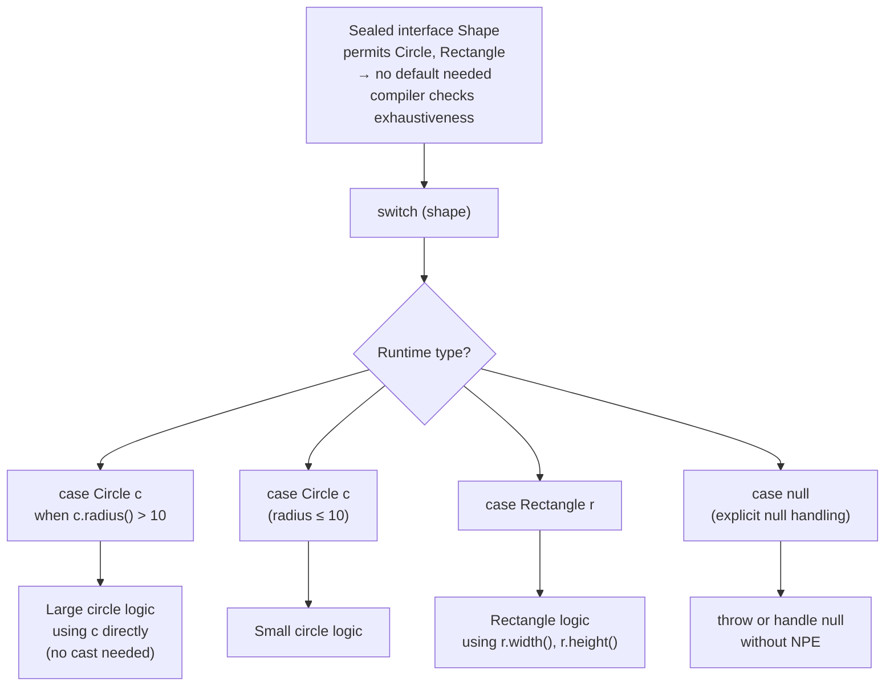

# Pattern Matching — Smart Casting (Java 16+)

## Diagram: Pattern Matching Switch Dispatch



## 1. instanceof Pattern Matching

```
BEFORE (Java 8):                          AFTER (Java 16+):
┌────────────────────────────────┐       ┌────────────────────────────┐
│ if (obj instanceof String) {   │       │ if (obj instanceof         │
│   String s = (String) obj;     │ →     │     String s) {            │
│   System.out.println(s.length);│       │   System.out.println(      │
│ }                              │       │     s.length());           │
└────────────────────────────────┘       │ }                          │
  Two operations: check + cast            └────────────────────────────┘
                                           One operation: check + bind
```

```java
// Pattern variable scope
Object obj = "Hello";
if (obj instanceof String s && s.length() > 3) {
    System.out.println(s.toUpperCase());  // s in scope
}
// s is OUT of scope here

// Works with negation too:
if (!(obj instanceof String s)) {
    return;  // early exit
}
// s is in scope here (compiler knows obj IS String)
```

---

## 2. Switch Pattern Matching (Java 21)

```java
// Pattern matching in switch expressions
static String describe(Object obj) {
    return switch (obj) {
        case Integer i when i > 0  -> "Positive int: " + i;
        case Integer i             -> "Non-positive int: " + i;
        case String s when s.isEmpty() -> "Empty string";
        case String s              -> "String: " + s;
        case int[] arr             -> "Array of length " + arr.length;
        case null                  -> "null value";
        default                    -> "Unknown: " + obj.getClass();
    };
}

// With sealed classes — exhaustive, no default needed!
sealed interface Shape permits Circle, Square {}
record Circle(double r) implements Shape {}
record Square(double s) implements Shape {}

double area(Shape shape) {
    return switch (shape) {
        case Circle c -> Math.PI * c.r() * c.r();
        case Square s -> s.s() * s.s();
    };
}
```

---

## 3. Record Patterns — Destructuring (Java 21)

```java
record Point(int x, int y) {}
record Line(Point start, Point end) {}

// Nested destructuring!
String describe(Object obj) {
    return switch (obj) {
        case Point(int x, int y)
            -> "Point at (" + x + "," + y + ")";
        case Line(Point(int x1, int y1), Point(int x2, int y2))
            -> "Line from (" + x1 + "," + y1 + ") to (" + x2 + "," + y2 + ")";
        default -> "Unknown";
    };
}
```

```
Record Pattern Destructuring:
┌──────────────────────────────────────────────────┐
│  Line line = new Line(new Point(0,0), new Point(5,5));  │
│                                                  │
│  switch (line) {                                 │
│    case Line(Point(var x1, var y1),              │
│              Point(var x2, var y2)) → {          │
│      // x1=0, y1=0, x2=5, y2=5                  │
│      // Directly available without .start().x()  │
│    }                                             │
│  }                                               │
│                                                  │
│  Python equivalent: match line:                  │
│    case Line(Point(x1, y1), Point(x2, y2)): ... │
└──────────────────────────────────────────────────┘
```

---

## Python Bridge

| Java Pattern Matching | Python Equivalent |
|---|---|
| `if (obj instanceof String s)` | `if isinstance(obj, str): s = obj` — manual assignment |
| `switch (shape) { case Circle c -> ... }` | `match shape: case Circle(): ...` (Python 3.10+) |
| `case Circle c when c.radius() > 10` | `case Circle(radius=r) if r > 10:` |
| Exhaustive switch on sealed types | `match` — not compile-checked, runtime only |
| `case null` explicit in switch | `case None:` in Python match |

**Critical Difference:** Python's `match` statement (3.10+) and Java's pattern matching switch were introduced around the same time (2021-2022) with similar goals. Key difference: Python's `match` uses structural pattern matching — `case Point(x=0, y=y)` deconstructs by attribute name. Java's patterns match by type first and bind a variable — more explicit, less magic. Python's structural patterns are more powerful for deeply nested data; Java's type patterns integrate better with the class hierarchy.

---

## 🎯 Interview Questions

**Q1: What's the scope of a pattern variable?**
> The pattern variable is in scope only where the compiler can prove the match succeeded. In `if (x instanceof String s)`, `s` is in scope inside the `if` block. In `if (!(x instanceof String s)) return;`, `s` is in scope after the `if` because early return guarantees the match.

**Q2: What does `when` do in switch patterns?**
> `when` adds a guard condition to a pattern case. `case Integer i when i > 0` matches only positive integers. Guards are evaluated after the pattern matches. Order matters — more specific cases (with guards) must come before general cases.

**Q3: Why is pattern matching significant for Java?**
> It moves Java toward exhaustive, type-safe dispatch without the Visitor pattern, instanceof chains, or manual casting. Combined with sealed classes and records, it enables algebraic data type patterns similar to Rust, Kotlin, and Scala.
