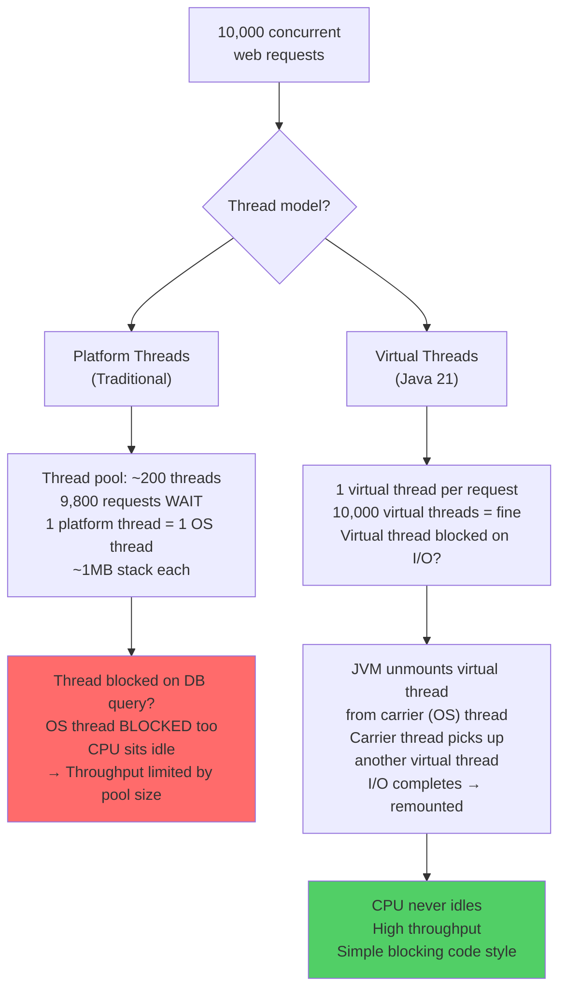

# Virtual Threads — Lightweight Concurrency (Java 21)

## Diagram: Virtual Thread Architecture



## The Problem Virtual Threads Solve

```
PLATFORM THREADS (Traditional):
┌──────────────────────────────────────────────────────────┐
│ Each thread = 1 OS thread = ~1MB stack memory             │
│                                                            │
│ 1,000 threads = ~1GB RAM consumption                      │
│ 10,000 threads = OS scheduling overhead + OOM risk        │
│                                                            │
│ Web server handling 10,000 concurrent requests?            │
│ → Thread pool of ~200 threads → rest must WAIT             │
│ → Most threads are BLOCKED on I/O (DB, network, file)     │
│ → Wasting resources on waiting!                            │
└──────────────────────────────────────────────────────────┘

VIRTUAL THREADS (Java 21):
┌──────────────────────────────────────────────────────────┐
│ Virtual thread = user-space thread = ~1KB                  │
│                                                            │
│ 1,000,000 virtual threads = ~1GB (vs 1TB for platform!)   │
│                                                            │
│ When virtual thread blocks on I/O:                         │
│   → JVM unmounts it from carrier OS thread                 │
│   → Carrier thread runs another virtual thread!            │
│   → Zero wasted resources                                  │
│                                                            │
│ Result: One-thread-per-request at massive scale            │
└──────────────────────────────────────────────────────────┘
```

---

## 1. Creating Virtual Threads

```java
// Direct creation
Thread vt = Thread.ofVirtual().start(() -> {
    System.out.println("Running in virtual thread: "
        + Thread.currentThread());
});

// Named virtual thread
Thread.ofVirtual()
    .name("worker-", 0)  // worker-0, worker-1, ...
    .start(() -> doWork());

// ExecutorService (recommended)
try (var executor = Executors.newVirtualThreadPerTaskExecutor()) {
    // Each submit() creates a new virtual thread
    for (int i = 0; i < 100_000; i++) {
        executor.submit(() -> {
            // simulate I/O (DB call, HTTP request)
            Thread.sleep(Duration.ofSeconds(1));
            return fetchFromDatabase();
        });
    }
}  // waits for all tasks to complete
```

---

## 2. When to Use Virtual Threads

```
USE Virtual Threads when:
┌──────────────────────────────────────────────────────────┐
│ ✅ I/O-bound tasks (HTTP calls, DB queries, file reads)   │
│ ✅ High-concurrency servers (web, API, chat)              │
│ ✅ Thread-per-request architecture                        │
│ ✅ Fan-out patterns (call 10 services in parallel)        │
└──────────────────────────────────────────────────────────┘

DO NOT USE Virtual Threads when:
┌──────────────────────────────────────────────────────────┐
│ ❌ CPU-bound computation (math, image processing)         │
│    → Use parallel streams or ForkJoinPool instead         │
│ ❌ With synchronized blocks holding during I/O            │
│    → "Pinning" prevents unmounting from carrier thread    │
│    → Use ReentrantLock instead of synchronized            │
│ ❌ With ThreadLocal for caching                           │
│    → 1M virtual threads = 1M copies of cached data!      │
└──────────────────────────────────────────────────────────┘
```

---

## 3. Spring Boot 3.2+ Integration

```
application.yml:
  spring:
    threads:
      virtual:
        enabled: true    # ← One line! Spring handles everything.

What this does:
  - Tomcat uses virtual threads for request handling
  - @Async methods run on virtual threads
  - Spring WebMVC gets near-WebFlux scalability
  - Without changing any application code!

┌───────────────────────────────────────────────────────┐
│ Spring MVC + Virtual Threads = Simple code + High scale│
│ Spring WebFlux + Reactor = Complex code + High scale   │
│                                                         │
│ For most apps: MVC + Virtual Threads is the right choice│
└────────────────────────────────────────────────────────┘
```

---

## Python Bridge

| Java Virtual Threads | Python Equivalent |
|---|---|
| `Thread.ofVirtual().start(runnable)` | `asyncio.create_task(coroutine)` |
| Virtual thread blocks on I/O → unmounts | `await` suspends coroutine — same concept |
| Millions of virtual threads | Millions of asyncio tasks |
| Blocking code style (no async/await) | `asyncio` requires `async def` and `await` everywhere |
| `Executors.newVirtualThreadPerTaskExecutor()` | `asyncio.TaskGroup` |
| Spring Boot 3.2 + virtual threads: set `spring.threads.virtual.enabled=true` | FastAPI is async-native |

**Critical Difference:** This is the deepest architectural difference between the platforms. Python's `asyncio` requires *explicit* cooperative multitasking — every I/O call must be `await`-ed, spreading `async def` through your entire codebase. Java virtual threads achieve the *same throughput* while letting you write normal **blocking** code — the JVM handles the scheduling transparently. Virtual threads are Java's answer to Python async, without the async "virus" that infects every function in the call stack.

---

## 🎯 Interview Questions

**Q1: Virtual threads vs platform threads — key difference?**
> Platform threads map 1:1 to OS threads (~1MB each, limited to thousands). Virtual threads are managed by the JVM (~1KB each, scale to millions). When a virtual thread blocks on I/O, the JVM unmounts it from the carrier OS thread, which then runs other virtual threads. No OS thread is wasted waiting.

**Q2: What is "thread pinning"?**
> When a virtual thread executes inside a `synchronized` block and performs a blocking operation, it "pins" the carrier OS thread — preventing other virtual threads from using it. Fix: replace `synchronized` with `ReentrantLock`, which allows proper unmounting during I/O.

**Q3: Should you use thread pools with virtual threads?**
> No! Thread pools exist to limit the number of expensive platform threads. Virtual threads are cheap — create one per task. Using a bounded pool with virtual threads defeats the purpose. Use `Executors.newVirtualThreadPerTaskExecutor()` instead.
