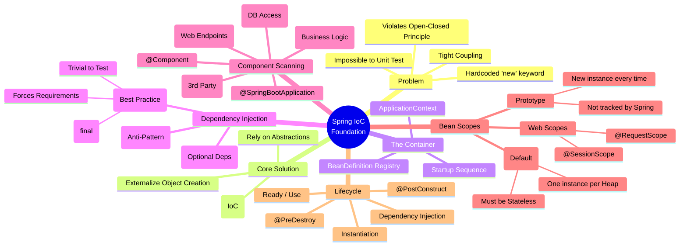

# Mindmap: Inversion of Control & Dependency Injection

```mermaid
mindmap
  root((Spring IoC
  Foundation))
    Problem
      Tight Coupling
      Hardcoded 'new' keyword
      Impossible to Unit Test
      Violates Open-Closed Principle
    Core Solution
      Inversion of Control (IoC)
      Externalize Object Creation
      Rely on Abstractions
    The Container
      ApplicationContext
      BeanDefinition Registry
      Startup Sequence
    Dependency Injection
      Field Injection (Anti-Pattern)
      Setter Injection (Optional Deps)
      Constructor Injection (Best Practice)
        Forces Requirements
        Guarantees Immutability (final)
        Trivial to Test
    Component Scanning
      @SpringBootApplication
      @Component
      @Service (Business Logic)
      @Repository (DB Access)
      @Controller (Web Endpoints)
      @Configuration & @Bean (3rd Party)
    Bean Scopes
      Singleton (Default)
        Must be Stateless
        One instance per Heap
      Prototype
        New instance every time
        Not tracked by Spring
      Web Scopes
        @RequestScope
        @SessionScope
    Lifecycle
      Instantiation
      Dependency Injection
      @PostConstruct
      Ready / Use
      @PreDestroy
```
