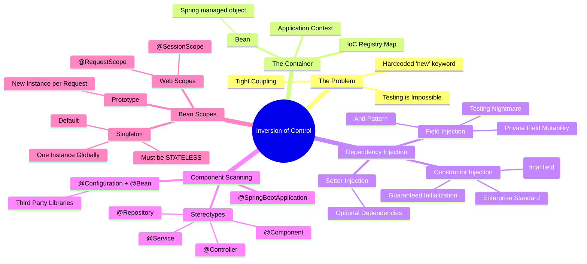

```mermaid
mindmap
  root((Inversion of Control))
    The Problem
      Tight Coupling
      Hardcoded 'new' keyword
      Testing is Impossible
    The Container
      Application Context
      IoC Registry Map
      Bean
        Spring managed object
    Dependency Injection
      Constructor Injection
        Enterprise Standard
        Immutable (final field)
        Guaranteed Initialization
      Setter Injection
        Optional Dependencies
      Field Injection
        Anti-Pattern
        Private Field Mutability
        Testing Nightmare
    Component Scanning
      @SpringBootApplication
      Stereotypes
        @Component
        @Service
        @Repository
        @Controller
      @Configuration + @Bean
        Third Party Libraries
    Bean Scopes
      Singleton
        Default
        One Instance Globally
        Must be STATELESS
      Prototype
        New Instance per Request
      Web Scopes
        @RequestScope
        @SessionScope
```
