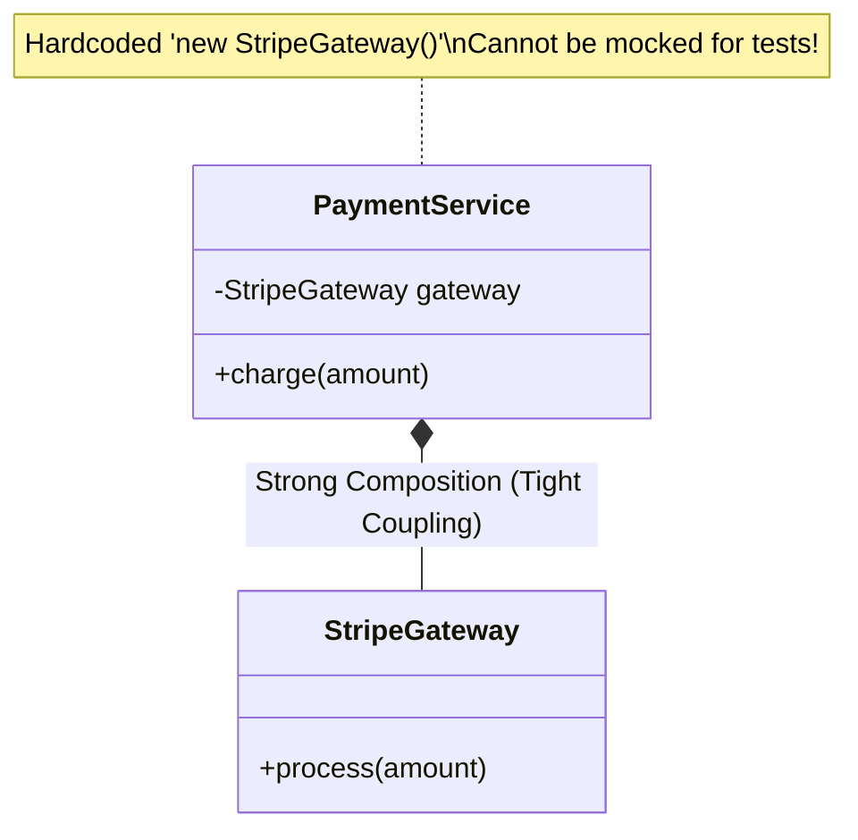
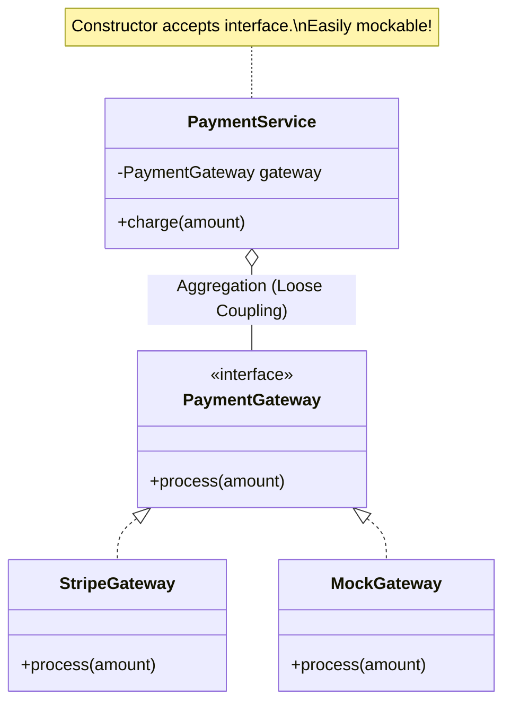

# 01 - Tight Coupling vs. Inversion of Control (IoC)

> **Python Bridge:** In Python, you might `import` a concrete class and instantiate it directly. In Spring, you define dependencies (usually interfaces) and let the framework "inject" the concrete implementation at runtime, somewhat similar to Python's `dependency_injector` library or FastAPI's `Depends()`.

Before diving into Spring Boot specifics, we must understand the core architectural problem it solves: **Tight Coupling**.

---

## 1. The Problem: Tight Coupling

In traditional Java applications, an object manually creates its own dependencies using the `new` keyword.

```java
public class PaymentService {
    // TIGHT COUPLING: PaymentService is permanently glued to StripeGateway.
    private StripeGateway gateway = new StripeGateway();

    public void charge(double amount) {
        gateway.process(amount);
    }
}
```

### Why is this disastrous for Enterprise systems?

1. **Testing is Impossible:** You cannot unit test `PaymentService` without hitting the real Stripe API. Swapping in a `MockGateway` is mathematically impossible because the `new` keyword is hardcoded.
2. **Replacement is Painful:** If the business migrates from Stripe to PayPal, you must open the `PaymentService` source code, delete `StripeGateway`, and replace it. This violates the **Open-Closed Principle (SOLID)**.



---

## 2. The Solution: Inversion of Control (IoC)

Inversion of Control (IoC) states: **Objects should not create their dependencies. Dependencies should be handed to them from the outside.**

```java
public class PaymentService {
    // LOOSE COUPLING: Depending on an Abstraction (Interface)
    private final PaymentGateway gateway;

    // The dependency is injected from the outside!
    public PaymentService(PaymentGateway gateway) {
        this.gateway = gateway;
    }

    public void charge(double amount) {
        gateway.process(amount);
    }
}
```

### The Architectural Shift

The control over *how* and *when* the dependency is created has been "inverted". The `PaymentService` no longer cares what specific gateway it is using, provided it implements the `PaymentGateway` interface.



---

## 3. The Role of the IoC Container

If an object doesn't create its dependencies, who does? 

In a small application, the `main()` method handles it (Manual Dependency Injection):

```java
public static void main(String[] args) {
    // Manual IoC Configuration
    PaymentGateway stripe = new StripeGateway(); 
    PaymentService service = new PaymentService(stripe);
    service.charge(100.0);
}
```

However, in an Enterprise application with 10,000 components, writing manual object graphs becomes an unmaintainable nightmare.

This is exactly why the **Spring Application Context (The IoC Container)** exists. It acts as an invisible factory that:
1. Discovers all your objects (`@Component`, `@Service`).
2. Figures out their dependency graph.
3. Instantiates them in the correct order.
4. Auto-injects them into each other (`@Autowired`) at startup.

---

## Interview Questions

### Conceptual
**Q: What is Inversion of Control (IoC) in the context of Spring?**
> **A:** IoC is a design principle where the flow of control regarding object creation and management is inverted. Instead of objects creating their own dependencies using the `new` keyword, an external container (the Spring IoC container) handles the instantiation, configuration, and injection of these dependencies at runtime.

**Q: Why is Tight Coupling considered bad practice in enterprise software?**
> **A:** Tight coupling makes code rigid, hard to maintain, and nearly impossible to test in isolation. When class A instantiates class B internally, you cannot unit test class A without also executing class B's logic. It also violates the Open-Closed Principle, as replacing class B with class C requires modifying class A's source code.

### Scenario/Debug
**Q: A junior developer asks why they shouldn't just write `PaymentService svc = new PaymentService(new PaypalGateway())` in their controller. How do you explain the architectural flaw?**
> **A:** Manually instantiating the service in the controller means the controller is now responsible for managing the lifecycle and dependencies of the service. If `PaymentService` suddenly requires a `DatabaseRepository` tomorrow, you must modify the controller to create the repository as well. By delegating this to Spring's IoC container, the controller only asks for a `PaymentService`, and Spring automatically resolves the entire dependency graph, making the architecture highly modular and resilient to change.
