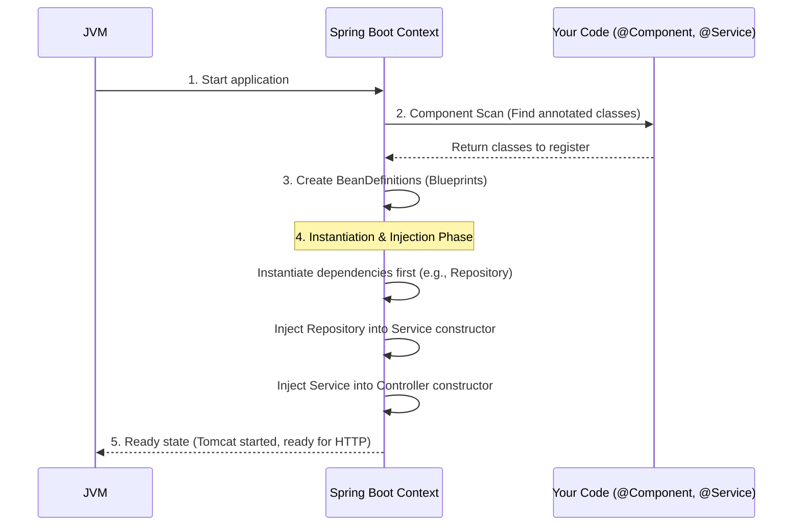
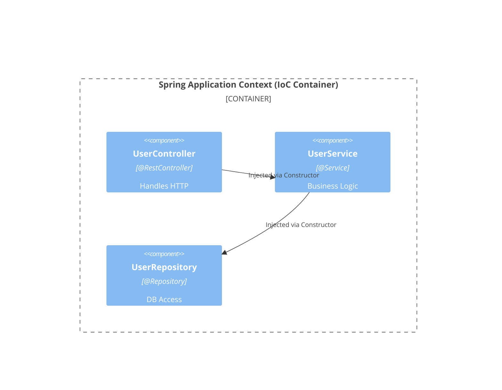

# 02 - The Spring Application Context (The IoC Container)

> **Python Bridge:** In Python, you might manually wire up dependencies in a `main.py` file or use a simple dictionary to hold singletons `services = {"user": UserService()}`. The Spring `ApplicationContext` is essentially a massive, highly-advanced version of that dictionary that automatically figures out the wiring for you.

Spring Boot operates around a central entity called the **IoC Container**, technically represented by the `ApplicationContext` interface.

---

## 1. What is a "Bean"?

In the Spring ecosystem, any object that is instantiated, assembled, and managed entirely by the Spring IoC Container is called a **Spring Bean**.

If you create an object yourself:
```java
// Just a regular Java object
UserService service = new UserService(); 
```

If Spring creates it for you (e.g., via `@Service` or `@Bean`):
```java
// This is a Spring Bean!
@Service 
public class UserService {}
```

---

## 2. How the Application Context Works (Startup Sequence)

When a Spring Boot application starts (`SpringApplication.run(App.class, args)`), the following sequence occurs:



1. **Scanning Phase:** Spring rapidly scans your designated packages looking for specific stereotype annotations (`@Component`, `@Service`, `@Repository`, `@Controller`).
2. **Registration Phase:** When it finds these classes, it creates a `BeanDefinition` (a structural blueprint) in its internal registry.
3. **Instantiation & Injection Phase:** Spring iterates through its registry, instantiates the Java objects, and aggressively resolves their dependencies. It handles the order automatically (e.g., creating the `Repository` before the `Service` that needs it).
4. **Ready State:** The `ApplicationContext` is fully loaded. It holds references to all singletons in memory. 

---

## 3. Visualizing the Container

Imagine a master Hash Map living in memory inside the JVM heap: `Map<String, Object> singletonObjects`.

When you annotate a class with `@Service`:
```java
@Service
public class UserService {
}
```
Spring essentially executes this concept behind the scenes:
```java
singletonObjects.put("userService", new UserService());
```

When a `UserController` needs a `UserService`, Spring looks it up in that exact Map and injects the reference. 



---

## Interview Questions

### Conceptual
**Q: What is the difference between an ApplicationContext and a BeanFactory?**
> **A:** `BeanFactory` is the root interface for accessing the Spring container; it provides basic IoC and DI features (lazy instantiation by default). `ApplicationContext` is a sub-interface of `BeanFactory` that adds enterprise-specific functionality such as event publishing, internationalization (AOP), and environment-specific configurations. Spring Boot uses `ApplicationContext` by default.

**Q: If you use the `new` keyword inside a Spring @Service to create another object, is that object a Spring Bean?**
> **A:** No. Objects created manually using the `new` keyword are completely invisible to the Spring container. They are not Beans, and Spring cannot inject dependencies into them or manage their lifecycle. 

### Scenario/Debug
**Q: Your application throws a `NoSuchBeanDefinitionException` at startup when trying to inject `OrderService` into `OrderController`. What are the most likely causes?**
> **A:** 1. The `OrderService` class is missing a stereotype annotation like `@Service` or `@Component`. 2. The `OrderService` class is located in a package outside of the main application's component scan path (e.g., higher up in the directory tree than the `@SpringBootApplication` class). 3. It's an interface and no implementation is provided or registered.
