# 04 - Bean Scopes and Lifecycles

> **Python Bridge:** In Python, module-level variables or classes implemented as Singleton patterns act globally. Spring Bean Scopes define exactly how many instances of a class Spring will create and how long they live in memory.

Whenever Spring Boot registers a class into the IoC Container, it assigns an explicit **Scope** defining its lifecycle.

---

## 1. The Singleton Scope (Default Context)

By default, every annotated component (`@Service`, `@Controller`, `@Repository`) in Spring Boot operates under the **Singleton Scope**.

**Architectural Mechanics:**
- Spring instantiates exactly **one instance** of your class on the Application Heap during startup.
- Every subsequent injection request (e.g., pulling it into 10 different controllers) receives the exact same memory pointer.

> **CRITICAL DANGER:** Singletons must be entirely **STATELESS**. 
> If you declare a class-level variable `private String currentUser` inside a Singleton, Thread A (processing User A's request) and Thread B (processing User B's request) will overwrite each other, causing catastrophic cross-contamination of user data. You must only store autowired dependencies at the class level.

---

## 2. The Prototype Scope

**Mechanics:**
- If you explicitly annotate a class with `@Scope("prototype")`, Spring changes its behavior mechanically.
- Every single time another class demands this bean, Spring physically calls `new` and hands over a brand new, distinct instance.
- **Trap:** Spring *does not track* Prototype beans after giving them to the requester. It is up to the JVM Garbage Collector to clean them up.

**Use Case:**
Extremely rare. Usually used when you need a complex object to hold state for a specific short-lived algorithmic operation, and you want Spring to wire its internal dependencies before handing you a fresh copy.

---

## 3. Web-Aware Scopes

If working inside a web application (Spring MVC), Spring offers specialized scopes tied to the HTTP network lifecycle:
- `@RequestScope`: A brand-new instance is generated exclusively for every single HTTP Request. Safe for holding state for one user's exact network call.
- `@SessionScope`: A single instance is generated and maintained for a user's entire HTTP Session (e.g., a Shopping Cart object attached to the user's browser cookie).

---

## 4. The Bean Lifecycle Hook Map

What happens during the exact microsecond Spring builds your Singletons?

```mermaid
stateDiagram-v2
    direction LR
    
    [*] --> Instantiation : Java 'new'
    Instantiation --> DependencyInjection : Autowire dependencies
    DependencyInjection --> PostConstruct : @PostConstruct
    
    state "Ready to Use" as Ready
    PostConstruct --> Ready
    
    Ready --> PreDestroy : Context Shutdown
    PreDestroy --> [*] : Garbage Collected
```

1. **Instantiation:** Spring calls the constructor.
2. **Dependency Injection:** Spring pushes the required beans into the constructor arguments.
3. **Initialization Callback:** Spring executes any method annotated with `@PostConstruct`. You use this to run setup logic (e.g., priming a local cache *after* the Database connection bean is securely injected).
4. **Use:** The application runs and services requests.
5. **Destruction Callback:** Before gracefully shutting down, Spring executes any method annotated with `@PreDestroy`. You use this to close open network sockets or flush buffers cleanly.

---

## Interview Questions

### Conceptual
**Q: What is the default scope of a Spring Bean, and what does it imply?**
> **A:** The default scope is Singleton. This means the Spring container creates only one instance of the bean per Spring IoC container. This single instance is cached in memory, and all subsequent requests for that named bean return the cached object. It implies the bean must be thread-safe (stateless).

**Q: Does `@Scope("prototype")` mean the bean is managed completely by Spring?**
> **A:** No. Spring instantiates, configures, and hands over a prototype bean, but does not manage its complete lifecycle. Unlike singletons, Spring does NOT execute `@PreDestroy` callbacks for prototype beans. The client code is responsible for cleaning up prototype scoped objects.

### Scenario/Debug
**Q: A developer adds `private int requestCount = 0;` to a `@RestController` and increments it inside an endpoint method. Is this safe?**
> **A:** Absolutely not. The `@RestController` is a Singleton. A single instance is shared simultaneously across hundreds of Tomcat worker threads processing concurrent HTTP requests. Increments (`requestCount++`) are not atomic, leading to profound Race Conditions and lost updates. The controller must be strictly stateless.
