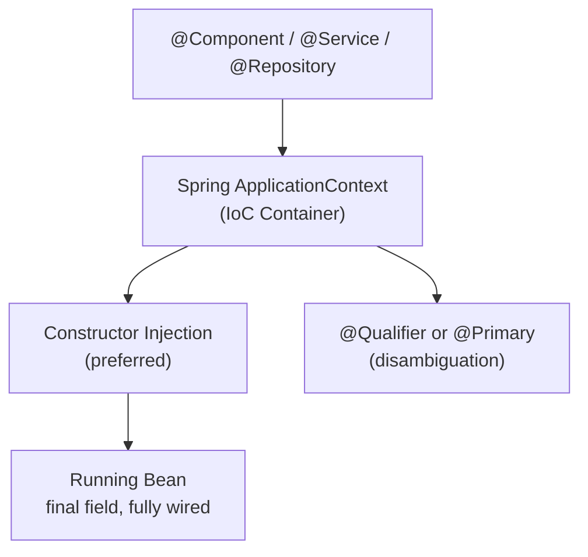

# IoC & Dependency Injection — One-Page Cheat Sheet

## Fast Rules

| Rule | Detail |
|---|---|
| Default scope | Singleton — one instance per context |
| Injection method | Constructor injection > field injection |
| Field must be | `final` — guarantees immutability |
| Depend on | Interface, not concrete class |
| Two beans, same type | Use `@Primary` or `@Qualifier` |
| Prototype scope | Use only for stateful, request-specific beans |
| `@Transactional` on private | Has NO effect — proxy can't intercept |
| Self-invocation | Bypasses AOP proxy — extract to new bean |

## Python Bridge

| Java Spring | Python FastAPI |
|---|---|
| `@Service` bean | FastAPI router / service module |
| Constructor injection | `def __init__(self, repo: UserRepo)` |
| `@Autowired` | `Depends(get_repo)` in endpoint signature |
| `@Primary` | Default provider in `Depends()` |
| ApplicationContext | FastAPI's dependency injection container |
| Singleton scope | Module-level singleton (Python default) |
| Prototype scope | `Depends()` with per-request factory |

## Common Traps

1. **Storing mutable state in a Singleton** — all requests corrupt each other's data.
2. **`@Autowired` on `final` field** — Spring can't set final fields via reflection; use constructor injection.
3. **Self-invocation breaking `@Transactional`** — calling `this.method()` skips the AOP proxy.
4. **Two beans same type without disambiguation** — Spring throws `NoUniqueBeanDefinitionException` at startup.
5. **Field injection in tests** — unit tests can't inject fields without starting a Spring context.

## Annotation Quick Reference

| Annotation | Purpose |
|---|---|
| `@Component` | Generic bean registration |
| `@Service` | Business logic layer bean |
| `@Repository` | DAO layer bean + exception translation |
| `@Controller` / `@RestController` | HTTP request handler bean |
| `@Autowired` | Mark injection point (constructor/field/setter) |
| `@Qualifier("name")` | Specify which bean to inject when multiple exist |
| `@Primary` | Mark default bean when multiple candidates exist |
| `@Scope("prototype")` | New instance per injection point |
| `@Lazy` | Defer bean creation until first use |

## Key Interview Questions

1. Why is constructor injection preferred over `@Autowired` on a field?
2. A singleton bean has a mutable `requestId` field. What breaks in production?
3. You call a `@Transactional` method on `this` — does the transaction start? Why not?
