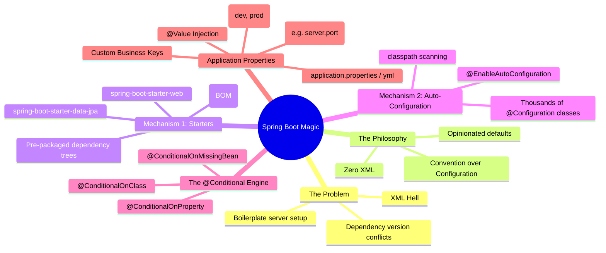

# Mindmap: Spring Boot Magic

```mermaid
mindmap
  root((Spring Boot Magic))
    The Problem
      XML Hell
      Dependency version conflicts
      Boilerplate server setup
    The Philosophy
      Convention over Configuration
      Opinionated defaults
      Zero XML
    Mechanism 1: Starters
      Pre-packaged dependency trees
      spring-boot-starter-web
      spring-boot-starter-data-jpa
      No Version Clashes (BOM)
    Mechanism 2: Auto-Configuration
      Thousands of @Configuration classes
      classpath scanning
      @EnableAutoConfiguration
    The @Conditional Engine
      @ConditionalOnClass
      @ConditionalOnMissingBean
      @ConditionalOnProperty
    Application Properties
      application.properties / yml
      Overriding Boot defaults (e.g. server.port)
      Custom Business Keys
      @Value Injection
      Profile-specific (dev, prod)
```
