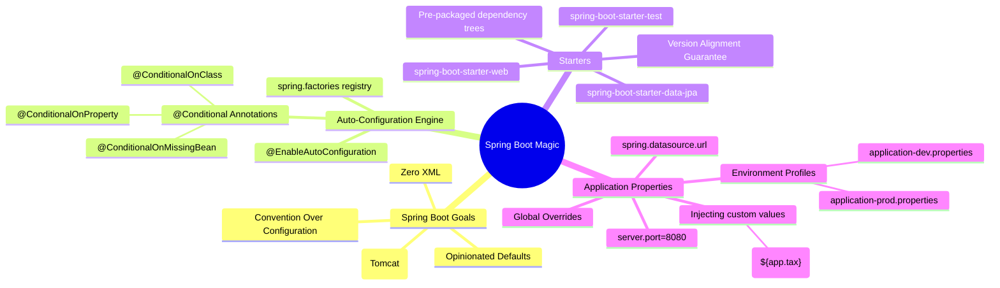

```mermaid
mindmap
  root((Spring Boot Magic))
    Spring Boot Goals
      Convention Over Configuration
      Zero XML
      Opinionated Defaults
      Embedded Servers (Tomcat)
    Auto-Configuration Engine
      @EnableAutoConfiguration
      @Conditional Annotations
        @ConditionalOnClass
        @ConditionalOnMissingBean
        @ConditionalOnProperty
      spring.factories registry
    Starters
      Pre-packaged dependency trees
      spring-boot-starter-web
      spring-boot-starter-data-jpa
      spring-boot-starter-test
      Version Alignment Guarantee
    Application Properties
      Global Overrides
      server.port=8080
      spring.datasource.url
      Injecting custom values
        @Value("${app.tax}")
      Environment Profiles
        application-dev.properties
        application-prod.properties
```
