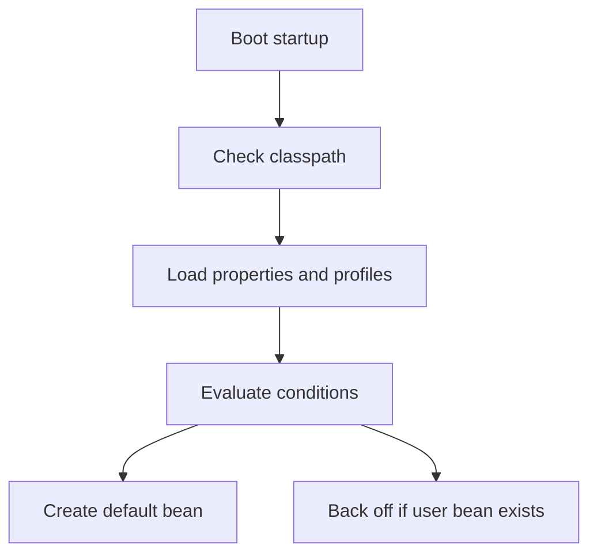

# 02 - Spring Boot Magic

This module explains how Spring Boot automates the container you learned in the IoC module. The key idea is simple: Boot does not guess randomly. It evaluates classpath, properties, profiles, and conditions to decide which beans should exist.

> Python bridge: if FastAPI or Django settings decide which dependencies or middleware are wired, Spring Boot is doing the same thing at container startup, but in a more declarative and opinionated way.

## Why This Module Matters
Vanilla Spring required a lot of manual configuration for infrastructure beans such as web servers, JSON mappers, and data sources. Spring Boot removes that overhead with starters and auto-configuration.

## Startup Decision Flow

## What You Will Learn
1. Spring Boot goals and the idea of convention over configuration.
2. Auto-configuration and the `@Conditional` family.
3. Starters and dependency alignment through the Boot BOM.
4. Application properties, profile overlays, and environment-specific behavior.
5. Conditional beans that let Boot back off when you provide your own implementation.

## Directory Structure
- `/explanation`: Conceptual breakdowns, Mermaid diagrams, Python comparisons, and interview questions
- `/exercises`: Hands-on practice for properties and custom condition logic
- `/resources`: Progressive quiz drill, one-page cheat sheet, and external learning resources

## Support Pack

- [Progressive Quiz Drill](resources/progressive-quiz-drill.md)
- [One-Page Cheat Sheet](resources/one-page-cheat-sheet.md)
- [Top Resource Guide](resources/top-resource-guide.md)

## How to Proceed
1. Read the explanation files in order.
2. Run `AutoConfigurationDemo.java` and `ConditionalDemo.java` to see the startup decision tree.
3. Complete the exercises once you can explain why Boot chose each bean.
