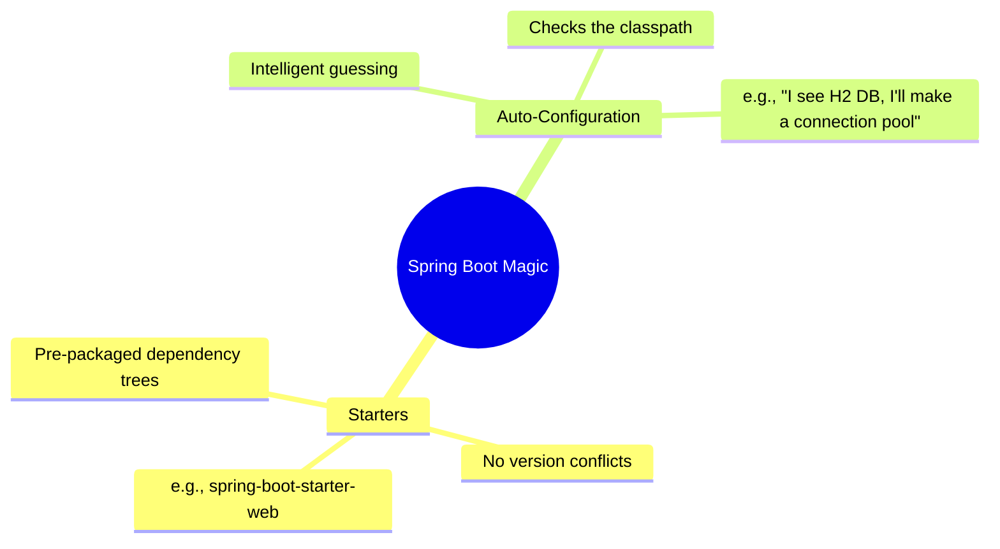

# 01 - What exactly is Spring Boot?

> **Python Bridge:** If Spring Framework is like raw Flask (where you must manually wire up SQLAlchemy, Jinja, and gunicorn), Spring Boot is like Django (which comes with batteries included, an ORM, admin panel, and development server out of the box). It optimizes for "Convention over Configuration."

If you understand the Spring IoC Container and Dependency Injection, you understand what the **Spring Framework** fundamentally is. But then what is **Spring Boot**?

---

## 1. The Problem with Vanilla Spring (XML Hell)

In the early 2010s, building a Spring application was a nightmare of manual configuration.

To set up a simple web application connecting to a database, you had to manually construct hundreds of lines of XML just to tell Spring:
1. "Here is the Tomcat Web Server."
2. "Here is the Database Driver."
3. "Here is the Hibernate ORM connection pool."
4. "Wire them all together in exactly this specific order."

Developers spent 3 days configuring servers and 1 hour writing actual business logic. 

---

## 2. The Spring Boot Revolution

Spring Boot was entirely engineered to eliminate configuration. It is an extension of the Spring Framework explicitly designed with the philosophy of **"Convention over Configuration."**

Spring Boot's main goals:
1. **Radically faster "getting started" experiences:** You can generate a running web app in 5 seconds.
2. **Highly opinionated defaults:** It assumes you want to do things the "normal" industry-standard way.
3. **Non-functional enterprise features:** Embedded servers (Tomcat), security, metrics, health checks, and externalized configuration are included out of the box.
4. **Absolutely zero XML configuration natively.**

---

## 3. How does it do it? (The Two Pillars)

Spring Boot achieves this magic via two massive architectural mechanisms:



1. **Starters (Dependency Management):** Curated sets of dependencies that are guaranteed to work together.
2. **Auto-Configuration (Mechanical Magic):** Intelligent evaluation of your classpath to mechanically guess what beans you need, rapidly building the boilerplate infrastructure for you.

---

## 4. Python vs. Java Code Comparison

| Feature | Python (Django/FastAPI) | Java (Spring Boot) |
|---|---|---|
| **Entry Point** | `app = FastAPI()` | `@SpringBootApplication` |
| **Server** | `uvicorn main:app` | `embedded Tomcat` (inside JAR) |
| **Settings** | `settings.py` | `application.properties` |
| **Philosophy** | Explicit Wiring | Convention over Configuration |

```python
# FastAPI (Explicit)
from fastapi import FastAPI
app = FastAPI()

@app.get("/")
def home():
    return {"status": "ok"}
```

```java
// Spring Boot (Conventional)
@SpringBootApplication
@RestController
public class MainApp {
    public static void main(String[] args) {
        SpringApplication.run(MainApp.class, args);
    }

    @GetMapping("/")
    public Map<String, String> home() {
        return Map.of("status", "ok");
    }
}
```

---

## Interview Questions

### Conceptual
**Q: Is Spring Boot a replacement for the Spring Framework?**
> **A:** No. Spring Boot is built *on top* of the Spring Framework. Under the hood, Spring Boot is still just using the Spring `ApplicationContext` (IoC Container) to manage beans and dependency injection. Spring Boot simply automates the creation of those beans.

**Q: What does "Convention over Configuration" mean in the context of Spring Boot?**
> **A:** It means Spring Boot provides default configurations that make sense for 80% of use cases. You only need to write explicit configuration when you want to deviate from the underlying conventions (e.g., Boot automatically configures Tomcat on port 8080. You only configure it if you want port 9090).

### Scenario/Debug
**Q: You want to deploy a Spring Boot application. Do you need to install a Tomcat server on the host machine?**
> **A:** No. Spring Boot includes an *embedded* Tomcat server natively within its executable JAR file. You simply run `java -jar app.jar` and the server boots up internally, binding to the specified port.
