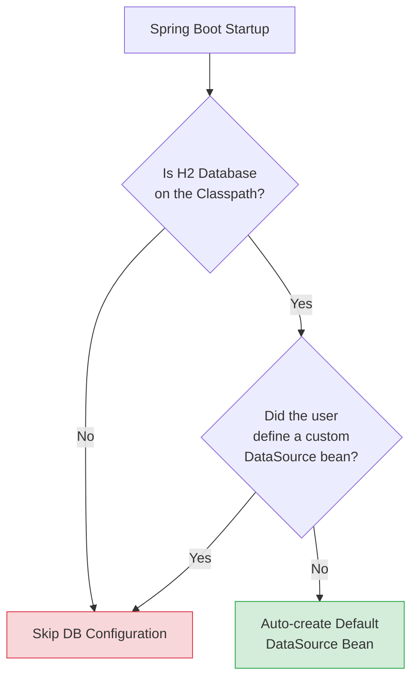

# 02 - Understanding Auto-Configuration

> **Python Bridge:** Python developers often rely on `getattr` or `hasattr` to conditionally load drivers (e.g., "If `psycopg2` is installed, use Postgres; otherwise use SQLite"). Spring Boot's Auto-Configuration aggressively scales this pattern using `@Conditional` annotations to generate massive, intricate dependency graphs dynamically.

If you include an embedded Tomcat server in your `pom.xml`, Spring Boot magically boots up a web server on port 8080. 
If you include an H2 Database dependency, Spring Boot magically creates an in-memory database connection pool.

This "magic" is called **Auto-Configuration**.

---

## 1. How the Magic Works Mechanically: `@Conditional`

Spring Boot Auto-Configuration is just thousands of pre-written `@Configuration` classes hiding inside the Spring Boot core JAR files. But instead of blindly loading every single one of them, Spring uniquely employs `@Conditional` annotations.

Spring essentially asks a massive sequence of logical `If/Else` statements before loading a Bean into the IoC container.



---

## 2. Examples of Core Conditions

1. **`@ConditionalOnClass`:**
   > *Spring Logic:* "If the class `DataSource` mechanically exists on the classpath (because you added a SQL dependency in `pom.xml`), I will instantiate a Connection Pool. If the class does not exist, I will gracefully skip this."

2. **`@ConditionalOnMissingBean`:**
   > *Spring Logic:* "If I need an `ObjectMapper` (for JSON conversion), I will check if you manually defined your own custom `@Bean` for it. If you did, I will step back and let yours win. If you did NOT (`OnMissingBean`), I will create a default one for you."

3. **`@ConditionalOnProperty`:**
   > *Spring Logic:* "I will only create this Bean if the user explicitly typed `feature.x.enabled=true` inside their `application.properties` file."

---

## 3. The `@SpringBootApplication` Annotation

Your main application class is beautifully annotated with `@SpringBootApplication`. What does that actually do?

It is fundamentally a composite "macro" annotation that perfectly combines exactly three core annotations:

1. **`@SpringBootConfiguration`:** Marks the class as a configuration source.
2. **`@ComponentScan`:** Commands Spring to deeply scan your local packages for your `@Service` and `@Controller` classes.
3. **`@EnableAutoConfiguration`:** **(The Magic Engine!)** This forces Spring Boot to scan the `spring.factories` (or `org.springframework.boot.autoconfigure.AutoConfiguration.imports` in newer Spring Boot 3.x) registry, load up all pre-written Auto-Configuration classes, and rigorously evaluate their `@Conditional` rules against your current classpath dependencies.

---

## 4. Python vs. Java Code Comparison

| Concept | Python (Manual Logic) | Java (Auto-Config) |
|---|---|---|
| **Detection** | `import pkgutil; pkgutil.find_loader('pg')` | `@ConditionalOnClass(DataSource.class)` |
| **Fallback** | `if not db: db = MockDB()` | `@ConditionalOnMissingBean(DataSource.class)` |
| **Toggle** | `if os.getenv('USE_REDIS'): ...` | `@ConditionalOnProperty("redis.enabled")` |

```python
# Python: Manual conditional logic
try:
    import redis
    cache = redis.Redis()
except ImportError:
    cache = InMemoryCache()
```

```java
// Java: Declarative auto-configuration
@Configuration
@ConditionalOnClass(RedisClient.class)
public class RedisAutoConfig {
    @Bean
    @ConditionalOnMissingBean
    public Cache redisCache() {
        return new RedisCache();
    }
}
```

---

## Interview Questions

### Conceptual
**Q: How does Spring Boot's Auto-Configuration differ from Component Scanning?**
> **A:** Component Scanning (`@ComponentScan`) is the process of finding your custom beans (`@Service`, etc.) in your application's source code packages. Auto-Configuration (`@EnableAutoConfiguration`) is the process of analyzing the classpath and automatically configuring third-party infrastructure beans (like Web Servers, DataSources, mapping libraries) based on what dependencies you chose to include. 

**Q: Can you disable a specific Auto-Configuration class if you don't want it?**
> **A:** Yes. You can exclude it at the entry point: `@SpringBootApplication(exclude = {DataSourceAutoConfiguration.class})`.

### Scenario/Debug
**Q: You want to implement a highly customized Gson JSON parser, but Spring Boot keeps using its default Jackson parser. How do you override Boot's auto-configured parser?**
> **A:** Because Spring Boot registers default beans using `@ConditionalOnMissingBean`, you simply create your own `@Bean` of type `Gson` or `ObjectMapper` in a `@Configuration` class. Spring Boot will detect your custom bean during the evaluation phase, trigger the condition failure for its own default bean, and gracefully step back, allowing your custom bean to take over the application context.
