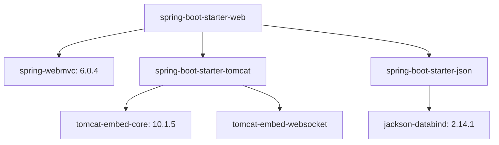

# 03 - Understanding Spring Boot Starters

> **Python Bridge:** In Python, `pip` handles dependencies, but you still have to lock versions exactly right in `requirements.txt` to prevent libraries from clashing. Spring Boot "Starters" act like meta-packages (e.g., `pip install fastapi[all]`) that guarantee a perfectly curated list of dependency versions that will never clash in production.

Before Spring Boot, Maven dependency management was a versioning disaster. 

---

## 1. The Pre-Boot Nightmare

If you wanted to build a Hibernate ORM application in 2012, you had to carefully align the exact versions of:
1. `hibernate-core` (Version 5.2.1)
2. `spring-data-jpa` (Version 2.3.4)
3. `mysql-connector` (Version 8.0.21)

If any of these versions were marginally incompatible with each other, your entire application would compile perfectly but silently crash with terrifying `ClassNotFoundException` or `NoSuchMethodError` stack traces at runtime.

---

## 2. The Solution: "Starter" Dependencies

Spring Boot introduced **Starters**.
A Starter is an empty Maven dependency that simply points to a curated, heavily tested tree of sub-dependencies. The Spring Engineering team permanently tests combinations to guarantee they are perfectly compatible versions.

When you add exactly one line to your `pom.xml`:
```xml
<dependency>
    <groupId>org.springframework.boot</groupId>
    <artifactId>spring-boot-starter-web</artifactId>
</dependency>
```

You are automatically downloading over 40 precisely aligned dependencies, inherently including:
- **Spring MVC** (for REST APIs)
- **Spring Core** (for the IoC Container)
- **Jackson** (for serializing JSON)
- **Embedded Tomcat** (The web server software)
- **Validation API**



---

## 3. Common Structural Starters

1. **`spring-boot-starter-web`:** Builds RESTful web applications. Boots embedded Tomcat natively.
2. **`spring-boot-starter-data-jpa`:** Connects to SQL databases natively using Hibernate.
3. **`spring-boot-starter-test`:** Pulls in JUnit, Mockito, and the Spring Test Context automatically and flawlessly.
4. **`spring-boot-starter-security`:** Pulls in Spring Security, cleanly enforcing a login screen on all endpoints immediately.

> **Architect Rule:** If you ever need a capability (e.g. sending Emails, connecting to Kafka, executing GraphQL), search for the "Spring Boot Starter" for it first. Never manually pull in the raw libraries unless a starter doesn't exist.

---

## 4. Python vs. Java Code Comparison

| Goal | Python (requirements.txt) | Java (Spring Starter) |
|---|---|---|
| **Web App** | `fastapi`, `uvicorn`, `pydantic` | `spring-boot-starter-web` |
| **Database** | `sqlalchemy`, `psycopg2`, `alembic` | `spring-boot-starter-data-jpa` |
| **Testing** | `pytest`, `pytest-mock`, `httpx` | `spring-boot-starter-test` |

```text
# requirements.txt (Explicit list)
fastapi==0.109.0
uvicorn==0.27.0
pydantic==2.5.3
# Must manage versions manually!
```

```gradle
// build.gradle (One starter = dozens of aligned libs)
dependencies {
    implementation 'org.springframework.boot:spring-boot-starter-web'
    // Versions managed by Spring Parent BOM automatically!
}
```

---

## Interview Questions

### Conceptual
**Q: What exactly is inside a Spring Boot Starter JAR file?**
> **A:** Almost nothing! A starter JAR typically contains no Java code. It is merely a Maven `pom.xml` file containing a carefully curated list of `<dependencies>`. It utilizes Maven's transitive dependency resolution to pull the actual libraries into your project.

**Q: How does Spring Boot ensure that the versions across different starters don't conflict?**
> **A:** Through the Spring Boot Starter Parent POM (or Dependency Management BOM). The parent POM explicitly locks down the version numbers for thousands of libraries. When you declare `<dependency>`, you leave the `<version>` tag completely empty, and Maven inherits the strictly tested version from the Spring Boot parent.

### Scenario/Debug
**Q: You added `spring-boot-starter-web` but you want to use the Undertow server instead of Tomcat because of performance requirements. How do you achieve this?**
> **A:** You use Maven exclusions. You configure the `spring-boot-starter-web` dependency to exclude the `spring-boot-starter-tomcat` transient dependency, and then explicitly add the `spring-boot-starter-undertow` dependency to your POM. Because of auto-configuration, Spring Boot will instantly detect Undertow on the classpath instead of Tomcat, and boot that server instead.
