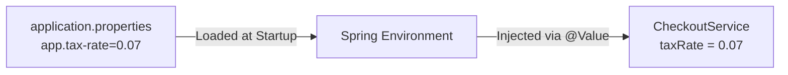

# 04 - Application Properties & Configuration

> **Python Bridge:** In Python, you often use `.env` files and `os.environ.get()` or libraries like `pydantic-settings` to manage environment configurations. Spring Boot uses `application.properties` (or `application.yml`) to centrally manage *both* framework-level infrastructure overrides and your custom business variables.

Because Spring Boot relies heavily on "Auto-Configuration" to guess what your app needs natively, how do you *tell* it to behave differently?

The answer is the `application.properties` (or `application.yml`) file.

---

## 1. The Global Configuration Map

When Spring Boot starts up, it reads this physical file from your `src/main/resources/` directory and loads every single key-value pair directly into the global Spring **Environment**.

By default, the `@Conditional` auto-configuration classes constantly sniff these Environment property values. 

For example, Spring Boot configures Tomcat on port 8080 by default. But if it sees a specific property, it overrides that behavior:

```properties
# Overrides the default embedded Tomcat port (8080) to 9090.
server.port=9090

# Tells the Auto-Configured DataSource to connect to PostgreSQL instead of in-memory H2.
spring.datasource.url=jdbc:postgresql://localhost:5432/mydb
spring.datasource.username=admin
spring.datasource.password=secret123

# Overrides exactly how verbose logging should functionally be.
logging.level.org.springframework.web=DEBUG
```

---

## 2. Injecting Custom Properties (`@Value`)

You can also create your own custom business keys inside the file:
```properties
app.tax-rate=0.07
app.feature.new-checkout=true
```

Then you can cleanly inject these raw Strings or primitives natively into any of your own Spring Beans using the `@Value` annotation (or newer `@ConfigurationProperties` for bulk mapping).

```java
@Service
public class CheckoutService {

    // Spring parses the properties file and injects 0.07 into this field.
    @Value("${app.tax-rate}")
    private double taxRate;

    public double calculateTotal(double subtotal) {
        return subtotal + (subtotal * taxRate);
    }
}
```



---

## 3. Profile-Specific Properties

Enterprise applications run in multiple environments (Local, Staging, QA, Production). Spring Boot allows you to define multiple properties files for these different deployment environments:

- `application.properties` (Base configurations loaded everywhere)
- `application-dev.properties` (Loaded only when testing locally)
- `application-prod.properties` (Loaded only when running on real servers)

By passing an environment variable or flag to the JVM argument (`-Dspring.profiles.active=prod`), Spring will neatly load your core base file AND strategically overlay the `prod` file dynamically, replacing any matching keys.

---

## 4. Python vs. Java Code Comparison

| Task | Python (os.environ / pydantic) | Java (@Value / @ConfigurationProperties) |
|---|---|---|
| **Single Value** | `os.getenv("DB_URL")` | `@Value("${spring.datasource.url}")` |
| **Defaults** | `os.getenv("PORT", "8000")` | `@Value("${server.port:8080}")` |
| **Mapping** | `BaseSettings` (Pydantic) | `@ConfigurationProperties` |

```python
# Python: os.environ or Pydantic Settings
import os
port = int(os.environ.get("SERVER_PORT", 8000))
```

```java
// Java: @Value or Type-safe Config
@RestController
public class MyController {
    @Value("${server.port:8080}")
    private int port;
}
```

---

## Interview Questions

### Conceptual
**Q: What is the difference between `application.properties` and `application.yml`?**
> **A:** There is absolutely no functional difference; they perfectly achieve the exact same thing. `.yml` files use hierarchical YAML syntax which is often much cleaner and more readable for deeply nested properties (e.g., configuring complex logging trees), whereas `.properties` uses flat `key=value` lines.

**Q: In what order does Spring Boot read property overrides?**
> **A:** Spring Boot has a very strict hierarchy of property evaluation. The order of precedence (highest to lowest) roughly is: 1) Command-line arguments (`--server.port=9090`), 2) OS Environment Variables (`SERVER_PORT=9090`), 3) Profile-specific `application-{profile}.properties`, 4) Base `application.properties`. This allows DevOps to override values dynamically in Docker containers using environment variables without repacking the JAR.

### Scenario/Debug
**Q: You set `app.database.timeout=5000` in `application.properties`. You use `@Value("${app.database.timeout}")` in your class. But the application refuses to start up, throwing an `IllegalArgumentException: Could not resolve placeholder`. Why?**
> **A:** Either the property key is misspelled in the `@Value` annotation, the properties file is physically missing from the `src/main/resources` classpath, or the class containing the `@Value` is not a Spring-managed Bean (e.g., someone instantiated it manually using `new`, bypassing Spring's dependency injection entirely).
