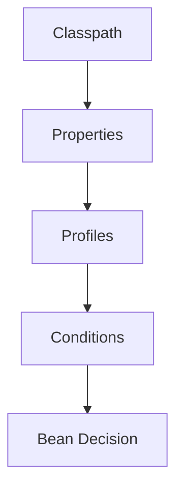

# Spring Boot Magic One-Page Cheat Sheet

## Core Ideas

| Concept | Fast reminder |
|---|---|
| Auto-configuration | Boot adds beans when the environment matches |
| Profile | startup-time environment switch |
| Conditional bean | create a bean only when a rule matches |
| Conditions report | explain why Boot chose or skipped a bean |
| Starter | curated dependency bundle plus expected auto-config |

## Python Bridge

| Spring Boot | Python mental model |
|---|---|
| auto-configuration | app startup dependency wiring |
| profile | dev/staging/prod settings file selection |
| conditional bean | factory function that only runs when a rule matches |

## Fast Rules

1. Put environment decisions in config, not in service methods.
2. Let Boot back off when you provide your own bean.
3. Read the conditions report before guessing.
4. Prefer constructor injection over field injection.

## Common Gotchas

| Gotcha | Why it hurts |
|---|---|
| missing active profile | wrong beans or missing beans at startup |
| duplicate beans | ambiguous wiring or unexpected overrides |
| field injection | hidden dependencies and harder tests |
| untracked properties | works locally, fails in staging |

## Interview Questions

1. Why does Boot favor conditions over hard-coded configuration branches?
2. How does a custom bean override a Boot default safely?
3. Why is the conditions report one of the first tools you should check?
