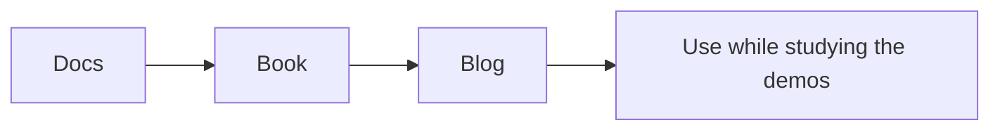

# Spring Boot Magic Top Resource Guide

Curated external resources for learning Spring Boot startup behavior, profiles, and auto-configuration.

## Official Docs

1. [Spring Boot auto-configuration](https://docs.spring.io/spring-boot/reference/using/auto-configuration.html)
2. [Spring Boot profiles](https://docs.spring.io/spring-boot/reference/features/profiles.html)
3. [Spring Boot auto-configuration classes appendix](https://docs.spring.io/spring-boot/docs/3.2.10/reference/html/auto-configuration-classes.html)
4. [Spring Boot reference documentation overview](https://docs.spring.io/spring-boot/docs/current/reference/)

## Books

1. [Spring Boot in Action](https://livebook.manning.com/book/spring-boot-in-action/table-of-contents)
2. [Spring in Action, Sixth Edition](https://www.manning.com/books/spring-in-action-sixth-edition)

## Blogs and Articles

1. [Spring Blog](https://spring.io/blog)
2. [Spring Boot reference documentation is the source of truth for conditions](https://docs.spring.io/spring-boot/reference/using/auto-configuration.html)

## Study Order

1. Read the Spring Boot reference docs first.
2. Use the book for broader examples and mental models.
3. Check the blog when you want feature announcements or deeper context.

## Interview Questions

1. Why is auto-configuration powerful but still debuggable?
2. When should you use profiles instead of conditional beans?
