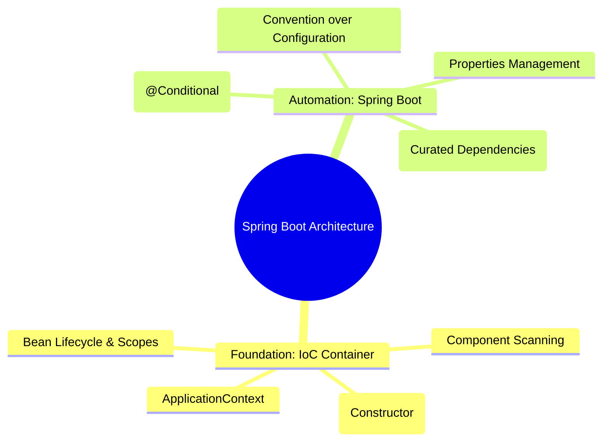

# Mindmap: Core Architecture

```mermaid
mindmap
  root((Spring Boot Architecture))
    Foundation: IoC Container
      ApplicationContext
      Component Scanning
      Dependency Injection (Constructor)
      Bean Lifecycle & Scopes
    Automation: Spring Boot
      Convention over Configuration
      Auto-Configuration (@Conditional)
      Starters (Curated Dependencies)
      Properties Management
```
