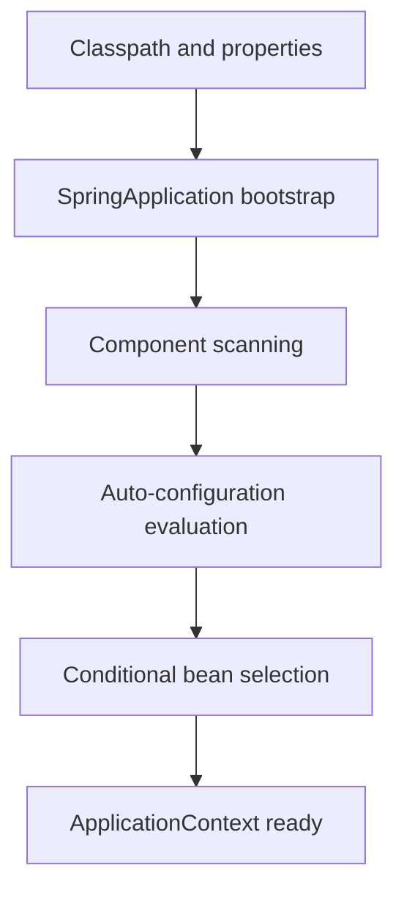

# 01 - Spring Boot Architecture

This module is the architectural foundation for the rest of the learning path. Before we write REST APIs or touch data access, we need a clear mental model of the Spring container, Spring Boot startup flow, and the conditional rules that decide which beans exist.

## Why This Matters
Spring Boot feels magical when a web server, data source, and JSON mapper appear with little code. The real lesson is that the system is deterministic. Once we understand the startup sequence, we can debug failures instead of guessing.

## Startup Flow

## Modules

### `01-inversion-of-control`
The mechanical foundation of the Spring Framework.
- Tight coupling versus IoC
- ApplicationContext and bean registration
- Constructor injection as the default enterprise style
- Bean lifecycle, scopes, and component scanning

### `02-spring-boot-magic`
How Spring Boot automates the container at startup.
- Convention over configuration
- Auto-configuration and `@Conditional` rules
- Starters and dependency alignment
- Application properties, profiles, and conditional beans

## Support Pack

- [Progressive Quiz Drill](resources/progressive-quiz-drill.md)
- [One-Page Cheat Sheet](resources/one-page-cheat-sheet.md)
- [Top Resource Guide](resources/top-resource-guide.md)

## How to Proceed
1. Read the `01-inversion-of-control` explanations in order.
2. Move to `02-spring-boot-magic` and run the demos to see startup-time decisions in action.
3. Use the `MINDMAP.md` files as the navigation map for the whole module.
