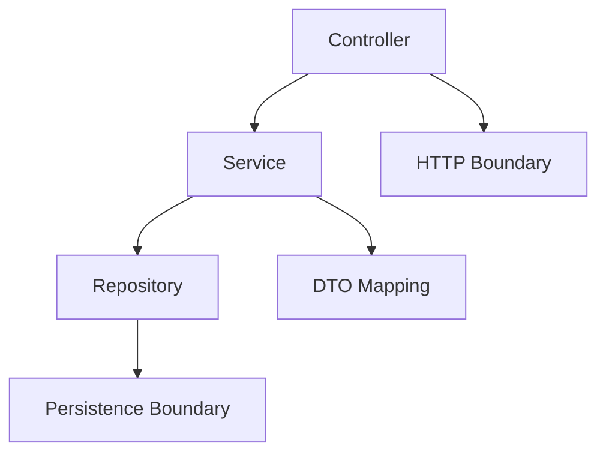

# Spring Boot Architecture One-Page Cheat Sheet



## Layer Guide

| Layer | Owns | Should avoid |
|---|---|---|
| Controller | HTTP request/response mapping | business rules and SQL concerns |
| Service | business logic, orchestration, transactions | HTTP framework details |
| Repository | persistence operations and query access | transport-layer logic |
| DTO | boundary data shape | domain behavior |
| Config | bean wiring and infrastructure setup | business decisions |

## Spring Boot Magic in Plain Words

| Feature | What it really means |
|---|---|
| IoC | Spring creates and wires objects for you |
| Auto-configuration | Boot adds sensible beans when conditions match |
| Profiles | startup-time environment switching |
| Conditional beans | register a bean only when classpath/properties/bean state fits |

## Fast Rules

1. Keep environment decisions in config, not inside services.
2. Let controllers stay thin.
3. Prefer constructor injection over field injection.
4. Use profile or conditional beans when infrastructure changes by environment.

## Python Bridge

```text
FastAPI dependency wiring -> Spring IoC container
settings/environment switching -> Spring profiles
startup factory decisions -> conditional bean registration
```

## Interview Questions

1. Why is thin-controller, rich-service layering still useful in Spring Boot?
2. What problem does auto-configuration solve, and what risk comes with it?
3. When would you choose profiles over plain configuration properties?
