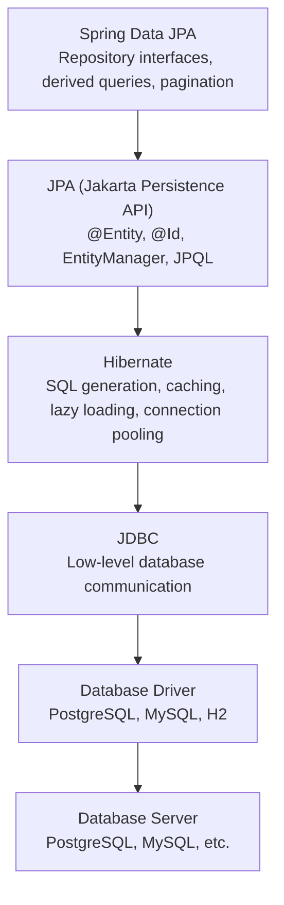
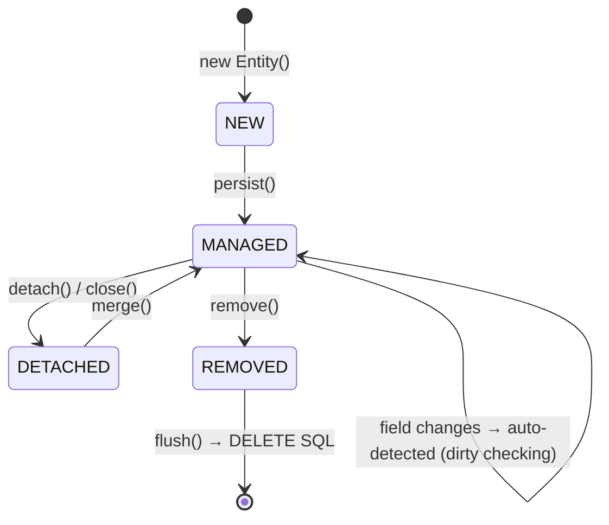

# What is JPA?

JPA (Jakarta Persistence API) is the **official Java standard** for Object-Relational Mapping (ORM). It defines a set of annotations and interfaces that map Java classes to database tables, without tying your code to a specific ORM implementation.

## The Key Insight: Specification vs Implementation

JPA itself is just a **specification** — a contract describing *what* should happen (e.g., "the `@Entity` annotation marks a Java class as a database table"). It does NOT contain code that actually talks to a database.

**Hibernate** is the default **implementation** of JPA — it is the actual engine that translates Java objects to SQL queries and executes them against the database.

```mermaid
flowchart TD
    A["Your Spring Boot Code"] -->|uses| B["JPA API<br/>(Interfaces + Annotations)"]
    B -->|implemented by| C["Hibernate<br/>(Default Provider)"]
    C -->|generates| D["SQL Queries"]
    D -->|executes via| E["JDBC Driver"]
    E -->|talks to| F["Database<br/>(PostgreSQL, MySQL, etc.)"]
    
    B -->|could be implemented by| G["EclipseLink<br/>(Alternative Provider)"]
    G -->|generates| D
```



This architecture means: **you code against JPA, not Hibernate.** If you ever need to switch ORM providers (e.g., from Hibernate to EclipseLink), your entity classes and repository interfaces remain unchanged.

## The Data Access Layer Stack



| Layer | What It Does | You Write Code Here? |
|---|---|---|
| **Spring Data JPA** | Auto-generates repository implementations | ✓ (interfaces only) |
| **JPA** | Standard annotations for entity mapping | ✓ (annotations on classes) |
| **Hibernate** | Translates objects to SQL, manages cache | ✗ (auto-configured) |
| **JDBC** | Sends SQL to the database | ✗ (abstracted away) |
| **JDBC Driver** | Protocol adapter for specific database | ✗ (just add dependency) |
| **Database** | Stores data | ✗ (external service) |

## Python Comparison

| JPA / Hibernate / Spring Data | Python / SQLAlchemy |
|---|---|
| JPA (specification) | No standard — SQLAlchemy IS the library |
| Hibernate (implementation) | SQLAlchemy ORM |
| `@Entity` | `class User(Base):` |
| `EntityManager` | `Session` |
| JPQL (JPA Query Language) | SQLAlchemy query API |
| `@Id @GeneratedValue` | `Column(primary_key=True)` |
| Spring Data Repository | Custom `crud.py` functions |
| Auto-generated CRUD | Must write `get_user()`, `create_user()` manually |

### Critical Difference

In Python, you write **your own CRUD functions**:

```python
# Python/SQLAlchemy — you write this manually
def get_user_by_email(db: Session, email: str) -> User | None:
    return db.query(User).filter(User.email == email).first()

def create_user(db: Session, user: UserCreate) -> User:
    db_user = User(**user.model_dump())
    db.add(db_user)
    db.commit()
    db.refresh(db_user)
    return db_user
```

In Java/Spring Data JPA, you **declare an interface** and Spring generates the implementation:

```java
// Java/Spring Data JPA — the implementation is AUTO-GENERATED
public interface UserRepository extends JpaRepository<User, Long> {
    Optional<User> findByEmail(String email);
    // That's it! Spring generates the SQL and implementation at runtime.
}
```

## Entity Lifecycle

JPA entities pass through specific states managed by the `EntityManager`:



| State | Description | Python Equivalent |
|---|---|---|
| **NEW** | Object created, not yet tracked by JPA | `user = User()` (not added to session) |
| **MANAGED** | Tracked by EntityManager; changes auto-detected | `db.add(user)` |
| **DETACHED** | Was tracked, now disconnected | `db.expunge(user)` |
| **REMOVED** | Marked for deletion on next flush | `db.delete(user)` |

## Interview Questions

### Conceptual

**Q1: What is the relationship between JPA, Hibernate, and Spring Data JPA?**
> **JPA** is a specification (contract) that defines ORM annotations and interfaces. **Hibernate** is the default implementation that actually translates Java objects to SQL. **Spring Data JPA** sits on top of both, adding repository auto-generation, derived queries, and pagination. Your code depends on JPA annotations and Spring Data interfaces — Hibernate is a hidden implementation detail.

**Q2: Why does JPA use a specification-implementation pattern instead of being a library directly?**
> The specification pattern provides vendor independence. If Hibernate has a critical bug or licensing issue, you can switch to EclipseLink without changing your entity classes or repository interfaces. It also enables competition among implementations, driving quality improvement.

### Scenario/Debug

**Q3: A developer writes all database code using Hibernate-specific APIs (`Session`, `SessionFactory`) instead of JPA APIs (`EntityManager`, `EntityManagerFactory`). What's the problem?**
> The code is now tightly coupled to Hibernate. If the team later needs to switch to EclipseLink (e.g., for a specific feature), every data access class must be rewritten. Using JPA APIs preserves portability.

**Q4: You have a `User` entity that is returned from a repository method in a service class. Later in the same transaction, you modify `user.setName("new name")` but never call `save()`. Will the database be updated?**
> Yes. The entity is in the **MANAGED** state within the persistence context. JPA performs **dirty checking** — it detects field changes and automatically generates an `UPDATE` SQL statement at transaction commit time. This is a common source of confusion.

### Quick Fire

**Q5: What annotation marks a Java class as a JPA entity?**
> `@Entity`

**Q6: What is the default JPA provider in Spring Boot?**
> Hibernate
