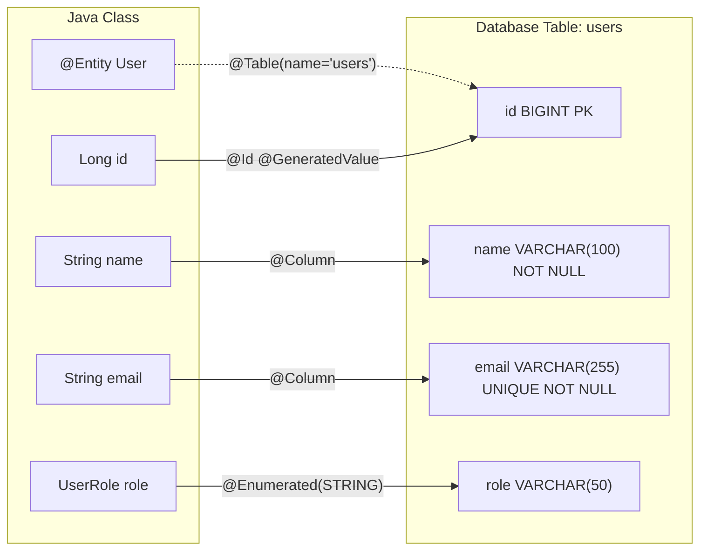

# Entities and Annotations

JPA entities are regular Java classes annotated with `@Entity` that map to database tables. Each field in the class maps to a column in the table, and each instance of the class represents a row.

## Anatomy of a JPA Entity

```java
@Entity                              // Marks this class as a JPA entity (table)
@Table(name = "users")               // Explicit table name (optional)
public class User {

    @Id                              // Primary key
    @GeneratedValue(strategy = GenerationType.IDENTITY)  // Auto-increment
    private Long id;

    @Column(nullable = false, length = 100)  // Column constraints
    private String name;

    @Column(unique = true, nullable = false)
    private String email;

    @Enumerated(EnumType.STRING)     // Store enum as string, not ordinal
    private UserRole role;

    @Column(name = "created_at")     // Custom column name
    private LocalDateTime createdAt;

    @Transient                       // NOT stored in database
    private String temporaryToken;

    // Getters, setters, no-arg constructor (required by JPA)
}
```

## Entity-to-Table Mapping



## Essential Annotations

### `@Entity` and `@Table`

```java
@Entity                               // Required: marks as JPA entity
@Table(
    name = "products",                // Table name (default: class name)
    schema = "ecommerce",            // Database schema
    uniqueConstraints = {
        @UniqueConstraint(columnNames = {"sku", "warehouse_id"})
    }
)
public class Product { ... }
```

### `@Id` and `@GeneratedValue`

```java
// Strategy 1: IDENTITY — Database auto-increment (PostgreSQL SERIAL, MySQL AUTO_INCREMENT)
@Id
@GeneratedValue(strategy = GenerationType.IDENTITY)
private Long id;

// Strategy 2: SEQUENCE — Database sequence (Best for PostgreSQL)
@Id
@GeneratedValue(strategy = GenerationType.SEQUENCE, generator = "user_seq")
@SequenceGenerator(name = "user_seq", sequenceName = "user_sequence", allocationSize = 1)
private Long id;

// Strategy 3: UUID — Universally unique identifier
@Id
@GeneratedValue(strategy = GenerationType.UUID)
private UUID id;
```

| Strategy | Database | Pros | Cons |
|---|---|---|---|
| `IDENTITY` | All (auto-increment) | Simple, no setup | Batch inserts slower |
| `SEQUENCE` | PostgreSQL, Oracle | Best batch insert performance | Requires sequence object |
| `UUID` | All | Globally unique, merge-safe | Larger storage, slower indexes |

### `@Column`

```java
@Column(
    name = "email_address",          // Column name (default: field name)
    nullable = false,                // NOT NULL constraint
    unique = true,                   // UNIQUE constraint
    length = 255,                    // VARCHAR length (default 255)
    columnDefinition = "TEXT"        // Override type (use sparingly)
)
private String email;
```

### `@Enumerated`

```java
// ALWAYS use STRING — ORDINAL breaks when you reorder enum values!
@Enumerated(EnumType.STRING)         // Stores "ADMIN", "USER", "GUEST"
private UserRole role;

// NEVER DO THIS (default):
@Enumerated(EnumType.ORDINAL)        // Stores 0, 1, 2 — breaks on reorder!
private UserRole role;
```

### `@Temporal` and Java 8+ Date/Time

```java
// Modern approach (Java 8+): Use java.time classes directly — no @Temporal needed
private LocalDate birthDate;         // DATE column
private LocalDateTime createdAt;     // TIMESTAMP column
private Instant lastLogin;           // TIMESTAMP WITH TIMEZONE

// Legacy approach (avoid): @Temporal required for java.util.Date
@Temporal(TemporalType.TIMESTAMP)
private Date createdAt;              // Use LocalDateTime instead!
```

## Python Comparison

| JPA Annotation | SQLAlchemy Equivalent |
|---|---|
| `@Entity` | `class User(Base):` |
| `@Table(name="users")` | `__tablename__ = "users"` |
| `@Id` | `Column(primary_key=True)` |
| `@GeneratedValue(IDENTITY)` | `Column(Integer, autoincrement=True)` |
| `@Column(nullable=false)` | `Column(String, nullable=False)` |
| `@Column(unique=true)` | `Column(String, unique=True)` |
| `@Enumerated(STRING)` | `Column(Enum(UserRole))` |
| `@Transient` | Don't add a `Column()` |
| `@Temporal(TIMESTAMP)` | `Column(DateTime)` |

### Side-by-side

```python
# Python/SQLAlchemy
class User(Base):
    __tablename__ = "users"

    id = Column(Integer, primary_key=True, autoincrement=True)
    name = Column(String(100), nullable=False)
    email = Column(String(255), unique=True, nullable=False)
    role = Column(Enum(UserRole), default=UserRole.USER)
    created_at = Column(DateTime, default=func.now())
```

```java
// Java/JPA
@Entity
@Table(name = "users")
public class User {
    @Id @GeneratedValue(strategy = GenerationType.IDENTITY)
    private Long id;

    @Column(nullable = false, length = 100)
    private String name;

    @Column(unique = true, nullable = false)
    private String email;

    @Enumerated(EnumType.STRING)
    private UserRole role = UserRole.USER;

    private LocalDateTime createdAt = LocalDateTime.now();
}
```

## JPA Entity Rules

1. **Must have a no-arg constructor** (public or protected). JPA uses reflection to instantiate entities.
2. **Must have an `@Id` field**. Every entity needs a primary key.
3. **Cannot be `final`**. Hibernate creates proxy subclasses for lazy loading.
4. **Cannot be a Java `record`**. Records are immutable; JPA needs setters for state management.
5. **Fields should NOT be `final`**. JPA needs to set them via reflection.

## Interview Questions

### Conceptual

**Q1: Why should you always use `@Enumerated(EnumType.STRING)` instead of `ORDINAL`?**
> `ORDINAL` stores the enum's position (0, 1, 2). If you reorder the enum values or insert a new value in the middle, all existing database rows become corrupted — they point to wrong enum values. `STRING` stores the actual name ("ADMIN", "USER"), which is immune to reordering.

**Q2: Why can't JPA entities be Java `record` types?**
> Java records are immutable (all fields are `final`). JPA entities need mutable state because: (1) JPA creates instances via no-arg constructor and sets fields via reflection/setters, (2) the persistence context tracks field changes (dirty checking) which requires mutability.

### Scenario/Debug

**Q3: You define a JPA entity but forget to add a no-arg constructor (you only have a constructor with parameters). What happens at runtime?**
> Hibernate throws `InstantiationException` when trying to load entities from the database. JPA implementations use the no-arg constructor internally. If you use Lombok's `@AllArgsConstructor`, you must also add `@NoArgsConstructor`.

**Q4: You use `@Column(length = 50)` for an email field. A user enters a 100-character email. What happens?**
> If the schema was generated by Hibernate (`spring.jpa.hibernate.ddl-auto=update`), the column was created as `VARCHAR(50)`. The database will throw a `DataTruncation` exception. The entity annotation alone doesn't validate — it's a schema hint.

### Quick Fire

**Q5: What annotation makes a field NOT stored in the database?**
> `@Transient`

**Q6: What is the default column name for a field called `firstName` in a JPA entity?**
> `first_name` (Spring Boot's default naming strategy converts camelCase to snake_case).
