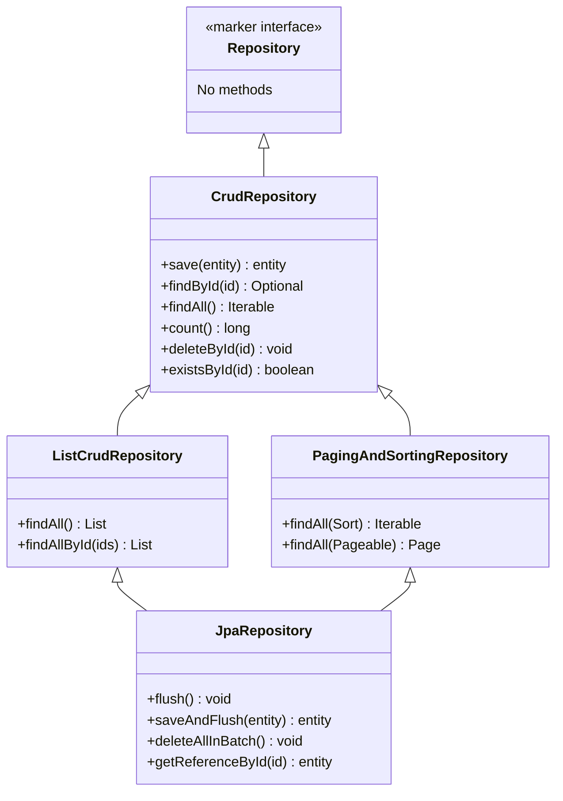
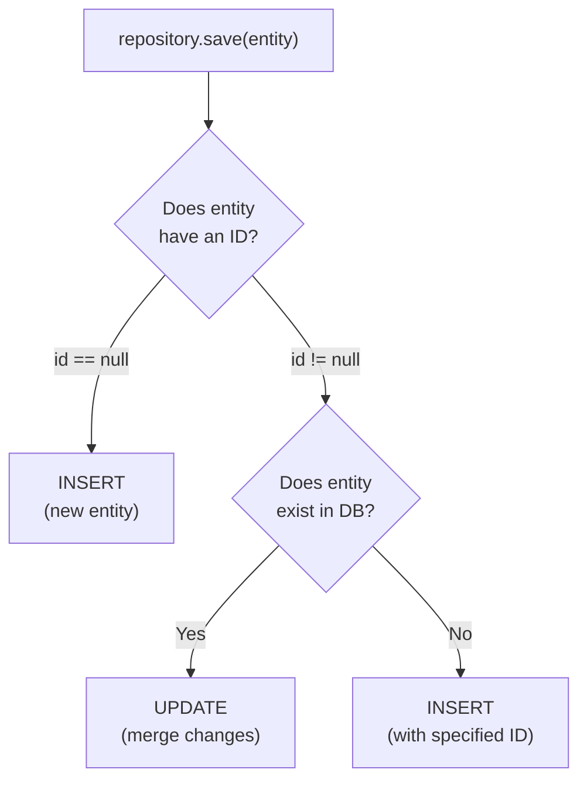

# Spring Data Repositories

Spring Data JPA's killer feature is **auto-generated repository implementations**. You declare a Java interface with method signatures, and Spring generates the entire implementation — including SQL queries, connection management, and transaction handling — at runtime.

## The Repository Hierarchy



**Rule of thumb**: Always extend `JpaRepository` — it includes everything from all parent interfaces.

## Creating a Repository

```java
// This is ALL you need — Spring generates the implementation at startup!
public interface UserRepository extends JpaRepository<User, Long> {
    // JpaRepository<EntityType, PrimaryKeyType>
}
```

This single interface gives you **15+ methods for free**:

| Method | Generated SQL | Python Equivalent |
|---|---|---|
| `save(user)` | `INSERT INTO users ...` or `UPDATE users ...` | `db.add(user); db.commit()` |
| `findById(1L)` | `SELECT * FROM users WHERE id = 1` | `db.query(User).get(1)` |
| `findAll()` | `SELECT * FROM users` | `db.query(User).all()` |
| `deleteById(1L)` | `DELETE FROM users WHERE id = 1` | `db.query(User).filter_by(id=1).delete()` |
| `count()` | `SELECT COUNT(*) FROM users` | `db.query(User).count()` |
| `existsById(1L)` | `SELECT COUNT(*) > 0 ...` | `db.query(exists().where(...))` |
| `findAll(pageable)` | `SELECT * FROM users LIMIT ? OFFSET ?` | Manual slicing |
| `saveAndFlush(user)` | INSERT/UPDATE + immediate FLUSH | `db.add(user); db.flush()` |
| `deleteAllInBatch()` | `DELETE FROM users` (single SQL) | `db.query(User).delete()` |

## Using a Repository in a Service

```java
@Service
public class UserService {

    private final UserRepository userRepository;

    // Constructor injection — Spring injects the auto-generated proxy
    public UserService(UserRepository userRepository) {
        this.userRepository = userRepository;
    }

    public User createUser(String name, String email) {
        User user = new User();
        user.setName(name);
        user.setEmail(email);
        return userRepository.save(user);  // INSERT or UPDATE
    }

    public Optional<User> findUser(Long id) {
        return userRepository.findById(id);  // SELECT by primary key
    }

    public List<User> getAllUsers() {
        return userRepository.findAll();  // SELECT all
    }

    public void deleteUser(Long id) {
        userRepository.deleteById(id);  // DELETE by primary key
    }
}
```

## Pagination and Sorting

```java
// In the service or controller
Pageable pageable = PageRequest.of(
    0,                               // Page number (0-indexed)
    20,                              // Page size
    Sort.by("createdAt").descending() // Sort order
);

Page<User> page = userRepository.findAll(pageable);

// Page metadata
page.getContent();         // List<User> — the actual data
page.getTotalElements();   // Total rows in database
page.getTotalPages();      // Total pages
page.getNumber();          // Current page number
page.hasNext();            // Is there a next page?
```

## Python Comparison

| Spring Data Repository | Python/FastAPI |
|---|---|
| `interface UserRepository extends JpaRepository<User, Long>` | You write `def get_users(db: Session):` manually |
| Auto-generated CRUD methods | Must implement each method yourself |
| `save(entity)` handles INSERT and UPDATE | Separate `db.add()` and `db.commit()` calls |
| `Page<User>` with metadata | Manual `LIMIT/OFFSET` + count query |
| `@Repository` annotation (optional) | No equivalent annotation |
| Proxy created at startup | Plain Python functions |

### Key Insight

In Python, you write ~50 lines of CRUD code per model. In Spring Data JPA, you write **one interface declaration** — zero implementation code. This is not magic; Spring generates a proxy class at startup using Java's dynamic proxy mechanism.

## `save()` — INSERT vs UPDATE

The `save()` method is intelligent:



## Interview Questions

### Conceptual

**Q1: How does Spring Data JPA generate repository implementations without any code?**
> At application startup, Spring scans for interfaces extending `Repository` (or its subinterfaces). For each interface, Spring creates a dynamic proxy using Java's `Proxy.newProxyInstance()`. The proxy delegates method calls to `SimpleJpaRepository`, which uses the `EntityManager` to execute queries. No bytecode generation — it's all runtime composition.

**Q2: What is the difference between `CrudRepository` and `JpaRepository`?**
> `CrudRepository` provides basic CRUD methods (`save`, `findById`, `findAll`, `delete`). `JpaRepository` extends `CrudRepository` and adds JPA-specific features: `flush()`, `saveAndFlush()`, `deleteAllInBatch()`, `getReferenceById()`, and full `Page`/`Sort` support. Always use `JpaRepository` in Spring Boot projects.

### Scenario/Debug

**Q3: A developer calls `repository.save(user)` but the database still has the old data after the method returns. What could cause this?**
> Several possibilities: (1) No `@Transactional` on the service method — changes aren't committed. (2) An exception occurs after `save()` that rolls back the transaction. (3) The persistence context hasn't been flushed yet — Hibernate batches writes. Use `saveAndFlush()` to force immediate write.

### Quick Fire

**Q4: What generic parameters does `JpaRepository<User, Long>` take?**
> The entity type (`User`) and the primary key type (`Long`).

**Q5: What method returns a `Page` object with pagination metadata?**
> `findAll(Pageable pageable)` from `PagingAndSortingRepository`.
