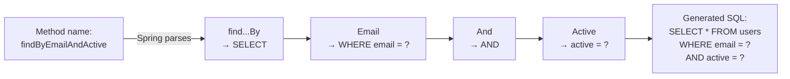
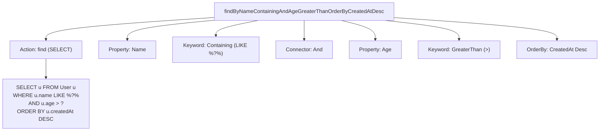

# Derived Query Methods

Derived query methods are Spring Data JPA's most elegant feature. You write a method name following naming conventions, and Spring automatically generates the SQL query. No SQL, no JPQL, no `@Query` annotation — just a descriptive method name.

## How It Works



## Naming Convention

The method name follows this pattern:

```
[action][Distinct][By][property][keyword][And|Or][property][keyword][OrderBy][property][Asc|Desc]
```

### Actions

| Prefix | SQL | Return Type |
|---|---|---|
| `findBy` | `SELECT` | `List<T>`, `Optional<T>`, `T` |
| `countBy` | `SELECT COUNT(*)` | `long` |
| `existsBy` | `SELECT COUNT(*) > 0` | `boolean` |
| `deleteBy` | `DELETE` | `long` (count) or `void` |

### Keywords

| Keyword | SQL Equivalent | Example |
|---|---|---|
| `And` | `AND` | `findByNameAndAge` |
| `Or` | `OR` | `findByNameOrEmail` |
| `Between` | `BETWEEN` | `findByAgeBetween(18, 65)` |
| `LessThan` | `<` | `findByAgeLessThan(30)` |
| `GreaterThan` | `>` | `findByAgeGreaterThan(18)` |
| `LessThanEqual` | `<=` | `findBySalaryLessThanEqual(50000)` |
| `Like` | `LIKE` | `findByNameLike("%john%")` |
| `Containing` | `LIKE %?%` | `findByNameContaining("john")` |
| `StartingWith` | `LIKE ?%` | `findByNameStartingWith("J")` |
| `EndingWith` | `LIKE %?` | `findByEmailEndingWith("@gmail.com")` |
| `In` | `IN (?, ?, ?)` | `findByRoleIn(List.of(ADMIN, USER))` |
| `IsNull` | `IS NULL` | `findByDeletedAtIsNull()` |
| `IsNotNull` | `IS NOT NULL` | `findByEmailIsNotNull()` |
| `True` / `False` | `= true` / `= false` | `findByActiveTrue()` |
| `OrderBy` | `ORDER BY` | `findByRoleOrderByNameAsc()` |
| `Top` / `First` | `LIMIT` | `findTop5ByOrderBySalaryDesc()` |
| `Distinct` | `DISTINCT` | `findDistinctByRole()` |

## Real-World Examples

```java
public interface UserRepository extends JpaRepository<User, Long> {

    // Simple finder
    Optional<User> findByEmail(String email);

    // Multiple conditions
    List<User> findByRoleAndActiveTrue(UserRole role);

    // Range query
    List<User> findByAgeBetween(int minAge, int maxAge);

    // Pattern matching
    List<User> findByNameContainingIgnoreCase(String namePart);

    // Ordering
    List<User> findByRoleOrderByCreatedAtDesc(UserRole role);

    // Top N results
    List<User> findTop10ByOrderBySalaryDesc();

    // Boolean check
    boolean existsByEmail(String email);

    // Count
    long countByRole(UserRole role);

    // Delete
    void deleteByActiveIsFalse();

    // Null check — find soft-deleted users
    List<User> findByDeletedAtIsNotNull();

    // Pagination with derived query
    Page<User> findByRole(UserRole role, Pageable pageable);
}
```

## Custom Queries with `@Query`

When derived queries become too complex, use `@Query` with JPQL or native SQL:

```java
public interface UserRepository extends JpaRepository<User, Long> {

    // JPQL (entity-oriented, portable across databases)
    @Query("SELECT u FROM User u WHERE u.email = :email AND u.active = true")
    Optional<User> findActiveByEmail(@Param("email") String email);

    // Native SQL (database-specific, use sparingly)
    @Query(value = "SELECT * FROM users WHERE email ILIKE %:search%", nativeQuery = true)
    List<User> searchByEmail(@Param("search") String search);

    // Update/Delete with @Modifying
    @Modifying
    @Query("UPDATE User u SET u.active = false WHERE u.lastLogin < :cutoff")
    int deactivateInactiveUsers(@Param("cutoff") LocalDateTime cutoff);
}
```

## Python Comparison

| Spring Data Derived Query | Python/SQLAlchemy |
|---|---|
| `findByEmail(email)` | `db.query(User).filter(User.email == email).first()` |
| `findByNameContaining("john")` | `db.query(User).filter(User.name.contains("john")).all()` |
| `findByAgeBetween(18, 65)` | `db.query(User).filter(User.age.between(18, 65)).all()` |
| `countByRole(ADMIN)` | `db.query(User).filter(User.role == "ADMIN").count()` |
| `existsByEmail(email)` | `db.query(exists().where(User.email == email)).scalar()` |
| `findTop5ByOrderBySalaryDesc()` | `db.query(User).order_by(User.salary.desc()).limit(5).all()` |
| `@Query("SELECT u FROM ...")` | `db.query(User).filter(text("...")).all()` |

### Key Difference

In Python, you compose queries using method chaining (`filter().order_by().limit()`). In Spring Data JPA, you express the same logic as a **method name** that Spring parses at startup. Both approaches are equally powerful, but Spring's approach requires zero boilerplate.

## How Spring Parses Method Names



## Interview Questions

### Conceptual

**Q1: How does Spring Data JPA generate queries from method names?**
> At application startup, Spring parses each method name in repository interfaces. It splits the name by keywords (`findBy`, `And`, `Or`, `OrderBy`, etc.), maps each part to entity properties, and generates JPQL queries. If a method name doesn't follow conventions or references non-existent properties, Spring throws an exception at startup — not at runtime.

**Q2: When should you use `@Query` instead of derived query methods?**
> Use `@Query` when: (1) The method name becomes unreadably long (more than ~3 conditions). (2) You need JOINs, subqueries, or aggregate functions. (3) You need native SQL for database-specific features (e.g., PostgreSQL `ILIKE`). (4) You need `@Modifying` UPDATE/DELETE operations.

### Scenario/Debug

**Q3: You add `findByUsrName(String name)` to a repository. The app crashes at startup with "No property 'usrName' found." What happened?**
> The method name references a property `usrName` that doesn't exist on the entity class. Spring validates derived query methods at startup by matching property names against entity fields. The fix: rename to match the actual field name (e.g., `findByUsername` if the field is `username`).

**Q4: A query `findByNameContaining("John")` returns no results, but the database has users named "john" and "JOHN". Why?**
> SQL `LIKE` is case-sensitive by default in most databases. Use `findByNameContainingIgnoreCase("John")` to generate a case-insensitive query, or use `@Query` with the database's case-insensitive function.

### Quick Fire

**Q5: What derived query method checks if any user exists with a given email?**
> `boolean existsByEmail(String email);`

**Q6: What annotation is required alongside `@Query` for UPDATE or DELETE operations?**
> `@Modifying`
