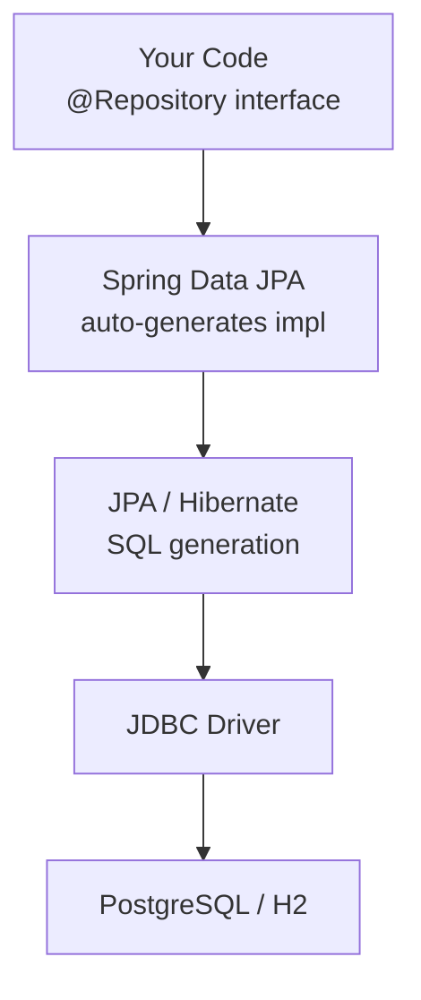

# Spring Data JPA — One-Page Cheat Sheet

## Fast Rules

| Rule | Detail |
|---|---|
| Entity requires | `@Entity`, `@Id`, no-arg constructor (protected OK) |
| Never use | `@Enumerated(EnumType.ORDINAL)` — use STRING |
| Never use | `float` / `double` for money — use `BigDecimal` |
| Timestamp immutability | `@Column(updatable = false)` on `createdAt` |
| Auto-generate PK | `@GeneratedValue(strategy = IDENTITY)` |
| Unique constraint | `@Column(unique = true)` (single column) |
| For read-only queries | `@Transactional(readOnly = true)` |
| Bulk UPDATE/DELETE | Requires `@Modifying` + `@Transactional` |
| Pagination | Return `Page<T>`, accept `Pageable` |
| Absent entity | Return `Optional<T>` from `findBy*` |

## Derived Query Keyword Cheat Table

| Keyword | SQL | Example Method |
|---|---|---|
| `findBy` | `WHERE x = ?` | `findByEmail(String email)` |
| `And` | `AND` | `findByActiveAndRole(...)` |
| `Or` | `OR` | `findByEmailOrPhone(...)` |
| `IsTrue` / `True` | `= true` | `findByActiveTrueAndRole(...)` |
| `Containing` | `LIKE '%?%'` | `findByTitleContaining(String s)` |
| `IgnoreCase` | `LOWER(x) = LOWER(?)` | `findByEmailIgnoreCase(String e)` |
| `LessThan` | `< ?` | `findByPriceLessThan(BigDecimal p)` |
| `OrderBy...Asc/Desc` | `ORDER BY` | `findByGenreOrderByTitleAsc(...)` |
| `Top10` | `LIMIT 10` | `findTop10ByOrderByCreatedAtDesc()` |
| `countBy` | `SELECT COUNT(*)` | `countByGenre(BookGenre g)` |
| `existsBy` | `COUNT > 0` | `existsByIsbn(String isbn)` |
| `deleteBy` | `DELETE WHERE` | `deleteByAvailableFalse()` |

## Python Bridge

| Spring Data JPA | Python SQLAlchemy |
|---|---|
| `JpaRepository<Book, Long>` | No equivalent — write all CRUD manually |
| Derived query method | `db.query(Book).filter(Book.x == v).all()` |
| `@Query("SELECT b FROM Book b WHERE...")` | `db.execute(text("SELECT..."))` |
| `Page<T>` with `Pageable` | `db.query(Book).limit(n).offset(m).all()` |
| `@Modifying @Query` | `db.execute(update(Book).where(...))` |
| `@PrePersist` | SQLAlchemy `@event.listens_for(Book, "before_insert")` |
| `@Transactional(readOnly=true)` | SQLAlchemy `session.execute(...)` (no explicit read-only) |

## Common Traps

1. **N+1 queries** — lazy loading associations in a loop triggers 1 query per item. Fix: `JOIN FETCH` in `@Query` or `@EntityGraph`.
2. **`getById()` outside transaction** — returns a proxy that throws `EntityNotFoundException` when accessed. Use `findById()` and handle `Optional`.
3. **`@Modifying` without `@Transactional`** — throws `TransactionRequiredException`. Always pair them.
4. **Forgetting `@Param` with named parameters** — `@Query("WHERE author = :author")` without `@Param("author")` causes `IllegalStateException`.
5. **`findAll()` on large tables** — loads entire table into memory. Always paginate.

## Key Interview Questions

1. You load 1000 orders and see 1001 SQL queries in the log. What is this pattern called and how do you fix it?
2. What does `@Transactional(readOnly = true)` do that a plain `@Transactional` doesn't?
3. Why is `@Enumerated(EnumType.ORDINAL)` dangerous for production data?
