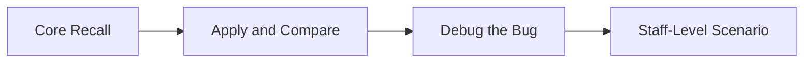

# Spring Data JPA — Progressive Quiz Drill



## Round 1 — Core Recall

**Q1.** What is the difference between JPA (the specification) and Hibernate (the implementation)?

**Q2.** Why does `@Enumerated(EnumType.STRING)` always win over `EnumType.ORDINAL`?

**Q3.** Why must a JPA entity have a no-arg constructor?

**Q4.** When does Hibernate generate an UPDATE SQL for an entity — do you need to call `save()` again?

**Q5.** What is the difference between `findById()` and `getById()` in Spring Data JPA?

---

## Round 2 — Apply and Compare

**Q6.** You need a query: "find all active orders for a customer, sorted by date descending." Write the derived method signature.

**Q7.** A derived method name is getting too long to read. What alternative does Spring Data provide and what annotation is used?

**Q8.** Compare Spring Data's `findByAuthor(String author)` to a Python SQLAlchemy approach for the same query. What does Spring Data eliminate?

**Q9.** When should you use `Page<T>` instead of `List<T>` as a repository return type?

---

## Round 3 — Debug the Bug

**Q10.** This derived query method generates incorrect SQL. What is wrong?

```java
List<Book> findByGenreAndAvailableAndPriceLessThan(BookGenre genre, boolean available, BigDecimal price);
// Expected: WHERE genre = ? AND available = true AND price < ?
// Actual:   WHERE genre = ? AND available = ? AND price < ?
```

**Q11.** A bulk update query runs without errors but no rows are updated. What is missing?

```java
@Query("UPDATE Book b SET b.available = false WHERE b.author = :author")
int markUnavailable(@Param("author") String author);
```

**Q12.** A `@PrePersist` method sets `createdAt` correctly on first save, but then every `save()` call resets it. What annotation is missing on the column?

---

## Round 4 — Staff-Level Scenario

**Q13.** Your product listing API loads 50,000 books into memory on every request because the repository uses `findAll()`. The service then filters in Java. What architectural changes would you make and which Spring Data features would you use?

**Q14.** An e-commerce site has Books linked to Authors and Categories. Loading the book catalog triggers hundreds of additional queries. Describe what is happening, what Spring Data mechanism caused it, and two ways to fix it.

---

## Answer Key

### Round 1
**A1.** JPA is a specification (set of interfaces and annotations in `jakarta.persistence.*`). Hibernate is the default implementation that translates JPA calls into SQL queries. Your code depends on JPA — Hibernate is swappable.

**A2.** ORDINAL stores integers (0, 1, 2...). If you reorder, add, or insert a new enum value, all stored integers map to the wrong enum constant — data corruption without any error. STRING stores the name ("FICTION") — stable regardless of enum order changes.

**A3.** JPA creates proxy subclasses for lazy loading and other features. The JVM needs a no-arg constructor to instantiate these proxies. Without one, `InstantiationException` is thrown at startup.

**A4.** Hibernate's dirty checking automatically detects field changes on managed entities within a transaction. At commit time, Hibernate generates UPDATE SQL for any entity that changed — no explicit `save()` call is needed for updates (only for new entities).

**A5.** `findById()` returns `Optional<T>` — safe and explicit about absence. `getById()` (deprecated as `getOne()`) returns a Hibernate proxy that throws `EntityNotFoundException` lazily when accessed, even if called outside a transaction.

### Round 2
**A6.** `List<Order> findByCustomerIdAndActiveTrueOrderByOrderDateDesc(Long customerId);`

**A7.** Use `@Query` with JPQL: `@Query("SELECT b FROM Book b WHERE b.author = :author ORDER BY b.title ASC")`. Use named parameters with `@Param`.

**A8.** Python SQLAlchemy requires a function: `def find_by_author(db, author): return db.query(Book).filter(Book.author == author).all()` — 3+ lines per query. Spring Data generates the SQL from the method name — 0 lines of query code.

**A9.** Use `Page<T>` for user-facing queries where the UI needs pagination (total count, page navigation). Use `List<T>` only for internal queries with known bounded results or when the full result set must be processed in memory.

### Round 3
**A10.** The method uses `available` as a boolean parameter, but since the requirement is always `available = true`, use `AvailableTrue` keyword instead: `findByGenreAndAvailableTrueAndPriceLessThan(BookGenre genre, BigDecimal price)`.

**A11.** The `@Modifying` annotation is missing. Without it, Spring Data treats `@Query` as a SELECT. Add `@Modifying` above `@Query`. Also, the calling service method needs `@Transactional`.

**A12.** `@Column(updatable = false)` is missing on the `createdAt` field. Without it, Hibernate includes the column in every UPDATE statement. While the value doesn't change (set only by @PrePersist), the field should be explicitly protected from updates.

### Round 4
**A13.** Never use `findAll()` for user-facing APIs on large tables. Fix: (1) Add `Pageable` parameter — `Page<Book> findAll(Pageable pageable)`. (2) Add filtering to the query — `Page<Book> findByAvailableTrue(Pageable pageable)`. (3) Use `@Query` with JPQL for complex filters. (4) Consider a search index (Elasticsearch/OpenSearch) if full-text search is needed.

**A14.** This is the N+1 query problem. When Book is loaded, Hibernate lazily loads Author and Category for each book separately — 1 query for books + N queries per association = N+1 queries. Fix: (1) Use `@EntityGraph` to specify which associations to JOIN FETCH in a single query. (2) Use `@Query` with explicit `JOIN FETCH`: `"SELECT b FROM Book b JOIN FETCH b.author JOIN FETCH b.categories"`.
