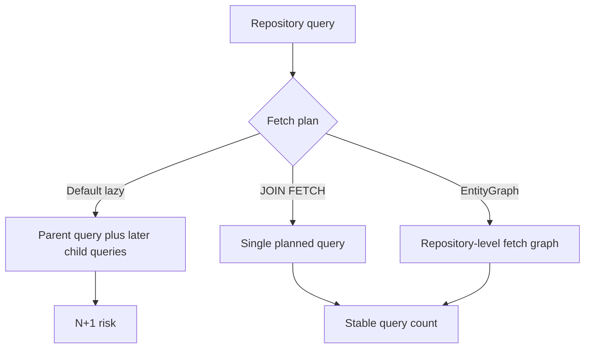

# 02 - Advanced JPA

## Overview

This sub-module covers the advanced JPA patterns that separate junior developers from senior engineers: entity relationships, transaction management, and fetch planning for performance-sensitive endpoints.

The main idea is simple: model the database correctly, then choose a fetch plan that matches the API response shape. If you skip that second part, the endpoint may work but still leak performance through the N+1 problem.

## Core Concepts Covered

1. Entity relationships - `@OneToOne`, `@OneToMany`, `@ManyToOne`, `@ManyToMany`, cascade types, and ownership rules.
2. Understanding transactions - `@Transactional`, propagation types, isolation levels, rollback behavior, and the self-invocation trap.
3. Fetch strategies and performance - `LAZY`, `EAGER`, `JOIN FETCH`, `@EntityGraph`, and N+1 troubleshooting.

## Fetch Planning Flow

## Fetch Plan Mental Model

Think of fetch planning the same way you think about SQLAlchemy loader options:

- `JOIN FETCH` is the explicit, endpoint-specific answer when you know the exact graph.
- `@EntityGraph` is the reusable repository-level answer when you want the query method to stay clean.
- `LAZY` is safe by default, but only when the access happens inside a live transaction.

## Structure

- `explanation/` - Deep-dive markdown files for each advanced concept
- `exercises/` - Hands-on tasks to implement relationships, transactions, and fetch planning
- `resources/` - Quiz drill, cheat sheet, and curated external resource guide
- `AdvancedJpaDemo.java` - Relationship and transaction walkthrough
- `FetchTypeDemo.java` - N+1 vs JOIN FETCH vs EntityGraph walkthrough

## Support Pack

- [progressive-quiz-drill.md](resources/progressive-quiz-drill.md)
- [one-page-cheat-sheet.md](resources/one-page-cheat-sheet.md)
- [top-resource-guide.md](resources/top-resource-guide.md)

## Mindmap

See [MINDMAP.md](MINDMAP.md) for a visual overview of advanced JPA concepts.
