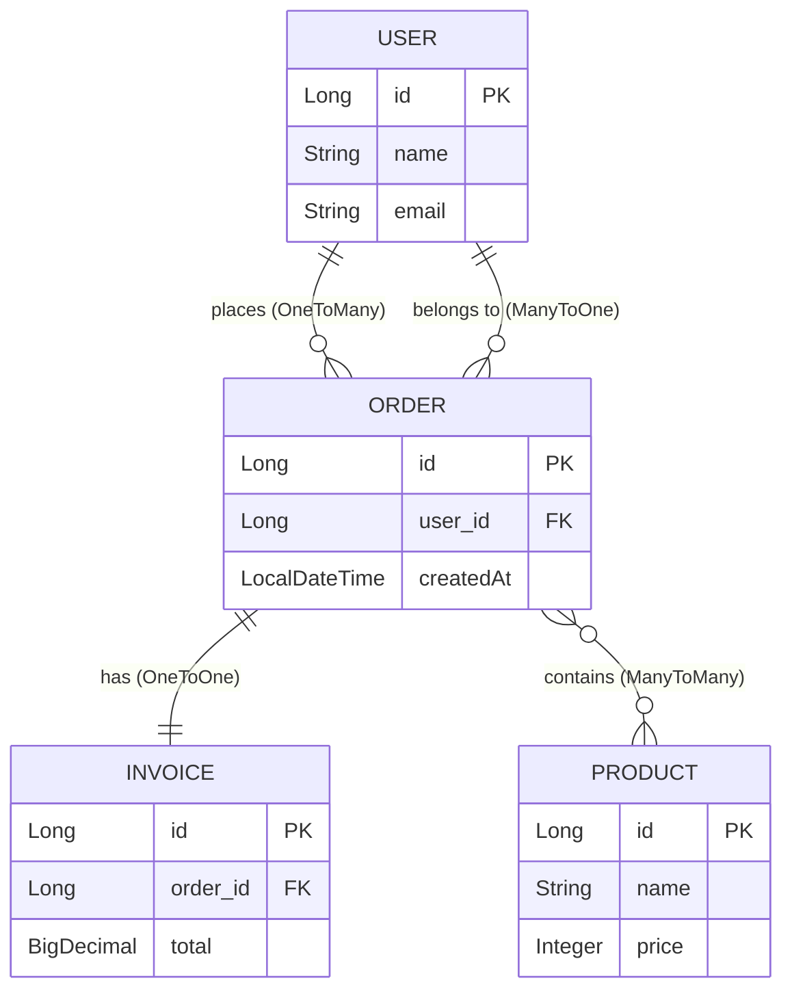
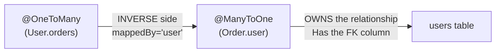
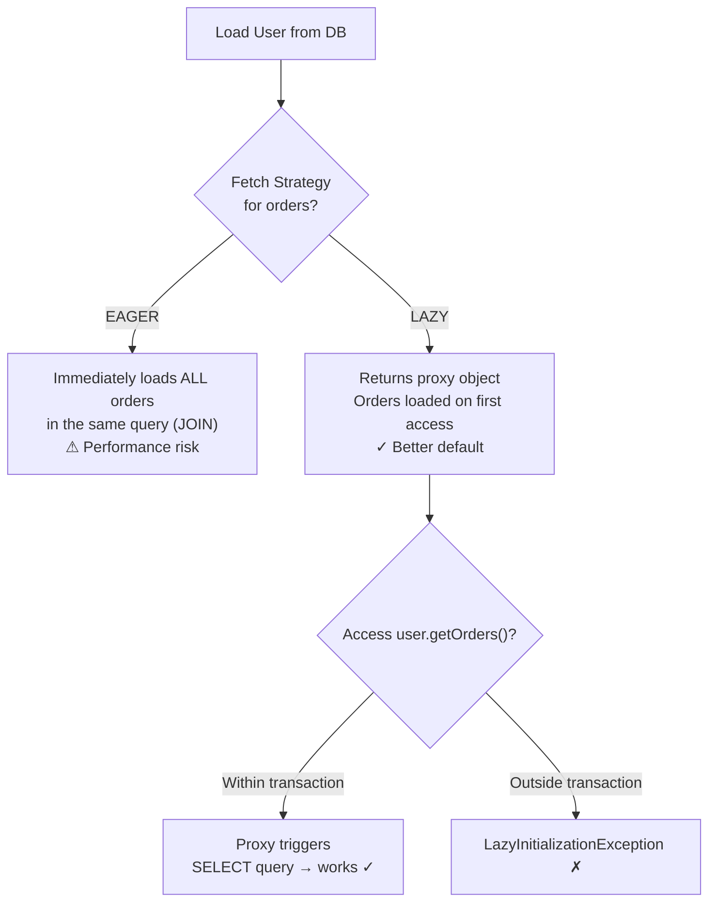

# Entity Relationships

JPA supports four types of entity relationships that map to database foreign keys and join tables. Understanding the **owning side**, **cascade behavior**, and **fetch strategy** is critical for writing correct and performant code.

## The Four Relationship Types



## @ManyToOne and @OneToMany (Most Common)

This is the most frequent relationship — a parent has many children, each child belongs to one parent.

```java
// OWNING SIDE — the entity with the foreign key column
@Entity
public class Order {
    @Id @GeneratedValue(strategy = GenerationType.IDENTITY)
    private Long id;

    /**
     * Many orders belong to one user.
     * This side OWNS the relationship — it has the user_id foreign key.
     * fetch = EAGER by default for @ManyToOne (loads user with every order).
     */
    @ManyToOne(fetch = FetchType.LAZY)   // Override: don't load user by default
    @JoinColumn(name = "user_id", nullable = false)  // Foreign key column name
    private User user;

    private LocalDateTime createdAt;
}

// INVERSE SIDE — references the owning side via 'mappedBy'
@Entity
public class User {
    @Id @GeneratedValue(strategy = GenerationType.IDENTITY)
    private Long id;
    private String name;

    /**
     * One user has many orders.
     * mappedBy = "user" → points to the 'user' field in Order class.
     * cascade = ALL → persist/delete orders when user is persisted/deleted.
     * orphanRemoval = true → delete order if removed from this list.
     */
    @OneToMany(mappedBy = "user", cascade = CascadeType.ALL, orphanRemoval = true)
    private List<Order> orders = new ArrayList<>();

    // Helper method to maintain both sides of the relationship
    public void addOrder(Order order) {
        orders.add(order);
        order.setUser(this);
    }

    public void removeOrder(Order order) {
        orders.remove(order);
        order.setUser(null);
    }
}
```

### The Owning Side Rule



**Rule**: The `@ManyToOne` side always owns the relationship because it contains the foreign key column. The `@OneToMany` side uses `mappedBy` to reference the owning field.

## @OneToOne

```java
@Entity
public class Order {
    @Id @GeneratedValue(strategy = GenerationType.IDENTITY)
    private Long id;

    @OneToOne(mappedBy = "order", cascade = CascadeType.ALL, orphanRemoval = true)
    private Invoice invoice;
}

@Entity
public class Invoice {
    @Id @GeneratedValue(strategy = GenerationType.IDENTITY)
    private Long id;

    @OneToOne(fetch = FetchType.LAZY)
    @JoinColumn(name = "order_id", unique = true)  // FK with unique constraint
    private Order order;

    private BigDecimal total;
}
```

## @ManyToMany

```java
@Entity
public class Order {
    @Id @GeneratedValue(strategy = GenerationType.IDENTITY)
    private Long id;

    @ManyToMany
    @JoinTable(
        name = "order_products",              // Join table name
        joinColumns = @JoinColumn(name = "order_id"),
        inverseJoinColumns = @JoinColumn(name = "product_id")
    )
    private Set<Product> products = new HashSet<>();
}

@Entity
public class Product {
    @Id @GeneratedValue(strategy = GenerationType.IDENTITY)
    private Long id;
    private String name;

    @ManyToMany(mappedBy = "products")   // Inverse side
    private Set<Order> orders = new HashSet<>();
}
```

**When @ManyToMany breaks**: If you need extra columns on the join table (e.g., `quantity`, `price_at_purchase`), promote the join table to a full entity with two `@ManyToOne` relationships.

## Cascade Types

| Cascade | Effect | When to Use |
|---|---|---|
| `PERSIST` | Saving parent auto-saves children | Parent-child (User → Orders) |
| `MERGE` | Updating parent auto-updates children | Usually with PERSIST |
| `REMOVE` | Deleting parent auto-deletes children | Strong composition (not reference) |
| `REFRESH` | Refreshing parent auto-refreshes children | Rarely needed |
| `DETACH` | Detaching parent auto-detaches children | Rarely needed |
| `ALL` | All of the above | Most common for @OneToMany |

**Warning**: Never use `CascadeType.REMOVE` on `@ManyToMany` — deleting one product would delete all its orders and their other products!

## Fetch Strategies



| Annotation | Default Fetch | Recommended |
|---|---|---|
| `@ManyToOne` | EAGER | Change to LAZY |
| `@OneToOne` | EAGER | Change to LAZY |
| `@OneToMany` | LAZY | Keep LAZY |
| `@ManyToMany` | LAZY | Keep LAZY |

## Python Comparison

| JPA Relationships | SQLAlchemy |
|---|---|
| `@ManyToOne @JoinColumn` | `Column(ForeignKey('users.id'))` |
| `@OneToMany(mappedBy=...)` | `relationship("Order", back_populates="user")` |
| `@ManyToMany @JoinTable` | `relationship(..., secondary=join_table)` |
| `cascade = ALL` | `cascade="all, delete-orphan"` |
| `fetch = LAZY` | `lazy="select"` (default) |
| `fetch = EAGER` | `lazy="joined"` or `lazy="subquery"` |
| `orphanRemoval = true` | `cascade="all, delete-orphan"` |
| `LazyInitializationException` | `DetachedInstanceError` in SQLAlchemy |

## Interview Questions

### Conceptual

**Q1: What does `mappedBy` mean in a JPA relationship?**
> `mappedBy` identifies the **inverse** (non-owning) side of a bidirectional relationship. It tells JPA: "Don't create a foreign key here — the relationship is already managed by the specified field on the other entity." The value of `mappedBy` is the field name on the owning entity.

**Q2: Why should `@ManyToOne` relationships use `FetchType.LAZY` instead of the default EAGER?**
> EAGER loading means every time you load an Order, JPA also loads the User in the same query. In a list of 100 orders, this may trigger the N+1 problem (100 extra queries). LAZY loading defers the User fetch until first access, and you can use JOIN FETCH or @EntityGraph when you actually need the data.

### Scenario/Debug

**Q3: You get a `LazyInitializationException` when accessing `user.getOrders()` in a REST controller. Why?**
> The JPA transaction (and persistence context) has already closed by the time the controller serializes the response. The `orders` collection is a lazy proxy, and there's no open session to execute the SELECT query. Solutions: (1) Use `@EntityGraph` on the repository method to eagerly fetch orders. (2) Use a DTO projection that fetches only needed fields within the transaction. (3) Use `JOIN FETCH` in a custom `@Query`.

**Q4: You have `CascadeType.ALL` on a `@ManyToMany` relationship. Deleting a Product also deletes all Orders associated with it. How do you fix this?**
> Remove `CascadeType.REMOVE` (or change from `ALL` to `{PERSIST, MERGE}`). `@ManyToMany` relationships are reference-based, not composition — deleting one side should not delete the other. Only use cascade REMOVE on true parent-child relationships.

### Quick Fire

**Q5: Which side of a `@ManyToOne` / `@OneToMany` relationship contains the foreign key?**
> The `@ManyToOne` side (the "many" side).

**Q6: What annotation creates a join table for `@ManyToMany` relationships?**
> `@JoinTable`
