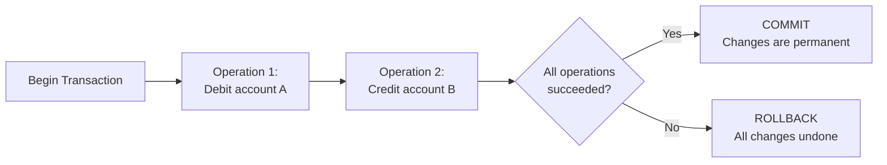
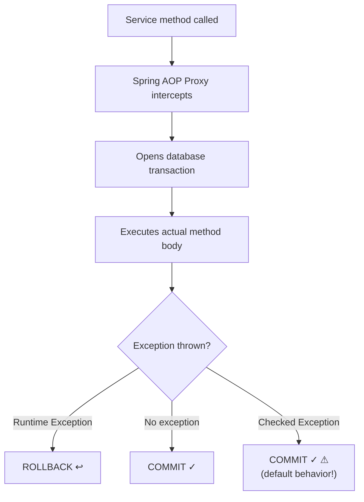
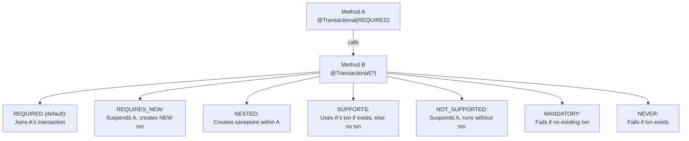

# Understanding Transactions

Transactions guarantee that a group of database operations either **all succeed** or **all fail** — there is no partial state. In Spring Boot, the `@Transactional` annotation is your primary tool for transaction management.

## What is a Transaction?



The classic example: transferring money. If the debit succeeds but the credit fails, you must undo the debit. Without transactions, the money disappears.

## ACID Properties

| Property | Meaning | Example |
|---|---|---|
| **Atomicity** | All-or-nothing | Transfer: both debit and credit, or neither |
| **Consistency** | Data rules preserved | Account balance cannot be negative |
| **Isolation** | Concurrent txns don't interfere | Two transfers to same account don't corrupt balance |
| **Durability** | Committed data survives crashes | Server restart doesn't lose committed transfer |

## `@Transactional` in Spring Boot

```java
@Service
public class TransferService {

    private final AccountRepository accountRepository;

    public TransferService(AccountRepository accountRepository) {
        this.accountRepository = accountRepository;
    }

    /**
     * Transfer money between accounts.
     * @Transactional ensures both operations succeed or both fail.
     *
     * Python equivalent:
     *   with db.begin():
     *       debit_account(from_id, amount)
     *       credit_account(to_id, amount)
     *       # Auto-commit on exit, auto-rollback on exception
     */
    @Transactional
    public void transfer(Long fromId, Long toId, BigDecimal amount) {
        Account from = accountRepository.findById(fromId)
            .orElseThrow(() -> new AccountNotFoundException(fromId));
        Account to = accountRepository.findById(toId)
            .orElseThrow(() -> new AccountNotFoundException(toId));

        if (from.getBalance().compareTo(amount) < 0) {
            throw new InsufficientFundsException(fromId, amount);
        }

        from.setBalance(from.getBalance().subtract(amount));
        to.setBalance(to.getBalance().add(amount));

        // No explicit save() needed! JPA dirty checking detects changes
        // and generates UPDATE SQL at transaction commit.
    }
}
```

## How @Transactional Works Internally



**Critical Detail**: `@Transactional` works through **Spring AOP proxies**. The proxy wraps your bean and intercepts method calls. This has an important implication:

```java
@Service
public class OrderService {

    @Transactional
    public void createOrder(OrderRequest request) {
        // This works — called through the proxy
    }

    public void processOrder(OrderRequest request) {
        // THIS DOES NOT WORK — self-invocation bypasses the proxy!
        createOrder(request);  // ⚠ No transaction!
    }
}
```

**Self-invocation trap**: Calling a `@Transactional` method from within the same class bypasses the proxy, so no transaction is created. This is the #1 Spring transaction bug.

## Propagation Types

Propagation controls what happens when a `@Transactional` method calls another `@Transactional` method.



| Propagation | Existing Transaction? | Behavior |
|---|---|---|
| `REQUIRED` (default) | Yes → joins it; No → creates new | Most common |
| `REQUIRES_NEW` | Always creates new, suspends existing | Audit logging, independent operations |
| `NESTED` | Creates savepoint within existing | Partial rollback support |
| `SUPPORTS` | Yes → joins; No → runs without | Read-only queries |
| `NOT_SUPPORTED` | Suspends existing, runs without | Non-transactional operations |
| `MANDATORY` | Must exist — else exception | Enforce transactional context |
| `NEVER` | Must NOT exist — else exception | Prevent accidental transactional use |

## Rollback Behavior

```java
// Default: Rollback on unchecked (RuntimeException) only
@Transactional
public void riskyOperation() {
    throw new RuntimeException("Rolled back!"); // ← ROLLBACK ✓
}

@Transactional
public void riskyOperation() throws IOException {
    throw new IOException("NOT rolled back!"); // ← COMMIT ⚠ (checked exception)
}

// Explicit rollback for checked exceptions
@Transactional(rollbackFor = IOException.class)
public void safeOperation() throws IOException {
    throw new IOException("NOW rolled back!"); // ← ROLLBACK ✓
}

// No rollback for specific runtime exceptions
@Transactional(noRollbackFor = BusinessException.class)
public void businessOperation() {
    throw new BusinessException("NOT rolled back!"); // ← COMMIT
}
```

## Read-Only Optimization

```java
@Transactional(readOnly = true)
public List<User> getAllUsers() {
    return userRepository.findAll();
    // Hibernate disables dirty checking → no UPDATE SQL generated
    // Better performance for read-heavy operations
}
```

## Python Comparison

| Spring @Transactional | Python/SQLAlchemy |
|---|---|
| `@Transactional` | `with db.begin():` context manager |
| `@Transactional(readOnly = true)` | `session.execute(select(...)).scalars()` |
| Proxy-based (AOP) | Context manager or explicit `commit()` |
| Auto-rollback on RuntimeException | Auto-rollback on exception in `with` block |
| `REQUIRED` propagation | `session.begin_nested()` (savepoint) |
| `REQUIRES_NEW` | New `Session()` with separate connection |
| Dirty checking (auto-UPDATE) | `session.dirty` tracking |
| Self-invocation trap | No equivalent (Python has no proxy pattern) |

### Key Difference

In Python, you manage transactions explicitly with `db.begin()`, `db.commit()`, `db.rollback()`. In Spring, `@Transactional` handles all of this declaratively — you never see `begin()` or `commit()` in your code. The downside is that transaction behavior is invisible, making bugs harder to diagnose.

## Isolation Levels

| Level | Dirty Read | Non-Repeatable Read | Phantom Read |
|---|---|---|---|
| `READ_UNCOMMITTED` | Possible | Possible | Possible |
| `READ_COMMITTED` | Prevented | Possible | Possible |
| `REPEATABLE_READ` | Prevented | Prevented | Possible |
| `SERIALIZABLE` | Prevented | Prevented | Prevented |

**Default in PostgreSQL**: `READ_COMMITTED`
**Default in MySQL**: `REPEATABLE_READ`

## Interview Questions

### Conceptual

**Q1: What is the "self-invocation trap" in Spring @Transactional?**
> When a `@Transactional` method calls another `@Transactional` method in the same class, the call bypasses the Spring AOP proxy. Since the proxy is what manages transaction boundaries, the inner method runs without a transaction (or without the expected propagation). Solution: inject the service into itself, or extract the method into a separate service.

**Q2: Why does Spring NOT rollback transactions for checked exceptions by default?**
> This is a design decision inherited from EJB conventions. Checked exceptions are expected to be recoverable (e.g., `IOException`), so Spring assumes the developer will handle them without needing a rollback. Unchecked exceptions (RuntimeException) are considered unrecoverable, so rollback is automatic. To change this, use `@Transactional(rollbackFor = Exception.class)`.

### Scenario/Debug

**Q3: A developer marks a service method `@Transactional(readOnly = true)` but it still performs an UPDATE. Why?**
> `readOnly = true` is a *hint* to the underlying framework. Hibernate disables dirty checking for managed entities, but if the code explicitly calls `repository.save(modifiedEntity)`, the save bypasses the dirty checking optimization and still executes an UPDATE. Additionally, some JPA providers and databases ignore the read-only hint entirely.

**Q4: Method A (REQUIRED) calls Method B (REQUIRES_NEW). Method B commits successfully, then Method A throws an exception and rolls back. Is Method B's data persisted?**
> Yes. `REQUIRES_NEW` creates a completely independent transaction. When Method B commits, its data is permanently saved regardless of what happens to Method A afterward. This is commonly used for audit logging — the log entry should persist even if the main operation fails.

### Quick Fire

**Q5: What is the default propagation type for `@Transactional`?**
> `REQUIRED` — joins the existing transaction or creates a new one.

**Q6: Should `@Transactional` be placed on controllers or services?**
> Services. The service layer contains business logic and coordinates multiple repository calls. Placing `@Transactional` on controllers couples transaction boundaries to HTTP request handling, making the code harder to test and reuse.
