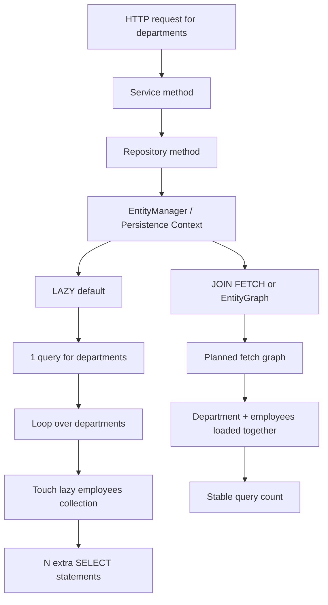

# Fetch Strategies and the N+1 Problem

JPA fetch strategy is not just an annotation detail. It decides how many SQL statements your endpoint will trigger, which directly affects latency, memory use, and database load.

The key lesson is this: model relationships for correctness, but choose fetch plans for the specific API response you are building.

## Why This Exists

`LAZY` loading protects you from loading too much data too early, but it also means the data may be fetched one relationship at a time. That is how the N+1 problem appears: one query for the parent rows, then one extra query per parent when you touch a lazy collection.

`JOIN FETCH` and `@EntityGraph` exist so you can say, "For this endpoint, load this object graph now." That removes accidental query explosions and makes the performance cost visible in code.

## Mermaid Diagram



## Fetch Strategy Matrix

| Strategy | What it does | When to use | Risk |
|---|---|---|---|
| `LAZY` | Defers loading until first access | Most entities and collections | `LazyInitializationException` outside a transaction |
| `EAGER` | Loads immediately with the entity | Rarely, when the relation is always required | Unpredictable joins and hidden query spikes |
| `JOIN FETCH` | Declares the fetch plan in JPQL | Endpoint-specific read models | Duplicate parent rows unless you use `DISTINCT` carefully |
| `@EntityGraph` | Declares the fetch plan on the repository method | Shared repository queries and cleaner code | Provider-specific SQL shape may vary |

## The N+1 Pattern

Imagine loading 10 departments, each with 5 employees.

Without a fetch plan:

1. Query 1 loads the 10 departments.
2. Query 2 through Query 11 load each department's employees.
3. The endpoint now performs 11 queries instead of 1.

With `JOIN FETCH`:

1. One query loads the departments and employees together.
2. The response shape stays the same, but the query count collapses.

With `@EntityGraph`:

1. The repository method declares the graph you need.
2. The provider uses that graph to avoid the lazy-loading loop.

## Java Demo

`FetchTypeDemo.java` prints the query count difference between the naive lazy-loading loop and a fetch-plan-based approach.

```java
@Query("select d from Department d")
List<Department> findAllDepartments();

@Query("select distinct d from Department d left join fetch d.employees")
List<Department> findAllWithEmployees();

@EntityGraph(attributePaths = "employees")
List<Department> findAllByNameContaining(String name);
```

The first method is simple but can trigger N+1 when the service touches `department.getEmployees()`. The second and third methods make the fetch decision explicit.

## Python Bridge

| Concern | Python / SQLAlchemy | Java / JPA |
|---|---|---|
| Lazy relation access | `relationship(lazy="select")` | `FetchType.LAZY` |
| Join-based eager loading | `joinedload(Department.employees)` | `JOIN FETCH` |
| Declarative fetch plan | `options(selectinload(...))` or `joinedload(...)` | `@EntityGraph` |
| Transaction boundary | `with session.begin():` | `@Transactional` |
| Access after session closes | `DetachedInstanceError` | `LazyInitializationException` |

In Python, you usually choose the loader option right where you build the query, so the fetch strategy stays visible at the query site. In Spring Data JPA, the relation mapping and the query plan are often split across annotations, which means the endpoint author must think about both the entity model and the service transaction together.

## Common Mistakes

- Using `EAGER` to "fix" N+1. This usually creates a different performance problem. Use `JOIN FETCH` or `@EntityGraph` instead.
- Loading lazy collections after the transaction has already ended. The fix is to move the access inside a service-level transaction or fetch the data eagerly at query time.
- Forgetting that `JOIN FETCH` can duplicate parent rows. Use `DISTINCT` on the root entity when the query shape requires it.
- Ignoring the `@Transactional` self-invocation trap. If one method in the same class calls another method that should be transactional, the proxy is bypassed.

## Real-World Use Cases

- Admin dashboards that show departments with employee counts and nested details.
- Order history screens that need orders plus order lines in one request.
- Reporting endpoints where query count matters more than the object graph convenience.

## Interview Questions

### Conceptual

**Q1: Why does `LAZY` not automatically solve performance problems?**
> `LAZY` delays loading, but it does not reduce total data access by itself. If the code later iterates over every parent and touches a lazy collection, the application still performs one parent query plus N child queries. The fix is to pair `LAZY` with an explicit fetch plan such as `JOIN FETCH` or `@EntityGraph`.

**Q2: When should you prefer `@EntityGraph` over `JOIN FETCH`?**
> Prefer `@EntityGraph` when you want the fetch plan to live with the repository method and keep the JPQL cleaner. Prefer `JOIN FETCH` when the query shape is specific to a use case and you want the fetch decision obvious in the query itself.

### Scenario / Debug

**Q3: Your API returns 10 departments and suddenly emits 11 SQL statements after a refactor. What should you check first?**
> Check whether the service started touching a lazy collection inside a loop, and check whether the method still runs inside a transaction. The likely fix is to move the fetch plan into the repository with `JOIN FETCH` or `@EntityGraph`, then keep the access inside the service transaction.

**Q4: A developer changed a collection to `FetchType.EAGER`, but the endpoint still feels slow. Why is that a bad fix?**
> `EAGER` changes when the relation loads, not whether the response needs it. It often causes bigger joins, more memory use, and hidden loading behavior across unrelated code paths. A targeted fetch plan is safer and easier to reason about.

### Quick Fire

**Q5: What is the name of the query explosion caused by one parent query plus one query per child?**
> The N+1 problem.

**Q6: What Spring annotation is commonly used to declare a repository-level fetch plan?**
> `@EntityGraph`.
