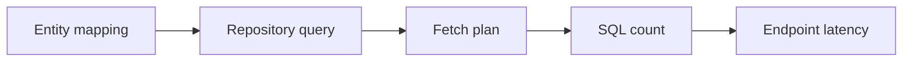

# Advanced JPA One-Page Cheat Sheet

## Core Flow

## Python Bridge

| JPA Concept | Python / SQLAlchemy Equivalent | Short Memory Hook |
|---|---|---|
| Entity | ORM model | Persistent row mapping |
| Repository | Data access object | Query entry point |
| `@Transactional` | Session scope | One unit of work |
| `LAZY` | Deferred load | Load only when touched |
| `JOIN FETCH` | Joined eager load | One planned query |

## Fast Reference

| Topic | Use It When | Watch Out For |
|---|---|---|
| `@OneToMany` | Parent owns many children | Large collections can explode joins |
| `@ManyToOne` | Child points to parent | Default `EAGER` can surprise you |
| `@Transactional` | Read/write service methods | Self-invocation skips the proxy |
| `JOIN FETCH` | One endpoint needs a fixed graph | Duplicates can appear with large joins |
| `@EntityGraph` | You want fetch intent on the repository | Keep the graph aligned with the API shape |
| `LAZY` | You want control and lower default cost | Needs an open session / transaction |
| N+1 | You see repeated selects in logs | Usually fixed by fetch planning |

## Debug Checklist

1. Count the queries.
2. Find the repeated select pattern.
3. Check whether a collection or association is being touched in a loop.
4. Compare the endpoint shape with the fetch plan.
5. Confirm the code runs inside a real transaction.

## Mental Model

- Map relationships correctly first.
- Keep collections lazy by default.
- Fetch what the endpoint actually needs.
- Treat query count as a testable contract.

## Interview Questions

1. Why is the endpoint shape important when choosing a fetch plan?
2. What is the safest default for collections?
3. How do you prove that a fix actually removed N+1?
4. Why can `@Transactional` fail if a method calls itself?
5. When is `@EntityGraph` a better fit than `JOIN FETCH`?
